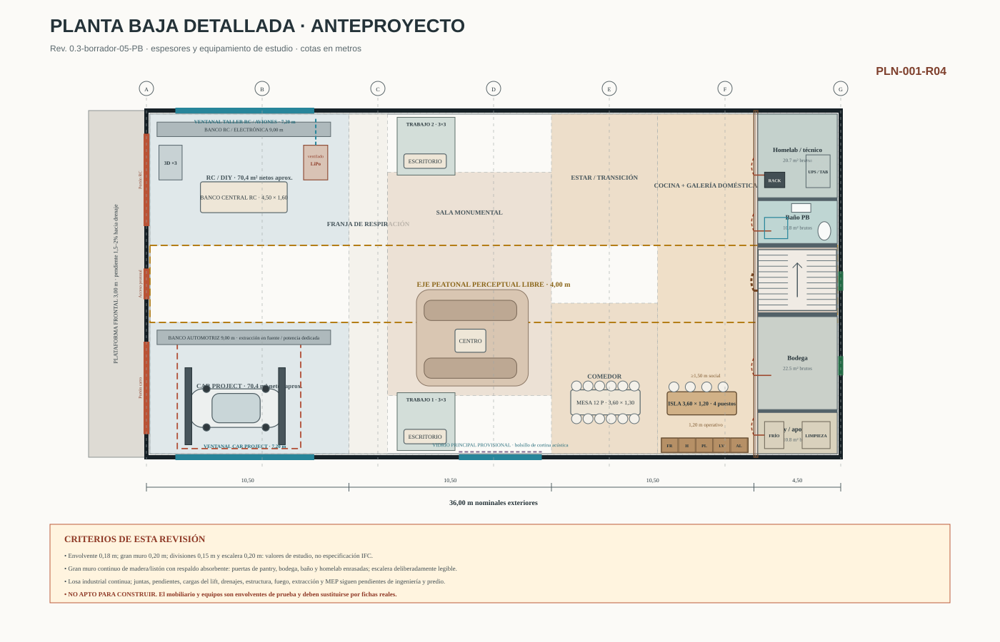
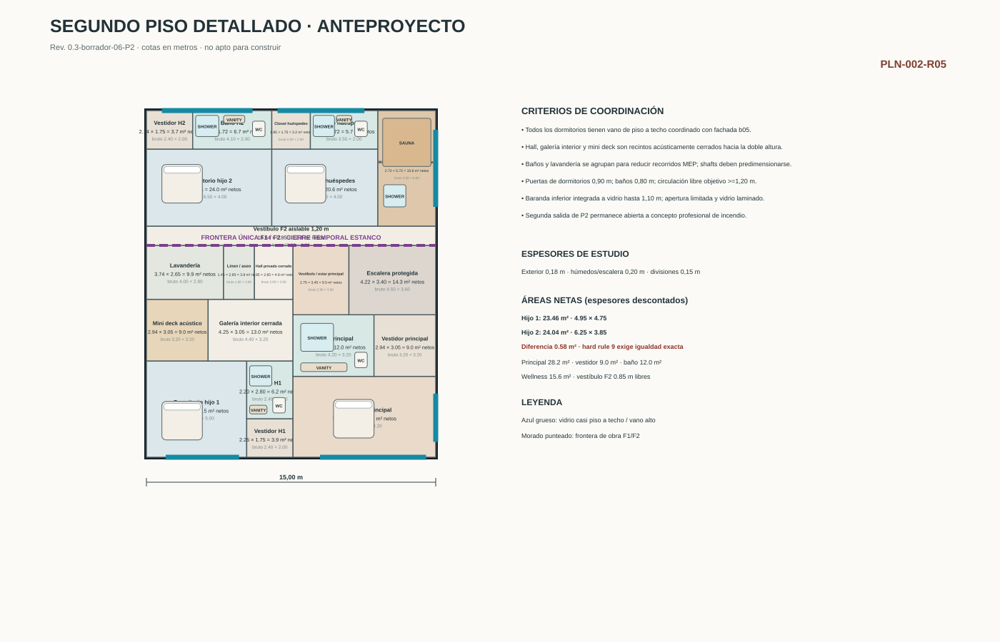
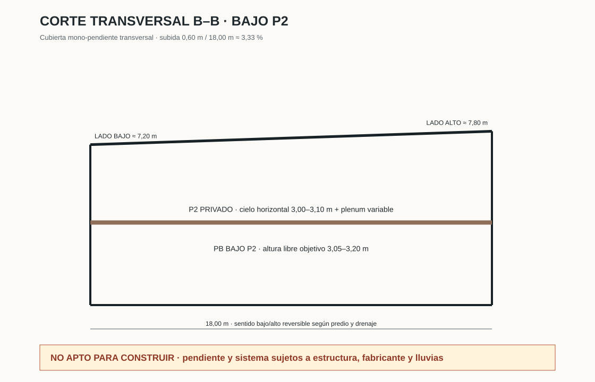
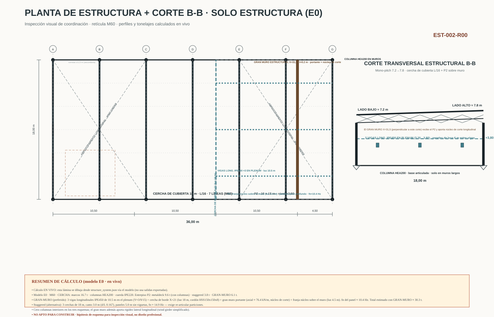
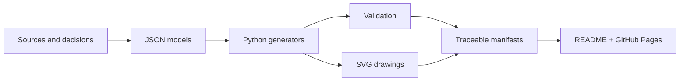

<p align="center">
  
</p>

<p align="center">
  <a href="https://bultodepapas.github.io/DremHouse/"><strong>Explore the presentation</strong></a>
  &nbsp;·&nbsp;
  <a href="docs/README.md">Open the project record</a>
  &nbsp;·&nbsp;
  <a href="docs/00_gobernanza/registro_decisiones.md">Review decisions</a>
  &nbsp;·&nbsp;
  <a href="CONTRIBUTING.md">How to contribute</a>
</p>

<p align="center">
  <a href="https://github.com/bultodepapas/DremHouse/actions/workflows/showcase.yml"></a>
</p>

# Dream House

A **residential and technical warehouse house in Boyacá, Colombia**: a home,
RC/DIY workshop, technology space, and a single project car contained within one
simple industrial hall. This repository is the living project record that
coordinates design intent, geometry, engineering, cost, decisions, and delivery.

> [!IMPORTANT]
> **Schematic design — not for construction.** The exact site and its technical
> studies are not yet available. Renders, sketches, and visualisations are never
> dimensional authorities.

## At a glance

**18 × 36 m** industrial hall · **648 m²** ground floor · **≈270 m²** partial
upper floor · **≈918 m²** conceptual gross floor area · **4** permanent suites ·
**2** delivery phases

The guiding idea is deliberately simple:

> One box + one structure + one great void + light + carefully organised
> technical objects + one final wall.

Luxury should come from proportion, height, light, landscape, silence,
structure, and performance—not from arbitrary forms or decorative layers.

## Latest deliverables

<!-- showcase:begin -->
<p align="center">
  <sub><strong>35</strong> vector drawings · <strong>45</strong> documents · <strong>44</strong> recorded decisions · <strong>4</strong> open conflicts</sub>
</p>

<table>
<tr>
<td width="50%" valign="top">
  <a href="planos/conceptual_v0.3_b05_pb/DH-ARQ-PLN-001-R04_PB-DETALLADA.svg"></a>
  <br><sub><strong>Architecture · ground floor</strong> · 0.3-borrador-05-PB</sub>
  <br><strong>The industrial hall as one continuous room</strong>
</td>
<td width="50%" valign="top">
  <a href="planos/conceptual_v0.3_b06_p2/DH-ARQ-PLN-002-R05_P2-DETALLADA.svg"></a>
  <br><sub><strong>Architecture · upper floor</strong> · 0.3-borrador-06-P2</sub>
  <br><strong>Privacy anchored at the rear</strong>
</td>
</tr>
<tr>
<td width="50%" valign="top">
  <a href="planos/conceptual_v0.3_b07_cubierta/DH-ARQ-SEC-002-R06_TRANSVERSAL-CUBIERTA.svg"></a>
  <br><sub><strong>Architecture · roof</strong> · 0.3-borrador-07-CUBIERTA</sub>
  <br><strong>One clear transverse gesture</strong>
</td>
<td width="50%" valign="top">
  <a href="planos/estructura/DH-EST-E0-002_ESTRUCTURA-INSPECCION.svg"></a>
  <br><sub><strong>Engineering · E0</strong> · 0.1</sub>
  <br><strong>The structure remains legible</strong>
</td>
</tr>
</table>

<p align="center"><sub>This selection is regenerated from the <code>manifest.json</code> files; select any drawing to open it at full resolution.</sub></p>
<!-- showcase:end -->

The drawings above are **coordination hypotheses**. Each drawing states its
revision and limitations; geometry only acquires authority in accordance with
the [document precedence](docs/00_gobernanza/fuentes_precedencia_y_conflictos.md).

## One architecture, four movements

### 01 · Technical

The open RC/DIY workshop and the project car with its lift are part of daily
life in the house. They are not annexes to be concealed.

### 02 · Monumental

The double-height front zone preserves the great void of the industrial hall,
making its steel structure, light, and scale fully legible.

### 03 · Domestic

Living, dining, and kitchen spaces occupy the transition towards the rear
without turning the ground floor into a collection of enclosed rooms.

### 04 · Private

The partial upper floor brings together four suites, wellness spaces, and
services behind an acoustically enclosed envelope.

## Navigate the project record

| Area | Entry document | Governs |
|---|---|---|
| **Governance** | [Project Constitution](docs/00_gobernanza/constitucion_del_proyecto.md) | Hard rules, precedence, and controlled change |
| **Architecture** | [Design Basis](docs/02_arquitectura/bases_de_diseno.md) | Space, materiality, and geometric coordination |
| **Engineering** | [Structural and Civil Design Basis](docs/03_ingenierias/bases_estructurales_y_civiles.md) | Assumptions, systems, and professional validation |
| **Cost** | [Cost Baseline and Control](docs/04_costos/base_y_control_de_costos.md) | Target, confidence, gaps, and cost gates |
| **Site** | [Site Criteria](docs/05_predio_y_normativa/criterios_del_predio.md) | Location, regulations, and pending studies |
| **Delivery** | [Master Plan](docs/06_gestion_y_obra/plan_maestro.md) | Phases, deliverables, and decision gates |

[View the complete index →](docs/README.md)

## From data to drawing



The drawings are not isolated images: their generators preserve source,
revision, and compliance checks in `manifest.json`. The presentation reads
those manifests to display the current deliverables automatically.

```powershell
# Refresh the README gallery and build the presentation locally
python .github/scripts/build_showcase.py --write-readme --site-dir .build/showcase

# Preview at http://localhost:8000
python -m http.server 8000 --directory .build/showcase
```

## Status and limitations

- **Phase:** consolidated definition and dimensional schematic design.
- **Document cutoff:** 11 August 2026.
- **Primary blocker:** exact site, topographic survey, geotechnical investigation,
  and planning assessment.
- **Cost alert:** the active control target for physical construction is
  **≈COP 988.05 million**, with a critical gap against the historical estimate;
  it is neither a contract price nor the developer's total project cost.

> [!WARNING]
> This repository does not replace planning permission, site investigations,
> signed designs, engineering calculations, independent review, a contract
> budget, construction management, or technical site supervision.

<details>
<summary><strong>Preserved original sources</strong></summary>

The four source documents remain unchanged and in Spanish under
`docs/BORN_Legacy/`:

- [Schematic-design conclusions](docs/BORN_Legacy/casa_bodega_boyaca_conclusiones_anteproyecto.md)
- [Concept drawing v0.2](docs/BORN_Legacy/Dream_House_Plano_Conceptual_v0.2.md)
- [Technical budget v0.2](<docs/BORN_Legacy/Dream House — Presupuesto Técnico y Control de Costos v0.2.docx>)
- [Preliminary budget v0.1](docs/BORN_Legacy/Dream_House_Presupuesto_Preliminar_v0.1.md)

</details>

---

<p align="center"><sub>Boyacá, Colombia · living project record · decisions are recorded, never overwritten without history.</sub></p>
