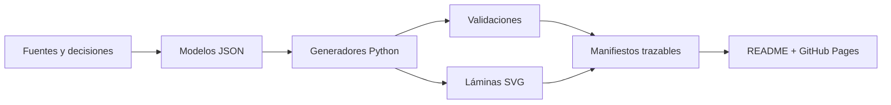

<p align="center">
  
</p>

<p align="center">
  <a href="https://bultodepapas.github.io/DremHouse/"><strong>Explorar la presentación</strong></a>
  &nbsp;·&nbsp;
  <a href="docs/README.md">Abrir el expediente</a>
  &nbsp;·&nbsp;
  <a href="docs/00_gobernanza/registro_decisiones.md">Ver decisiones</a>
  &nbsp;·&nbsp;
  <a href="CONTRIBUTING.md">Cómo colaborar</a>
</p>

<p align="center">
  <a href="https://github.com/bultodepapas/DremHouse/actions/workflows/showcase.yml"></a>
</p>

# Dream House

Una **warehouse house residencial-técnica en Boyacá, Colombia**: vivienda, taller
RC/DIY, tecnología y un único carro proyecto contenidos por una nave simple. Este
repositorio es el expediente vivo que coordina intención, geometría, ingeniería,
costos, decisiones y ejecución.

> [!IMPORTANT]
> **Anteproyecto conceptual — no apto para construir.** No hay predio exacto ni
> estudios técnicos del sitio. Los renders, croquis y visualizaciones nunca son
> autoridad dimensional.

## El proyecto, de un vistazo

**18 × 36 m** de nave · **648 m²** en planta baja · **≈270 m²** de segundo piso
posterior · **≈918 m²** construidos conceptuales · **4 suites** permanentes ·
**2 fases** de ejecución

La idea rectora es deliberadamente sencilla:

> Una caja + una estructura + un gran vacío + luz + objetos técnicos bien
> organizados + una pared final.

El lujo debe venir de la proporción, la altura, la luz, el paisaje, el silencio,
la estructura y el desempeño; no de formas gratuitas ni capas decorativas.

## Últimos entregables

<!-- showcase:begin -->
<p align="center">
  <sub><strong>36</strong> láminas vectoriales · <strong>45</strong> documentos · <strong>34</strong> decisiones registradas · <strong>4</strong> conflictos abiertos</sub>
</p>

<table>
<tr>
<td width="50%" valign="top">
  <a href="planos/conceptual_v0.3_b05_pb/DH-ARQ-PLN-001-R04_PB-DETALLADA.svg"></a>
  <br><sub><strong>Arquitectura · PB</strong> · 0.3-borrador-05-PB</sub>
  <br><strong>La nave como un solo recinto</strong>
</td>
<td width="50%" valign="top">
  <a href="planos/conceptual_v0.3_b06_p2/DH-ARQ-PLN-002-R05_P2-DETALLADA.svg"></a>
  <br><sub><strong>Arquitectura · P2</strong> · 0.3-borrador-06-P2</sub>
  <br><strong>Privacidad anclada al fondo</strong>
</td>
</tr>
<tr>
<td width="50%" valign="top">
  <a href="planos/conceptual_v0.3_b07_cubierta/DH-ARQ-SEC-002-R06_TRANSVERSAL-CUBIERTA.svg"></a>
  <br><sub><strong>Arquitectura · cubierta</strong> · 0.3-borrador-07-CUBIERTA</sub>
  <br><strong>Un solo gesto transversal</strong>
</td>
<td width="50%" valign="top">
  <a href="planos/estructura/DH-EST-E0-002_ESTRUCTURA-INSPECCION.svg"></a>
  <br><sub><strong>Ingeniería · E0</strong> · 0.2</sub>
  <br><strong>La estructura queda a la vista</strong>
</td>
</tr>
</table>

<p align="center"><sub>Selección regenerada desde los <code>manifest.json</code>; haz clic en una lámina para verla a resolución completa.</sub></p>
<!-- showcase:end -->

Los dibujos anteriores son **hipótesis de coordinación**. Cada lámina declara su
revisión y sus límites; la geometría solo adquiere autoridad según la
[precedencia documental](docs/00_gobernanza/fuentes_precedencia_y_conflictos.md).

## Una arquitectura, cuatro movimientos

### 01 · Técnica

Taller RC/DIY abierto y un carro proyecto con elevador forman parte de la vida de la
casa. No son anexos que deban esconderse.

### 02 · Monumental

La doble altura delantera conserva el gran vacío de la nave y hace legibles la
estructura metálica, la luz y la escala.

### 03 · Doméstica

Sala, comedor y cocina ocupan la transición hacia el fondo sin convertir la planta
baja en una colección de cajas cerradas.

### 04 · Privada

El segundo piso parcial reúne cuatro suites, wellness y servicios detrás de una
envolvente acústicamente cerrada.

## Navegar el expediente

| Área | Documento de entrada | Qué gobierna |
|---|---|---|
| **Gobierno** | [Constitución del proyecto](docs/00_gobernanza/constitucion_del_proyecto.md) | Hard rules, precedencia y cambios controlados |
| **Arquitectura** | [Bases de diseño](docs/02_arquitectura/bases_de_diseno.md) | Espacio, materialidad y coordinación geométrica |
| **Ingenierías** | [Bases estructurales y civiles](docs/03_ingenierias/bases_estructurales_y_civiles.md) | Hipótesis, sistemas y validación profesional |
| **Costos** | [Base y control de costos](docs/04_costos/base_y_control_de_costos.md) | Target, confianza, brechas y puertas económicas |
| **Predio** | [Criterios del predio](docs/05_predio_y_normativa/criterios_del_predio.md) | Sitio, normativa y estudios pendientes |
| **Ejecución** | [Plan maestro](docs/06_gestion_y_obra/plan_maestro.md) | Fases, entregables y puertas de decisión |

[Ver el índice completo →](docs/README.md)

## Del dato a la lámina



Los planos no son imágenes huérfanas: los generadores conservan la fuente, la
revisión y los controles de cumplimiento en `manifest.json`. La presentación lee
esos manifiestos para mostrar automáticamente los entregables vigentes.

```powershell
# Actualizar la galería del README y construir la presentación local
python .github/scripts/build_showcase.py --write-readme --site-dir .build/showcase

# Previsualizar en http://localhost:8000
python -m http.server 8000 --directory .build/showcase
```

## Estado y límites

- **Fase:** definición consolidada y anteproyecto dimensional.
- **Fecha de corte documental:** 11 de agosto de 2026.
- **Bloqueador principal:** predio exacto, topografía, geotecnia y concepto normativo.
- **Alerta económica:** el target activo de obra física de control es
  **≈$988,05 M COP**, con una brecha crítica frente a la estimación histórica; no es
  precio contractual ni costo total del promotor.

> [!WARNING]
> Este repositorio no sustituye licencia, estudios del sitio, diseños firmados,
> memorias de cálculo, revisión independiente, presupuesto contractual, dirección
> ni supervisión técnica de obra.

<details>
<summary><strong>Fuentes originales preservadas</strong></summary>

Los cuatro documentos de origen permanecen intactos en `docs/BORN_Legacy/`:

- [Conclusiones de anteproyecto](docs/BORN_Legacy/casa_bodega_boyaca_conclusiones_anteproyecto.md)
- [Plano conceptual v0.2](docs/BORN_Legacy/Dream_House_Plano_Conceptual_v0.2.md)
- [Presupuesto técnico v0.2](<docs/BORN_Legacy/Dream House — Presupuesto Técnico y Control de Costos v0.2.docx>)
- [Presupuesto preliminar v0.1](docs/BORN_Legacy/Dream_House_Presupuesto_Preliminar_v0.1.md)

</details>

---

<p align="center"><sub>Boyacá, Colombia · expediente vivo · las decisiones se registran; no se sobrescriben sin historia.</sub></p>
