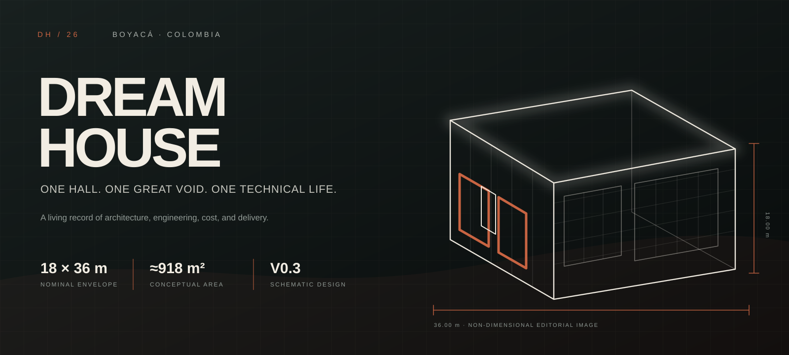
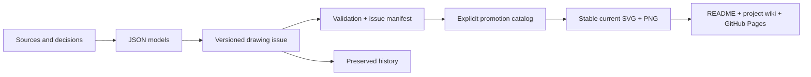

<p align="center">
  
</p>

<p align="center">
  <a href="https://bultodepapas.github.io/DremHouse/"><strong>Explore the presentation</strong></a>
  &nbsp;·&nbsp;
  <a href="planos/README.md"><strong>Current drawings</strong></a>
  &nbsp;·&nbsp;
  <a href="docs/README.md">Open the project record</a>
  &nbsp;·&nbsp;
  <a href="docs/00_gobernanza/registro_decisiones.md">Review decisions</a>
  &nbsp;·&nbsp;
  <a href="CONTRIBUTING.md">How to contribute</a>
</p>

<p align="center">
  <a href="https://github.com/bultodepapas/DremHouse/actions/workflows/showcase.yml"></a>
</p>

# Dream House

A **residential and technical warehouse house in Boyacá, Colombia**: a home,
RC/DIY workshop, technology space, and a single project car contained within one
simple industrial hall. This repository is the living project record that
coordinates design intent, geometry, engineering, cost, decisions, and delivery.

> [!IMPORTANT]
> **Schematic design — not for construction.** The exact site and its technical
> studies are not yet available. Renders, sketches, and visualisations are never
> dimensional authorities.

## At a glance

**18 × 36 m** industrial hall · **648 m²** ground floor · **≈270 m²** partial
upper floor · **≈918 m²** conceptual gross floor area · **4** permanent suites ·
**2** delivery phases

The guiding idea is deliberately simple:

> One box + one structure + one great void + light + carefully organised
> technical objects + one final wall.

Luxury should come from proportion, height, light, landscape, silence,
structure, and performance—not from arbitrary forms or decorative layers.

## Current project drawings

<!-- showcase:begin -->
<p align="center">
  <sub><strong>22</strong> current SVG/PNG pairs · <strong>71</strong> preserved versioned sheets · <strong>56</strong> documents · <strong>50</strong> decisions · <strong>6</strong> open conflicts</sub>
</p>

<table>
<tr>
<td width="50%" valign="top">
  <a href="planos/actual/DH-ARQ-PLN-001_CURRENT-GROUND-FLOOR.svg"></a>
  <br><sub><strong>Architecture · ground floor</strong> · 0.3-borrador-05-PB</sub>
  <br><strong>Ground-floor plan</strong>
  <br><sub><a href="planos/conceptual_v0.3_b05_pb/DH-ARQ-PLN-001-R04_PB-DETALLADA.svg">Versioned source</a> · stable current SVG/PNG above</sub>
</td>
<td width="50%" valign="top">
  <a href="planos/actual/DH-ARQ-PLN-002_CURRENT-UPPER-FLOOR.svg"></a>
  <br><sub><strong>Architecture · upper floor</strong> · 0.3-draft-15-P2</sub>
  <br><strong>Upper-floor plan</strong>
  <br><sub><a href="planos/conceptual_v0.3_b15_p2/DH-ARQ-PLN-002-R12_P2-COORDINATED.svg">Versioned source</a> · stable current SVG/PNG above</sub>
</td>
</tr>
<tr>
<td width="50%" valign="top">
  <a href="planos/actual/DH-ARQ-PLN-CUB-001_CURRENT-ROOF.svg"></a>
  <br><sub><strong>Architecture · roof</strong> · 0.4-I01-ROOFLIGHTS</sub>
  <br><strong>Roof and rooflight plan</strong>
  <br><sub><a href="planos/integracion_v0.4_i01/rooflights/DH-ARQ-PLN-CUB-001-R11_D054-HALF-CENTRES.svg">Versioned source</a> · stable current SVG/PNG above</sub>
</td>
<td width="50%" valign="top">
  <a href="planos/actual/DH-ARQ-SEC-002_CURRENT-TRANSVERSE.svg"></a>
  <br><sub><strong>Architecture · transverse section</strong> · 0.3-borrador-07-CUBIERTA</sub>
  <br><strong>Mono-pitch roof section</strong>
  <br><sub><a href="planos/conceptual_v0.3_b07_cubierta/DH-ARQ-SEC-002-R06_TRANSVERSAL-CUBIERTA.svg">Versioned source</a> · stable current SVG/PNG above</sub>
</td>
</tr>
<tr>
<td width="50%" valign="top">
  <a href="planos/actual/DH-ARQ-ELE-001_CURRENT-FRONT.svg"></a>
  <br><sub><strong>Architecture · front elevation</strong> · 0.3-borrador-07-CUBIERTA</sub>
  <br><strong>Front façade</strong>
  <br><sub><a href="planos/conceptual_v0.3_b07_cubierta/DH-ARQ-ELE-001-R06_FACHADA-FRONTAL-CUBIERTA.svg">Versioned source</a> · stable current SVG/PNG above</sub>
</td>
<td width="50%" valign="top">
  <a href="planos/actual/DH-ARQ-ELE-002_CURRENT-REAR.svg"></a>
  <br><sub><strong>Architecture · rear elevation</strong> · 0.3-borrador-07-CUBIERTA</sub>
  <br><strong>Rear façade</strong>
  <br><sub><a href="planos/conceptual_v0.3_b07_cubierta/DH-ARQ-ELE-002-R06_FACHADA-POSTERIOR-CUBIERTA.svg">Versioned source</a> · stable current SVG/PNG above</sub>
</td>
</tr>
<tr>
<td width="50%" valign="top">
  <a href="planos/actual/DH-ARQ-DET-003_CURRENT-P2-ACOUSTIC-PARTITION.svg"></a>
  <br><sub><strong>Architecture · acoustic partition</strong> · 0.3-draft-15-P2</sub>
  <br><strong>P2-W01 · 250 mm acoustic wall</strong>
  <br><sub><a href="planos/conceptual_v0.3_b15_p2/DH-ARQ-DET-003-R12_P2-ACOUSTIC-PARTITION.svg">Versioned source</a> · stable current SVG/PNG above</sub>
</td>
<td width="50%" valign="top">
  <a href="planos/actual/DH-ARQ-DET-004_CURRENT-P2-HALL-EDGE.svg"></a>
  <br><sub><strong>Architecture · acoustic hall edge</strong> · 0.3-draft-15-P2</sub>
  <br><strong>P2-W04 · continuous hall-edge enclosure</strong>
  <br><sub><a href="planos/conceptual_v0.3_b15_p2/DH-ARQ-DET-004-R12_P2-HALL-EDGE.svg">Versioned source</a> · stable current SVG/PNG above</sub>
</td>
</tr>
<tr>
<td width="50%" valign="top">
  <a href="planos/actual/DH-ARQ-DET-005_CURRENT-P2-EXTERIOR-WALL.svg"></a>
  <br><sub><strong>Architecture · refined P2 envelope</strong> · 0.3-draft-15-P2</sub>
  <br><strong>P2-W05 · double-frame exterior wall</strong>
  <br><sub><a href="planos/conceptual_v0.3_b15_p2/DH-ARQ-DET-005-R12_P2-EXTERIOR-WALL.svg">Versioned source</a> · stable current SVG/PNG above</sub>
</td>
<td width="50%" valign="top">
  <a href="planos/actual/DH-EST-E1-001_CURRENT-SYNTHESIS.svg"></a>
  <br><sub><strong>Engineering · E1 screening</strong> · 0.3 + E1 0.2</sub>
  <br><strong>Integrated structural evidence</strong>
  <br><sub><a href="planos/estructura/DH-EST-E1-001_SINTESIS-ESTRUCTURAL.svg">Versioned source</a> · stable current SVG/PNG above</sub>
</td>
</tr>
<tr>
<td width="50%" valign="top">
  <a href="planos/actual/DH-EST-E1-002_CURRENT-VERTICAL-CONTINUITY.svg"></a>
  <br><sub><strong>Engineering · vertical continuity</strong> · 0.3 + E1 0.2</sub>
  <br><strong>Stair-frame continuity</strong>
  <br><sub><a href="planos/estructura/DH-EST-E1-002_CONTINUIDAD-VERTICAL-ESCALERA.svg">Versioned source</a> · stable current SVG/PNG above</sub>
</td>
</tr>
</table>

<p align="center"><sub>Every thumbnail uses a stable file in <code>planos/actual/</code>; open it for the current SVG or follow its versioned source for history.</sub></p>
<!-- showcase:end -->

The gallery always reads the stable SVG/PNG pairs in [`planos/actual/`](planos/actual/).
Each alias retains its versioned source, revision, status, and hashes; replacing an alias
never deletes its predecessor. [Open the complete current drawing index →](planos/README.md)

The drawings remain **coordination hypotheses**. “Current” identifies the issue used for
coordination; it does not freeze a design or grant dimensional or construction authority.
The [document precedence](docs/00_gobernanza/fuentes_precedencia_y_conflictos.md) continues
to govern.

## One architecture, four movements

### 01 · Technical

The open RC/DIY workshop and the project car with its lift are part of daily
life in the house. They are not annexes to be concealed.

### 02 · Monumental

The double-height front zone preserves the great void of the industrial hall,
making its steel structure, light, and scale fully legible.

### 03 · Domestic

Living, dining, and kitchen spaces occupy the transition towards the rear
without turning the ground floor into a collection of enclosed rooms.

### 04 · Private

The partial upper floor brings together four suites, wellness spaces, and
services behind an acoustically enclosed envelope.

## Navigate the project record

| Area             | Entry document                                                                            | Governs                                           |
| ---------------- | ----------------------------------------------------------------------------------------- | ------------------------------------------------- |
| **Current views** | [Current Drawing Index](planos/README.md)                                                 | Stable SVG/PNG aliases and versioned provenance   |
| **Governance**   | [Project Constitution](docs/00_gobernanza/constitucion_del_proyecto.md)                   | Hard rules, precedence, and controlled change     |
| **Architecture** | [Design Basis](docs/02_arquitectura/bases_de_diseno.md)                                   | Space, materiality, and geometric coordination    |
| **Engineering**  | [Structural and Civil Design Basis](docs/03_ingenierias/bases_estructurales_y_civiles.md) | Assumptions, systems, and professional validation |
| **Cost**         | [Cost Baseline and Control](docs/04_costos/base_y_control_de_costos.md)                   | Target, confidence, gaps, and cost gates          |
| **Site**         | [Site Criteria](docs/05_predio_y_normativa/criterios_del_predio.md)                       | Location, regulations, and pending studies        |
| **Delivery**     | [Master Plan](docs/06_gestion_y_obra/plan_maestro.md)                                     | Phases, deliverables, and decision gates          |

[View the complete index →](docs/README.md)

## From data to drawing



The drawings are not isolated images. Versioned issues preserve source, revision, and
checks in `manifest.json`; the explicit promotion catalog then generates stable current
aliases. A larger revision number never becomes current by accident.

```powershell
# Install the lightweight cross-platform PNG renderer once
python -m pip install -e ".[presentation]"

# Synchronize current aliases, refresh the gallery, and build the presentation
python .github/scripts/sync_current_drawings.py --write
python .github/scripts/build_showcase.py --write-readme --site-dir .build/showcase

# Validate that sources, aliases, PNG metadata, hashes, indexes, and README agree
python .github/scripts/sync_current_drawings.py --check
python .github/scripts/build_showcase.py --check-readme

# Preview at http://localhost:8000
python -m http.server 8000 --directory .build/showcase
```

## Status and limitations

- **Phase:** consolidated definition and dimensional schematic design.
- **Document cutoff:** 13 August 2026.
- **Primary blocker:** exact site, topographic survey, geotechnical investigation, and planning assessment.
- **Cost alert:** the active control target for physical construction is
  **≈COP 988.05 million**, with a critical gap against the historical estimate;
  it is neither a contract price nor the developer's total project cost.

> [!WARNING]
> This repository does not replace planning permission, site investigations,
> signed designs, engineering calculations, independent review, a contract
> budget, construction management, or technical site supervision.

## With gratitude

> A sincere thank-you to **OpenAI**. The Pro subscription has helped this
> open-source project move forward with greater clarity, care, and ambition.
> That support is genuinely appreciated.

<details>
<summary><strong>Preserved original sources</strong></summary>

The four source documents remain unchanged and in Spanish under
`docs/BORN_Legacy/`:

- [Schematic-design conclusions](docs/BORN_Legacy/casa_bodega_boyaca_conclusiones_anteproyecto.md)
- [Concept drawing v0.2](docs/BORN_Legacy/Dream_House_Plano_Conceptual_v0.2.md)
- [Technical budget v0.2](<docs/BORN_Legacy/Dream House — Presupuesto Técnico y Control de Costos v0.2.docx>)
- [Preliminary budget v0.1](docs/BORN_Legacy/Dream_House_Presupuesto_Preliminar_v0.1.md)

</details>

---

<p align="center"><sub>Boyacá, Colombia · living project record · decisions are recorded, never overwritten without history.</sub></p>
