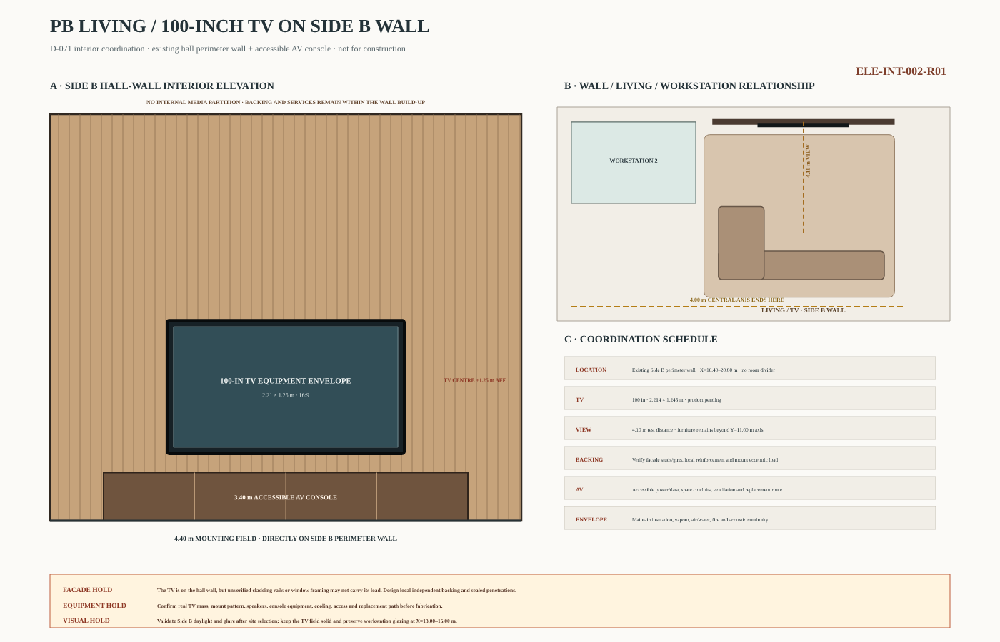
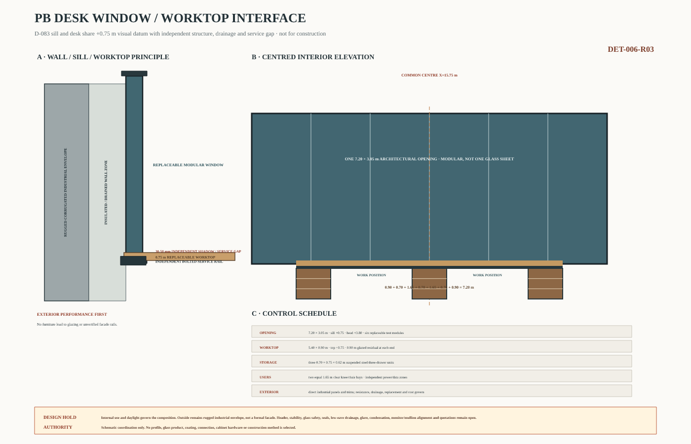
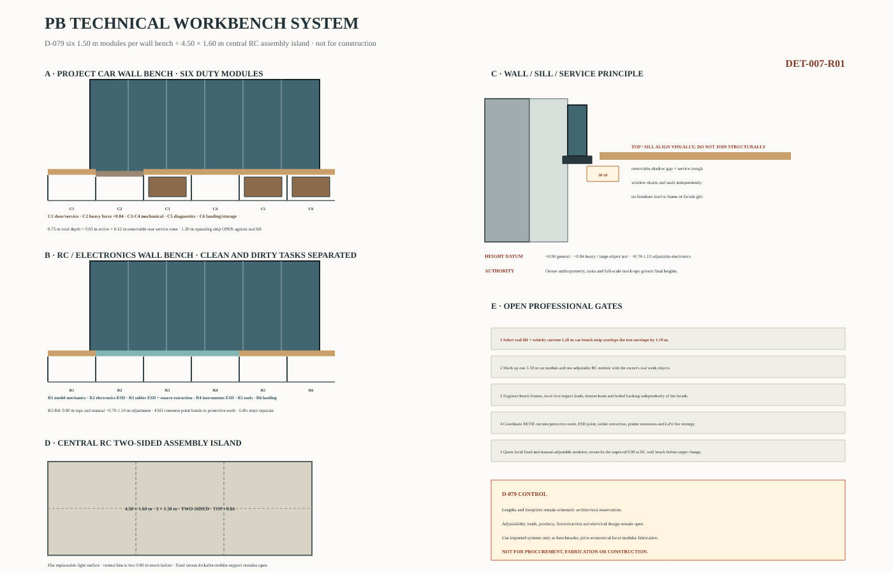
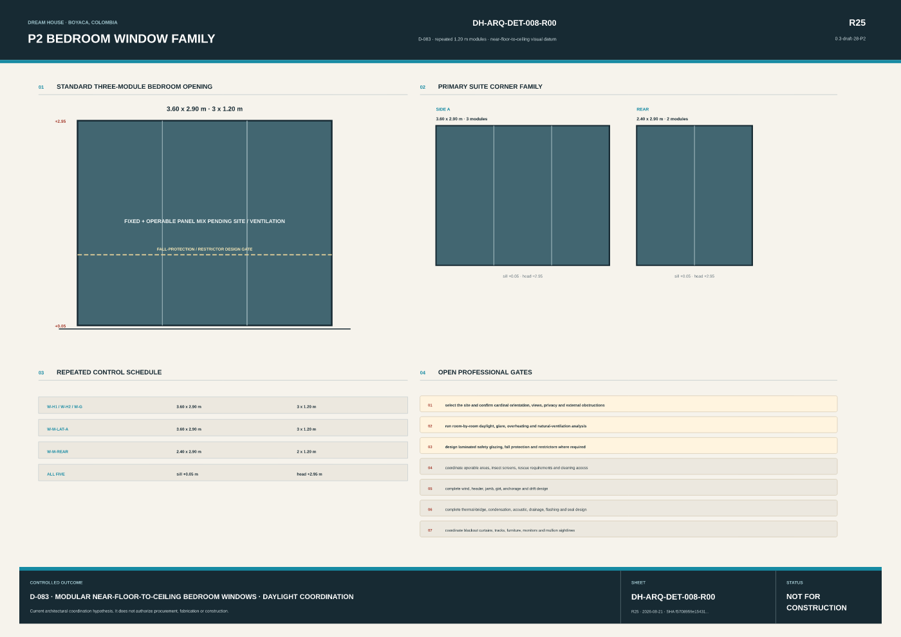
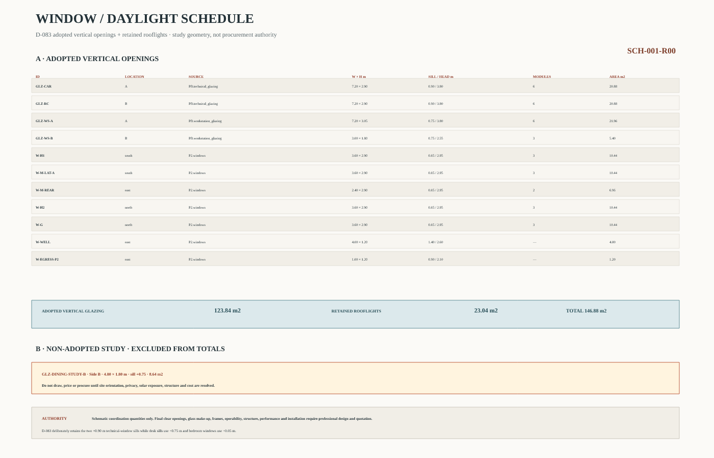

# Current drawings and visual index

**Status:** active publication guide; source-sheet limitations remain in force 
**Version:** 1.25 
**Date:** 2026-08-21 
**Source:** [current-drawing catalog](../../planos/actual/catalog.json) and D-056

This page is the visual entry point to the current coordinated state of Dream House. It
uses stable files under [`planos/actual/`](../../planos/actual/) so links in the project
record, repository README, and presentation do not change when a new issue is promoted.

> [!WARNING]
> These are schematic coordination drawings, not construction documents. A current alias
> means “the issue presently used for coordination”; it does not freeze a hypothesis or
> override the [source precedence](../00_gobernanza/fuentes_precedencia_y_conflictos.md).

## Current visual set

<table>
<tr>
<td width="50%" valign="top">
  
   <strong>Ground-floor plan</strong>
   0.3-draft-37-PB · <a href="../../planos/conceptual_v0.3_b37_pb/DH-ARQ-PLN-001-R15_PB-WINDOW-DAYLIGHT-DATUMS.svg">versioned source</a>
</td>
<td width="50%" valign="top">
  
   <strong>Upper-floor plan</strong>
   0.3-draft-28-P2 · <a href="../../planos/conceptual_v0.3_b28_p2/DH-ARQ-PLN-002-R25_P2-COORDINATED.svg">versioned source</a>
</td>
</tr>
<tr>
<td width="50%" valign="top">
  
   <strong>Roof and rooflight plan</strong>
   0.4-I01-ROOFLIGHTS · <a href="../../planos/integracion_v0.4_i01/rooflights/DH-ARQ-PLN-CUB-001-R11_D054-HALF-CENTRES.svg">versioned source</a>
</td>
<td width="50%" valign="top">
  
   <strong>Mono-pitch roof section</strong>
   0.3-borrador-07-CUBIERTA · <a href="../../planos/conceptual_v0.3_b07_cubierta/DH-ARQ-SEC-002-R06_TRANSVERSAL-CUBIERTA.svg">versioned source</a>
</td>
</tr>
<tr>
<td width="50%" valign="top">
  
   <strong>Front façade</strong>
   0.3-borrador-07-CUBIERTA · <a href="../../planos/conceptual_v0.3_b07_cubierta/DH-ARQ-ELE-001-R06_FACHADA-FRONTAL-CUBIERTA.svg">versioned source</a>
</td>
<td width="50%" valign="top">
  
   <strong>Rear façade</strong>
   0.3-draft-37-PB · <a href="../../planos/conceptual_v0.3_b37_pb/DH-ARQ-ELE-002-R07_REAR-WINDOW-DAYLIGHT.svg">versioned source</a>
</td>
</tr>
<tr>
<td width="50%" valign="top">
  
   <strong>PB living / 100-inch TV on Side B wall</strong>
   0.3-draft-27-PB · <a href="../../planos/conceptual_v0.3_b27_pb/DH-ARQ-ELE-INT-002-R01_PB-100IN-SIDE-B-WALL.svg">versioned source</a>
</td>
<td width="50%" valign="top">
  
   <strong>PB Side A shared two-person workstation</strong>
   0.3-draft-37-PB · <a href="../../planos/conceptual_v0.3_b37_pb/DH-ARQ-DET-006-R03_PB-DESK-WINDOW-INTERFACE.svg">versioned source</a>
</td>
</tr>
<tr>
<td width="50%" valign="top">
  
   <strong>PB modular technical workbench system</strong>
   0.3-draft-36-PB · <a href="../../planos/conceptual_v0.3_b36_pb/DH-ARQ-DET-007-R01_PB-TECHNICAL-WORKBENCH-SYSTEM.svg">versioned source</a>
</td>
<td width="50%" valign="top">
  
   <strong>P2 modular near-floor-to-ceiling window family</strong>
   0.3-draft-28-P2 · <a href="../../planos/conceptual_v0.3_b28_p2/DH-ARQ-DET-008-R00_P2-BEDROOM-WINDOW-FAMILY.svg">versioned source</a>
</td>
</tr>
<tr>
<td width="50%" valign="top">
  
   <strong>Window and daylight schedule</strong>
   0.3-draft-37-PB · <a href="../../planos/conceptual_v0.3_b37_pb/DH-ARQ-SCH-001-R00_D083-WINDOW-SCHEDULE.svg">versioned source</a>
</td>
<td width="50%" valign="top">
  
   <strong>P2 walls · 90 / 150 / 200 / 230 mm by duty</strong>
   0.3-draft-25-P2 · <a href="../../planos/conceptual_v0.3_b25_p2/DH-ARQ-DET-003-R22_P2-ACOUSTIC-PARTITION.svg">versioned source</a>
</td>
</tr>
<tr>
<td width="50%" valign="top">
  
   <strong>P2-W04R · open balcony / retained suite edge</strong>
   0.3-draft-25-P2 · <a href="../../planos/conceptual_v0.3_b25_p2/DH-ARQ-DET-004-R22_P2-HALL-EDGE.svg">versioned source</a>
</td>
<td width="50%" valign="top">
  
   <strong>P2-W05 · 230 mm insulated shell + lining</strong>
   0.3-draft-25-P2 · <a href="../../planos/conceptual_v0.3_b25_p2/DH-ARQ-DET-005-R22_P2-EXTERIOR-WALL.svg">versioned source</a>
</td>
</tr>
<tr>
<td width="50%" valign="top">
  
   <strong>Integrated structural evidence</strong>
   0.3 + E1 0.2 · <a href="../../planos/estructura/DH-EST-E1-001_SINTESIS-ESTRUCTURAL.svg">versioned source</a>
</td>
<td width="50%" valign="top">
  
   <strong>Stair-frame continuity</strong>
   0.3 + E1 0.2 · <a href="../../planos/estructura/DH-EST-E1-002_CONTINUIDAD-VERTICAL-ESCALERA.svg">versioned source</a>
</td>
</tr>
</table>

[Open the complete drawing index →](../../planos/README.md)

## What the set contains

The publication layer currently contains **27 SVG/PNG pairs**:
**22 architectural views** and **5 structural coordination
views**. It covers both floor plans, roof and rooflights, longitudinal and transverse
sections, all four exterior elevations, the Great Wall and service core, access/egress,
owner-priority interfaces, the D-083 bedroom/desk window family and opening schedule,
the D-079 corner-start technical workbenches, D-071 PB living/Side B TV wall and
D-078/D-069 workstation/cabinet family, structural
plans/elevations, the hybrid-wall study, E1 screening, and stair-frame vertical
continuity.

The set must be read together:

- the D-083 ground-floor sheet retains D-050's laundry relocation through the current
  owner-priorities detail;
- the ground-floor plan and TV-wall elevation coordinate the D-071 living group directly
  against the Side B perimeter wall, independent dining and clear pedestrian axis; the
  earlier Side B issue removes the unassigned alternative opening;
- the same ground-floor plan coordinates D-073's two 9.00 m technical benches from their
  front interior corners and retains D-072's inward-shifted lift envelope; door-jamb and
  real equipment clearances remain open;
- the D-083 Side A/Side B elevations and PB workstation detail align both desk-window
  sills with the +0.75 m worktops while keeping the technical windows at +0.90 m; the P2
  window detail uses repeated 1.20 m near-floor-to-ceiling modules. Secondary steel,
  joinery, rugged-envelope performance,
  facade structure, TV-wall backing, AV and MEP interfaces remain open;
- the D-083 rear façade shows the active primary/wellness windows and retained D-082
  rescue window with vertical foldout ladder; CF-012 remains open;
- roof form is represented by the b07 sections and façades, while the current rooflight
  position is represented by the 0.4-I01/D-054 roof plan and daylight section; and
- structural sheets are screening and coordination evidence only; they do not select a
  frame, member, joint, foundation, fire system, or construction method.

## Traceability

Every current SVG is identical to its preserved versioned source. Every PNG carries the
source revision and SHA-256 hash as embedded metadata. The generated
[publication manifest](../../planos/actual/manifest.json) records both aliases, their
hashes, their versioned source, status, and adjacent issue manifest.

Promotion is explicit. The workflow never decides that a drawing is current merely
because its filename contains a larger revision number. See the
[drawing-directory guide](../../planos/README.md) for the update procedure.
