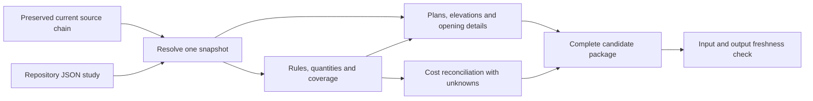

# Connected coordination workflow

**Version:** 0.1  
**Date:** 2026-10-02  
**Status:** implemented first source-to-review increment; schematic coordination only  
**Source:** owner authorization to implement the [phased plan](connected_project_coordination_next_step.md),
the [current-source audit](connected_source_inventory.md), PB b37/P2 b28/D-083, SC-01 and rooflight b12.  
**Decision:** D-084. Software workflow authority does not adopt a changed house design.

## What now works

One Python command resolves the current architectural sources into a shared model,
evaluates supported rules, measures openings, reconciles the available cost mappings and
generates seven connected review SVGs plus a read-only HTML index. Changes originate in a
JSON study in the repository. Generated SVGs are outputs; no graphical editor or SVG
write-back exists.

The first registry contains 105 entities: 14 openings including the excluded dining
study, 30 doors including seven with unresolved placement, 26 space rectangles, 28 host
reference lines, four stair-column plan reservations and three stair envelopes. This is
an explicitly bounded coordination registry, not a complete building information model.
The host lines do not select wall assemblies; the reservations do not select columns.

The five `GLZ-*` bedroom elevation references are aliases of the corresponding `W-*`
entities. Their dimensions are calculated once. The new views and opening measurements
use those same objects, avoiding duplicate window quantities.



## Run the current-source review

From the repository root, with Python 3.11 or later and the project dependencies installed:

```bash
python3 -m dreamhouse.coordination
python3 -m dreamhouse.coordination --check
```

The installed entry point is `dreamhouse-coordinate`. Run it from an editable repository
checkout: this workflow deliberately depends on governance and published-source files
outside the Python package. A standalone wheel is not a complete project archive.

The command prints the generated `index.html` path. Open that file locally. The index
embeds the SVGs, supports read-only entity selection and exposes their findings. It does
not require a web server. `.build/coordination/latest.json` identifies the most recent
complete review; its `issue_id` selects `.build/coordination/issues/<issue_id>/`.

All candidate artifacts are in `.build/`, which is ignored by Git. Version the authored
study JSON in an appropriate repository folder when retaining a real study. CI retains
its generated review package as a downloadable artifact. Existing current aliases and
historical issue folders are not promoted by this command.

The package includes:

| Artifact | Purpose |
| --- | --- |
| `model.json` | Resolved identities, geometry, aliases, sources, relations, requested changes and conservative dependency hashes |
| `openings.json`, `quantities.json` | Active nominal opening measurements, excluded studies and explicit quantity-family mapping |
| `findings.json`, `coverage.json` | Rule findings, required inputs, numerical tolerance and evaluated/unsupported/inapplicable coverage |
| `changes.json`, `finding_lifecycle.json` | Comparison with the preserved current baseline, including prior finding evidence |
| `cost.json` | Existing cost-code reconciliation; unmapped or ineligible costs stay unknown; no approved total |
| `drawing_inventory.json` | All 27 published aliases, source hashes and pending migration status |
| `view_inventory.json` | Per-view SVG occurrences, entity coverage denominator and explicit missing occurrences |
| Seven SVGs and `index.html` | PB/P2 plans, Side A/Side B/front/rear elevations and opening details, all generated from the snapshot |
| `review.md`, `manifest.json` | Readable review and complete output inventory with SHA-256 hashes and explicit authority |

Output paths inside the repository must be under `.build/`; external temporary/review
directories are also supported. Source/document/historical drawing folders are rejected
before either the build or freshness checker creates a lock or output file.

The nominal vertical opening total is **123.84 m²** and the rooflight total **23.04 m²**.
Workstation glazing is **27.36 m²**, in its own `PB-WORKSTATION-GLAZING` assembly. Nominal
opening area is not net glass area. The new ledger deliberately covers openings and
rooflight curbs; it is not the old integration pipeline's floor/programme ledger or a
whole-house takeoff. The older D059 scenario remains reproducible through its original
loader and command.

## Author and inspect a change

Create a study pinned to the current baseline:

```bash
python3 -m dreamhouse.coordination --study-template .build/studies/example.json --scenario-id EXAMPLE_ONLY
```

Edit the resulting JSON's `changes` object. This example changes a parameter in an
unadopted test scenario; it is not a proposed house change or a diagnosed current conflict:

```json
{
  "W-H1": {
    "expected": {"start_m": 21.8},
    "set": {"start_m": 22.0}
  }
}
```

Keep the generated `base_model_hash` and other top-level fields. Then run:

```bash
python3 -m dreamhouse.coordination --project .build/studies/example.json --out .build/study-review
python3 -m dreamhouse.coordination --project .build/studies/example.json --out .build/study-review --check
```

Use canonical entity IDs, not aliases or list positions. `expected` must contain exactly
the fields in `set`. The base fingerprint rejects a study based on changed source
semantics. Expected numeric values use a 1e-9 absolute comparison tolerance so ordinary
decimal authoring does not require binary-float display artifacts. Rule geometry uses
its separately declared numerical tolerance; neither tolerance specifies a construction
allowance.

Supported changes are `start_m`, `width_m`, `height_m`, `sill_m` and `modules` for located
active windows/doors; rooflights support `x_m`, `y_m`, `length_m` and `width_m`. These
fields resolve through the existing host and level. Host reassignment, element addition,
deletion, room restructuring, product adoption and unresolved PB door placement are not
implemented authoring operations. An unsupported operation fails with a diagnostic.
Supplying a missing door height in a study creates an explicit assumption for that study;
it does not resolve the source design or approve the product.

An invalid input structure prevents generation. A structurally valid study with a
geometric FAIL remains available for inspection, with a FAIL manifest. Add
`--require-no-fail` when a caller needs exit code 2 for such findings. Exit code 0 from
the normal build means that the candidate was built, not that its design passed. `OPEN`
continues to mean unresolved even when no FAIL exists.

## Checks and limits

The evaluator checks nominal dimensions/family mappings, host extents, overlap of
openings sharing a host and opening/column interference when a supported column solid
and vertical extents are actually available. Source-declared module widths, window
placement on the boundary of its referenced space and rooflight plan containment also
have explicit checks. It enumerates candidate pairs afresh on
every run. Tests use clearly synthetic column boxes to verify interference, touching,
height separation, containment and missing-data behaviour. They do not assert that a
column clash exists in this house.

Actual SC-01 columns remain plan reservations with unknown heights. They produce
coverage gaps; a plan intersection with a located opening is reported as an OPEN pair
for review, not a confirmed solid collision or a claim of structural clearance. Definite plan overrun can fail a
host check while unknown host height still prevents a full containment pass. P2 door
heights, ambiguous PB door anchors and unsupported solids remain explicit. A disappeared
finding does not automatically become resolved; resolution requires a supported,
evaluated passing result. Removed or no-longer-applicable pairs retain their prior evidence.

CF-009, CF-010, CF-011 and CF-012 remain open. The command does not calculate a new
structural design, fire approval, daylight simulation, MEP route, wall mass, thermal
performance or installed budget. Those consumers must be adapted and supplied with
their actual required data before their results can become part of the connected issue.

The source audit also records **CF-013**: PB core/rear door anchors differ between
archived plan, detail and elevation renderers. Their scalar source values remain in the
snapshot, but this increment deliberately leaves their endpoints unresolved pending
architectural reconciliation.

## Freshness, recovery and reproducibility

The build fingerprint conservatively covers package Python/JSON files, the study,
relevant governance, the current catalog and its source SVG/manifests, packaging and
available repository font files. This is deliberately a full-rebuild dependency set,
not a claim of minimal impact analysis. Model meaning has a separate fingerprint from
source paths and file bytes. The sorted Python JSON hash policy is explicitly not JCS.

The builder serializes concurrent writers to one output root using a local file lock,
writes to a staging directory, verifies the complete artifact inventory and rechecks
the inputs before exposing the issue through an atomic `latest.json` replacement. It
preserves prior complete packages. A renderer failure or changed input during the build
does not replace the previous pointer. `--check` detects edited SVGs, missing/extra
artifacts, changed manifests and stale source/code dependencies. It never imports a
manual SVG change back into the model.

A source edit after publication can make any previously built package stale; rerun
`--check` or rebuild before relying on it. Candidate locking uses `fcntl` and currently
targets Linux/macOS repository workflows. This is candidate publication only; atomic
promotion of all current catalog aliases is a separate rollout task. For recovery,
open the desired retained issue's `index.html` and manifest; do not relabel it fresh
without comparing it to its original inputs.

The first artifacts are SVG/HTML/JSON/Markdown. Text uses viewer font fallbacks; pixel
equivalence across machines is not certified. PNG exports, fixed-font rendering,
contact sheets, full sectioned construction details and visual-diff CI remain acceptance
work. The existing drawing set retains its publication process while these consumers
are migrated.

## Extension points and next acceptance gates

- `dreamhouse/coordination/model.py`: source ownership, normalization, identities,
  strict study validation and freshness inputs. Add a family here only with a source
  and an explicit geometry capability.
- `dreamhouse/coordination/rules.py`: pure evaluation and rule metadata. New rules need
  supported-input criteria, failure/unknown fixtures and explicit engineering limits.
- `dreamhouse/coordination/render.py`: pure snapshot-to-SVG/HTML projections. New
  occurrences need stable entity/view IDs, anchored measurements and propagation tests.
- `dreamhouse/coordination/pipeline.py`: complete-package assembly. Register each new
  artifact in the same manifest; do not add independent source reloads inside consumers.

Before extending authoring beyond openings, finish the phase gates recorded in the
plan: adapt the existing discipline checks, provide a per-view occurrence/anchor
inventory and the complete section/detail plate, harden visual export, then migrate
the remaining consumers and current aliases. The 27-row audit makes that remaining
work explicit. No missing engineering geometry is filled in merely to advance a phase.

## Verified implementation evidence — 2026-10-02

| Check | Result |
| --- | --- |
| Full repository unittest discovery | 353 tests passed; historical regressions retained |
| Final renderer regression check | 10 tests passed, including floor datums and visible failure priority |
| Ruff on coordination and quantities | Passed |
| Current drawing provenance | All 27 SVG/PNG pairs passed; no source promotion |
| Generated README consistency | Passed |
| Candidate build, repeat build and freshness verification | Passed; full artifact inventories agree for matching inputs |
| Resolved baseline | 105 entities; 98 have SVG occurrences; seven unresolved PB doors remain in the registry/findings |
| Baseline findings | 53 PASS, 138 OPEN, zero FAIL; these counts include coverage and standing professional gates |
| Visual review | P2 footprint, opening detail plate, Side A and rear projections rendered locally; finding text wrapping and absolute PB/P2 datums checked |

```bash
python3 -m unittest discover -s dreamhouse -p 'test_*.py'
python3 -m ruff check dreamhouse/coordination dreamhouse/quantities
python3 .github/scripts/sync_current_drawings.py --check
python3 .github/scripts/build_showcase.py --check-readme
python3 -m dreamhouse.coordination --require-no-fail
python3 -m dreamhouse.coordination --check --require-no-fail
```

The GitHub workflow is configured in `.github/workflows/coordination.yml`; remote CI
execution is not claimed by this local verification record. These checks establish
the implemented candidate workflow, not completion of the remaining plan phases.
