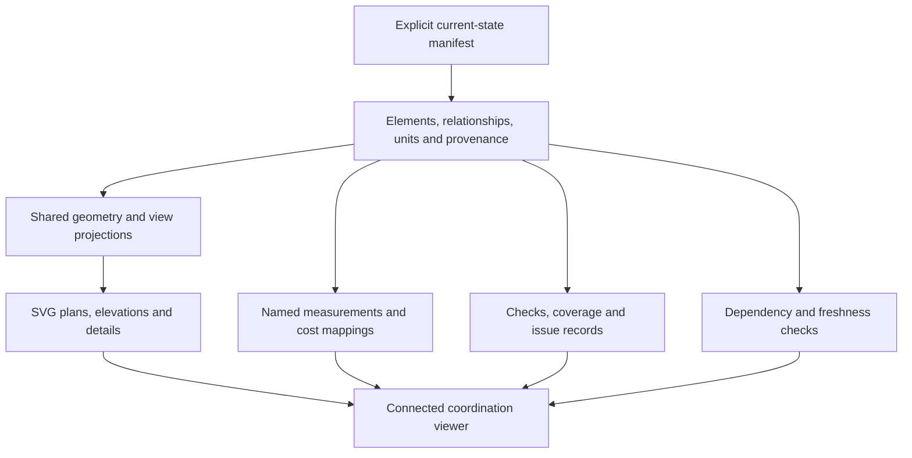
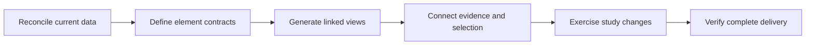

# Connected project coordination — recommended next step

**Status:** repository assessment and proposed next increment; not adopted for implementation<br>
**Version:** 0.3<br>
**Date:** 2026-10-02<br>
**Source:** owner's request to understand the repository and recommend meaningful progress
toward clearer, connected, automatically generated project information; repository review,
code inspection, numerical probes and validation performed in the same conversation;
subsequent owner-requested internet research against primary sources, recorded in
[twelve foundation investigations](../08_investigacion/connected_coordination_research_2026_10.md)
and [ten additional delivery investigations](../08_investigacion/connected_coordination_delivery_research_2026_10.md).<br>
**Reviewed baseline:** Git commit `24479a9`, with a clean working tree before this document.<br>
**Delivery review baseline:** Git commit `d5ea6ca`, containing v0.2 and the first research round.<br>
**Authority:** recommendation only. Recording this assessment does not adopt a design,
change scope or cost, promote a drawing, or close a professional design gate.

**Revision note:** v0.3 adds an incremental delivery sequence, controlled scenario edits,
fingerprint and tolerance policies, associative dimensions, connected window details,
purpose-specific information requirements and complete-package publication controls.
It draws on 22 investigations across two rounds. The baseline findings and 306-test result
below belong to the original assessment; this documentation revision does not claim to
have implemented or tested the proposed system.

## 1. Recommendation and project intent

The next significant step is to make one part of the house traceable, with a persistent
identity, from its definition through drawings, quantities, conflicts and pending
decisions. Start with one element family and complete that entire connection.

Dream House's purpose is a simple industrial hall that accommodates a rich domestic and
technical life: family, making, work and landscape together. Precision should concentrate
on the relationships that make this possible: how daylight enters, how people sleep while
the ground floor is active, how an installation can be maintained, and how the house can
be completed in phases. The repository should make those relationships visible and
testable.

This interpretation follows the [Project Constitution](../00_gobernanza/constitucion_del_proyecto.md),
[master brief](../01_brief/brief_maestro.md) and
[spatial relationships](../01_brief/relaciones_y_experiencia.md). The active
[source precedence and conflict register](../00_gobernanza/fuentes_precedencia_y_conflictos.md)
continues to govern every value and unresolved interface.

Progress can therefore mean reducing uncertainty, exposing a dependency or making a
proposal easier to evaluate before any new architectural decision is made.

The immediate work package is **C01: reconcile the current window state and its
measurements**. Its output should be a small comparison report that a person can inspect.
The connected viewer follows once that report establishes what its drawings and numbers
mean. Section 8.1 defines the sequence and the evidence needed to advance each package.

## 2. Review scope and verified starting point

The review covered governance, programme, architecture, the integration pipeline,
quantities, cost reconciliation, drawing generators, publication and graphic pilots.
Rendered ground-floor and pilot-contact images were also inspected.

The existing foundation is substantial:

- deterministic Python generators and machine-readable JSON inputs;
- versioned drawings and explicit promotion to stable current SVG/PNG aliases;
- input and output provenance checks;
- shared coordination inputs for the stair and recent window family;
- an architecture–structure–quantity–cost pipeline;
- five graphic pilots with readability and rendering controls.

Validation during the assessment produced:

| Check | Observed result |
| --- | --- |
| Repository test discovery | 306 tests passed |
| Current-drawing synchronization check | 27 SVG/PNG pairs and their provenance validated |
| Generated README check | Passed |
| Static lint of GP01–GP05 | 0 errors, 11 warning findings |

These results describe the reviewed baseline. They do not demonstrate complete
coordination across the latest discipline models. The commands used were:

```bash
python3 -m unittest discover -s dreamhouse -p 'test_*.py'
python3 .github/scripts/sync_current_drawings.py --check
python3 .github/scripts/build_showcase.py --check-readme
python3 -m dreamhouse.svg.lint planos/piloto_grafico_v0.1 --format markdown
```

## 3. Verified gaps and their consequences

| Finding | Evidence | Consequence |
| --- | --- | --- |
| Current drawings use PB b37 and P2 b28, while the default integration scenario still loads PB b05 and P2 b15. | [Current catalog](../../planos/actual/catalog.json), [scenario manifest](../../dreamhouse/model/project_v04.json), [model loader](../../dreamhouse/model/io.py). | A reproducible integrated calculation can still represent an earlier house state. |
| The earlier integrated opening schedule gives 96.78 m² of vertical glazing; the current inputs give 123.84 m². | Read-only calls to [the opening schedule builder](../../dreamhouse/envelope/openings.py), using the default scenario and then the PB b37/P2 b28 loaders with the same rooflight input. | File provenance alone does not establish that disciplines consume the same state. These are different scenario totals, not an approved scope or cost delta. |
| Supplying current inputs to the quantity ledger classifies the two workstation windows as rooflight glazing. | [Quantity ledger](../../dreamhouse/quantities/ledger.py): the fallback assembly assignment includes `PB.workstation_glazing`. The probe assigned 21.96 m² for `GLZ-WS-A` and 5.40 m² for `GLZ-WS-B` to `ROOFLIGHT-GLAZING`. | Updating sources also requires checking semantic mappings; a correct area can enter the wrong assembly. |
| Graphic QA is advanced in five pilots but has not become acceptance coverage for the current drawing set. | [Pilot contact audit v0.7](../08_investigacion/svg_pilot_contact_audit_v0.7.md). | Existing work can support a controlled rollout to current drawings. |
| GP01 assigns model-reference identifiers from positions in the copied source SVG. | [Ground-floor pilot generator](../../dreamhouse/svg/pilot_ground_floor.py), including `PB-SOURCE-{source_index:03d}`. | These identify copied drawing nodes, rather than a persistent building element shared by plan, elevation and quantities. |

The integration lag is partly acknowledged in the existing
[integration plan](parametric_architecture_structure_cost_integration_plan.md), including
its D-080 current-model gap. This assessment extends that observation to the current
PB/P2 window state and its quantity mapping. It does not invalidate historical evidence
for the scenario that evidence actually describes.

The next improvement should make the connections between disciplines verifiable.

## 4. First complete demonstration: windows and their interfaces

Build a first connected coordination viewer around windows and their interfaces. This
is a manageable family with an existing
[shared D-083 source](../../dreamhouse/window_daylight_d083.json). It connects daylight,
plans, elevations, details, secondary structure, envelope performance and quantities.



For example, selecting `GLZ-WS-A`, the Side A workstation window, should:

1. Highlight the same opening in the ground-floor plan, elevation and interface detail.
2. Show its current schematic definition: **7.20 × 3.05 m**, sill **+0.75 m**, nominal
   rectangular opening area **21.96 m²**, source **D-083**. This measured envelope does
   not establish net glass, ventilation free area or a manufacturer's window size.
3. Show its relationships to the workstation, host wall and unresolved interfaces.
4. Distinguish verified geometry from pending header, glazing, drainage, condensation
   and quotation work.
5. Make the differences from the preceding issue available for inspection.

The drawing becomes an entry point to the element's evidence. The viewer exposes the
model's authority and limitations; it does not create dimensional authority of its own.

### 4.1 Minimum element and relationship contract

The following is a proposed internal contract, informed by investigations
[R01–R03](../08_investigacion/connected_coordination_research_2026_10.md#r01) and
[R06–R07](../08_investigacion/connected_coordination_research_2026_10.md#r06). It does not
require IFC export to start.

| Record | Proposed content | Purpose |
| --- | --- | --- |
| Element identity | Persistent `entity_id`, existing human-readable tag and explicit legacy aliases | Preserve links when labels, file order or geometry change; record replacements separately. |
| Scenario occurrence | Scenario ID, element revision and adopted/study status | Compare alternatives without giving a study current authority. |
| Geometry | Declared length units, project axes, placement, host plane, width/height and elevation datum | Derive view geometry and distinguish local sill levels from project elevations. |
| Relationships | Host wall, void/opening, proposed filling/window assembly and relevant space references | Keep opening, frame and glass semantics distinct; leave unidentified assemblies explicitly unresolved. |
| Measurement | Source entity, named quantity kind, unit, formula/version, deductions and inclusion status | Prevent gross opening area being silently treated as net glass or as a priced assembly. |
| Evidence | Source reference/hash, decision/conflict references and applicable rule IDs | Explain both the value and its unresolved obligations. |

Keep existing project tags unchanged and map known aliases explicitly. A content hash
identifies a version of information; it should not replace the persistent identity of
the element. An unresolved host or filling must be reported rather than invented to make
the record appear complete.

Use a small shared geometric representation sufficient for this family: opening extents,
local placement, project levels and declared plan/elevation projection transforms. This
can be implemented without a complete solid-model kernel. Distinguish projected views
from schematic assembly details: a conceptual detail may share element references and
parameters while still having unsupported construction geometry.

### 4.2 Separate status dimensions

The proposed viewer should show these dimensions independently, following
[R04](../08_investigacion/connected_coordination_research_2026_10.md#r04) and
[R09](../08_investigacion/connected_coordination_research_2026_10.md#r09):

| Dimension | Question answered |
| --- | --- |
| Adoption | Is this an active schematic assumption, an unadopted study or historical evidence? |
| Freshness | Was this result generated from the declared current inputs and generator? |
| Automated checks | Which applicable information and geometry rules passed, failed or remain unevaluated? |
| Professional evidence | Which structural, envelope, safety and other reviews remain open? |
| Cost disposition | Is the quantity mapped, is a comparable rate available, and is its use authorized? |
| Publication authority | For which named purpose was this issue promoted? |

Retain existing `PASS`, `OPEN` and `FAIL` outcomes where applicable; add explicit coverage
and freshness information alongside them. An unsupported check must not disappear from
the coverage report. A current, geometrically consistent window can still have open
structural and cost gates. These are proposed project distinctions, not a claim of
standards certification.

### 4.3 Views and dimensions must declare what they represent

Each proposed view record should carry a view ID, scenario, purpose, projection basis,
scale and crop, plus a cut plane and depth range where applicable. Drawing layers should
distinguish cut elements, projected elements and schematic annotations. A plan symbol
above the cut plane can remain useful if identified as such; it should not imply that
the plane cuts that window. Follow [R18](../08_investigacion/connected_coordination_delivery_research_2026_10.md#r18).

Dimensions should reference the element and named geometric anchors, such as opening
left/right limits or sill/head, with a declared measurement direction and datum. Generate
their numbers from those anchors, retaining unrounded values for calculation and applying
rounding only for display. Record label positions separately. A deleted or ambiguous
anchor should produce an unresolved dimension rather than preserve an apparently valid
old number. These are proposed association rules from
[R19](../08_investigacion/connected_coordination_delivery_research_2026_10.md#r19), not an
instruction to replace the SVG generators with a CAD application.

Information requirements should depend on **element + intended use + delivery milestone**.
A coordination view needs location, dimensions, source and open interfaces; a procurement
package additionally needs reviewed performance requirements and comparable product
evidence. Later installation and maintenance uses need different records. Show coverage
against the selected purpose, including what is unknown, without assigning one global
completion percentage to the house. [R20](../08_investigacion/connected_coordination_delivery_research_2026_10.md#r20)
provides the information-delivery basis; project milestones remain governed locally.

### 4.4 First connected detail plate

Use `GLZ-WS-A` to demonstrate one readable review plate. The following proposed views
share the same selected identity and link back to the same source and issue records:

| View or panel | Automatically derived content | Evidence that remains to be developed |
| --- | --- | --- |
| Location plan | Opening position, host reference and affected workstation | An unresolved host identity is visible until mapped. |
| Elevation | Opening width, sill, head and dimensional anchors | Frame subdivisions and net glass require supported assembly data. |
| Vertical interface section | Opening extents and references to head and sill | Header, support, drainage and thermal interfaces need professional detail development. |
| Head / sill / jamb schematics | Parameter links and callouts to the selected opening | Materials, layer thicknesses, fixings and tolerances remain unresolved where no source exists. |
| Quantity and change panel | Named opening measurement, formula and study delta | Glass area, rates and quotation comparability remain separately pending. |
| Interface evidence panel | Open items, responsible roles, source and required evidence | Approval is recorded through existing project governance. |

For each head, sill and jamb, trace the intended water-management, air-control and thermal
continuity across the window-to-wall interface. Use explicit unresolved segments where
the assembly has not been designed. A visually continuous line is evidence of a drawing
relationship only; it is not proof of watertightness, condensation resistance or structural
adequacy. Research [R21](../08_investigacion/connected_coordination_delivery_research_2026_10.md#r21)
supports these questions without selecting an assembly for Boyacá.

This plate should help the owner see which detail matters next: for example, the opening
size may be consistent while the path by which sill water reaches the exterior is still
undefined. That uncertainty is a useful project output in its own right.

## 5. Three implementation increments and study controls

### 5.1 Establish an unambiguous current state

Provide one entry point that assembles currently adopted models and their dependencies.
Initially, it can reuse existing loaders and generators while preserving all historical
issues.

Declare which portions of earlier studies still apply and which require review. Different
revision numbers across disciplines are acceptable when their compatibility and limits
are explicit.

The proposed output is a reviewable current-state manifest identifying the consumed
sources, their statuses, dependencies and applicable checks. Historical comparison
scenarios remain available with their actual scope clearly stated.

Before connecting the viewer, reproduce the existing PB b37/P2 b28 geometry through the
new entry point, with a comparison report. Correct the workstation-window classification
through an explicit typed mapping; an unknown source family must produce a diagnostic
instead of falling through to rooflights. Preserve current scenario totals as regression
evidence while introducing precise measurement names; do not silently relabel nominal
opening area as measured glass.

Use schema validation for required fields, supported kinds and units, followed by
separate checks for reference integrity, finite numbers, geometric relationships and
quantity mappings. A schema-valid document is only the first validation layer.

Introduce a narrow adapter around the current loaders and compare old and new outputs
for the **same source scenario** before moving a consumer to the new entry point. Record
intended differences separately from parity failures: correcting the workstation cost
mapping must not require reproducing its known error. Retain historical scenario access
and source files. This incremental approach follows
[R13](../08_investigacion/connected_coordination_delivery_research_2026_10.md#r13) and
requires no Git branch or broad rewrite.

Define three distinct fingerprints: original source bytes, a normalized model under a
named serialization policy, and the complete build dependencies. Keep current historical
hashes verifiable under their original policy. The present `canonical_json_hash()` uses
Python's sorted-key JSON serialization; it should not be described as RFC 8785 compliant.
Specify handling of duplicate keys, non-finite values and numeric representation before
using a new fingerprint for caching or scenario preconditions.
[R15](../08_investigacion/connected_coordination_delivery_research_2026_10.md#r15)
explains the distinction; cross-language canonicalization can wait for an actual need.

Keep numerical comparison tolerance, drawing precision, required physical clearance and
construction tolerance separate. Every geometric rule should declare units, comparison
method and boundary behaviour, including whether touching counts as overlap. Use explicit
absolute/relative numerical tolerances where relevant; do not round geometry to make a
clash disappear. Start with the existing rectangle operations and documented limits.
[R16](../08_investigacion/connected_coordination_delivery_research_2026_10.md#r16)
does not justify introducing a polygon engine before the first family needs one.

### 5.2 Connect one element family to multiple views

Give each opening a persistent identity with references to its location, source,
decision, quantities and checks. Preserve that identity in every generated SVG view.

Reuse the existing graphic library and pilot work. Provide a clear primary drawing with
optional dimensions, identifiers and conflict overlays, plus a side panel for detailed
evidence. This supports both an overall reading of the house and closer technical review.

The first connected family should cover the relevant plans, elevations, window/interface
detail and opening schedule. Its common identity must come from the model, independently
of where a primitive happens to appear inside an SVG file.

The current gallery embeds drawings as images. For element selection, the proposed
viewer should mount validated generated SVG as inline document content, with interaction
managed by the host page. Preserve standalone SVG/PNG outputs for publication. Give each
view occurrence a unique DOM `id`, and use a shared `data-entity-id` to connect occurrences
of the same element; do not duplicate DOM IDs when several views share a page. This
implementation recommendation follows [R10](../08_investigacion/connected_coordination_research_2026_10.md#r10).

Provide a searchable HTML element list as an equivalent selection route, keyboard
operation, visible focus and textual status labels. Selection targets may use separate
interaction overlays or list controls without changing architectural geometry. Review
these behaviours under [R11](../08_investigacion/connected_coordination_research_2026_10.md#r11).

Link each unresolved matter to affected elements, a saved view, a responsible role,
required evidence and its decision gate. Generate issue summaries from those records,
with explicit links to the authoritative Markdown conflict register. A saved view should
retain its scenario/source references so it can be reopened faithfully. These internal
records borrow useful BCF concepts from
[R05](../08_investigacion/connected_coordination_research_2026_10.md#r05); BCF exchange
remains a later compatibility task.

### 5.3 Automate verification of the complete package

One command should produce a proposed issue containing drawings, quantities, differences
and pending matters. When an input changes, dependent outputs should regenerate or be
explicitly marked as outdated.

Keep the existing explicit promotion mechanism for current publication. Generating an
experimental scenario or passing automated checks does not adopt that scenario.

The package should be usable through the existing static site and reviewable before
promotion, with source and output provenance retained.

Declare a build dependency graph separately from the semantic relationships between
building elements. Each output should identify the sources and generator dependencies
it actually consumes. Include code, schema/rule versions, renderer and font inputs where
they affect an output. Propagate stale status through dependent outputs. Build into a
separate review directory, and verify repeatability in the declared environment before
considering selective caching. These are lightweight Python implementation proposals
informed by [R08](../08_investigacion/connected_coordination_research_2026_10.md#r08), not
a recommendation to install Bazel.

Continuous-integration coverage must follow those dependencies. The reviewed workflows
use selective path filters that do not cover every active model/generator input; a change
only to `dreamhouse/window_daylight_d083.json`, for example, is outside both current
workflow path lists. Include a fast coordination job for relevant inputs and publish its
report, visual comparisons and contact sheets as review artifacts. Keep current-drawing
promotion explicit and independent of a passing review build.

Use the existing renderer comparisons as a starting point. Fix the browser, renderer,
fonts and viewport for a given visual baseline, and keep model checks independent of
pixel comparison. Test meaningful change sequences as well as unchanged reference
models, as proposed in [R12](../08_investigacion/connected_coordination_research_2026_10.md#r12).

The reviewed publisher writes SVG/PNG aliases and indexes sequentially. For the new
review package, first generate into an isolated directory, validate the complete expected
output inventory and hashes, then retain a versioned candidate package. A render failure
must leave the previous current publication intact. Never overwrite a released package
in place. Before extending this mechanism to promotion, define how every consumer resolves
one release consistently: replacing individual files atomically does not make a multi-file
publication atomic. A release pointer is useful only when consumers actually resolve
through it; the existing stable aliases need an explicit compatibility strategy.
See [R17](../08_investigacion/connected_coordination_delivery_research_2026_10.md#r17).

### 5.4 Controlled study edits

Represent a trial as a named base scenario/fingerprint plus explicit element changes and
expected prior values. Apply it to a copy, validate the whole result and produce a review
package without modifying adopted inputs. A mismatched base, missing target or failed
precondition should reject the candidate with a useful diagnostic.

RFC 6902's ordered operations and `test` preconditions are a useful reference, but adopting
JSON Patch is optional. If used, target a normalized entity map by stable ID rather than
array position, and keep scenario metadata outside the patch-operation list. Application
code must ensure failed edits cannot partially persist. Preserve existing historical delta
loaders; this is a proposed boundary for new trials. Record changes as before/after values,
affected elements, invalidated outputs and still-open evidence needs.
[R14](../08_investigacion/connected_coordination_delivery_research_2026_10.md#r14)
supports the change mechanism; it provides no design-adoption authority.

## 6. Acceptance evidence

The main acceptance demonstration is a deliberate dimensional change in an unadopted
study scenario. The plan, elevation, relevant detail and quantity schedule must respond
coherently. Any affected view that cannot yet respond must be identified as outdated or
unsupported. The scenario remains a proposal until adoption under project governance.

Additional cross-layer checks should demonstrate that:

- every represented opening corresponds to a known model element;
- dimensions agree between its views;
- every quantity maps to the correct element family;
- unadopted studies are excluded from active totals;
- an unknown price remains pending rather than becoming zero or an invented allowance;
- a successful geometric check preserves applicable professional gates;
- changing a dependency cannot silently leave an apparently current downstream output.

These checks should complement the existing regression and graphic checks. The purpose
is to test the connections that were missing from the reviewed baseline.

### 6.1 Research-to-acceptance matrix

Each row below is a proposed acceptance fixture, not a statement that the fixture already
exists. The linked research records provide primary sources, findings and limits.

| Research | Concrete acceptance evidence |
| --- | --- |
| [R01 — Identity](../08_investigacion/connected_coordination_research_2026_10.md#r01) | Reordering source records or changing a display label preserves selection, issue links and quantity identity. |
| [R02 — Host/opening/filling](../08_investigacion/connected_coordination_research_2026_10.md#r02) | One void linked to a window assembly is measured once; a missing host or invalid relationship is reported. |
| [R03 — Coordinates and units](../08_investigacion/connected_coordination_research_2026_10.md#r03) | A P2 sill of +0.05 m relative to the +3.80 m floor maps to project elevation +3.85 m in the elevation view; a unit mismatch is rejected. |
| [R04 — Information requirements](../08_investigacion/connected_coordination_research_2026_10.md#r04) | Required window fields are checked for every applicable element; unsupported performance checks remain visible. |
| [R05 — Issues and viewpoints](../08_investigacion/connected_coordination_research_2026_10.md#r05) | Reopening a saved issue selects its original elements and view against the identified scenario, or reports an unavailable reference. |
| [R06 — Quantity meaning](../08_investigacion/connected_coordination_research_2026_10.md#r06) | The 21.96 m² workstation opening retains its nominal-envelope meaning; unknown net glass area remains unknown. |
| [R07 — Schema and semantics](../08_investigacion/connected_coordination_research_2026_10.md#r07) | Unknown kinds, duplicate identities, dangling references and workstation-to-rooflight mappings fail the appropriate validation layer. |
| [R08 — Dependencies](../08_investigacion/connected_coordination_research_2026_10.md#r08) | A relevant data or generator-only edit invalidates affected outputs; equivalent clean builds reproduce results; the edit triggers coordination CI. |
| [R09 — Provenance](../08_investigacion/connected_coordination_research_2026_10.md#r09) | A quantity can be traced to inputs and the producing calculation; successful regeneration never creates professional approval. |
| [R10 — SVG interaction](../08_investigacion/connected_coordination_research_2026_10.md#r10) | Selecting one occurrence highlights the corresponding element in other views without duplicate DOM IDs or coordinate changes. |
| [R11 — Accessibility](../08_investigacion/connected_coordination_research_2026_10.md#r11) | Keyboard and list selection reach the same element; focus and open issues remain understandable without colour. |
| [R12 — Change and visual tests](../08_investigacion/connected_coordination_research_2026_10.md#r12) | A width change updates the expected area; a move preserves area; excluding a study removes it from active totals; reviewed renders remain legible. |

For a rectangular opening with fixed height, the proposed width-change fixture has an
independent arithmetic expectation: `area_delta = height * width_delta`. Add a move-only
case because it changes location and affected interfaces while preserving area. These
fixtures test different dependencies and should not be replaced by screenshot equality.

### 6.2 Additional delivery acceptance evidence

These ten further fixtures turn the second research round into observable behaviour.
They are proposed tests for implementation, not checks claimed to have passed today.

| Research | Concrete acceptance evidence |
| --- | --- |
| [R13 — Migration](../08_investigacion/connected_coordination_delivery_research_2026_10.md#r13) | Current loaders and adapter agree on geometry and source identity for PB b37/P2 b28; the report separately identifies the intended quantity-classification correction. |
| [R14 — Study edits](../08_investigacion/connected_coordination_delivery_research_2026_10.md#r14) | A patch prepared against an older base fails without changing inputs or current output; reordered records cannot redirect the edit to another opening. |
| [R15 — Fingerprints](../08_investigacion/connected_coordination_delivery_research_2026_10.md#r15) | Formatting-only JSON edits change the byte hash but preserve the normalized fingerprint under its declared policy; duplicate keys and non-finite numbers are rejected. |
| [R16 — Numerical boundaries](../08_investigacion/connected_coordination_delivery_research_2026_10.md#r16) | Tests distinguish touching, a small gap and actual overlap; changing printed decimal places changes no geometry or clearance verdict. |
| [R17 — Complete releases](../08_investigacion/connected_coordination_delivery_research_2026_10.md#r17) | An injected late render failure leaves all previously published files unchanged; the failed candidate is not a promotable issue. |
| [R18 — View intent](../08_investigacion/connected_coordination_delivery_research_2026_10.md#r18) | Moving a plan cut plane changes cut/projected membership where supported, while preserving element identity and model quantities. |
| [R19 — Dimensions](../08_investigacion/connected_coordination_delivery_research_2026_10.md#r19) | A width edit updates its associated dimension and area; deleting a referenced anchor creates an unresolved annotation rather than a stale value. |
| [R20 — Information need](../08_investigacion/connected_coordination_delivery_research_2026_10.md#r20) | The same window can satisfy coordination fields while remaining incomplete for procurement; missing product evidence remains visible. |
| [R21 — Envelope interfaces](../08_investigacion/connected_coordination_delivery_research_2026_10.md#r21) | Head, sill and jamb records link to the selected window and show unresolved continuity; dimensional consistency does not close the envelope review. |
| [R22 — Handover](../08_investigacion/connected_coordination_delivery_research_2026_10.md#r22) | A Phase 2 provision is distinguishable from installed equipment; maintenance links survive renaming, and absent manufacturer data stays unknown. |

Advance by demonstrated connections, not by the total number of rendered sheets. For the
pilot, report represented elements versus expected elements, resolved dimension anchors,
valid quantity mappings, current versus stale outputs, and evidence completeness for the
declared purpose. Keep these counts separate so an improved drawing count cannot conceal
missing checks or unresolved engineering.

## 7. Subsequent applications with practical decision value

### 7.1 Shared stair core and section relationships

The next application should connect the ground floor (PB), upper floor (P2), longitudinal
section, doors, landings and four columns through the same
[SC-01 geometry](../../dreamhouse/stair_core.json).

The existing conflict register documents that **CF-011** places the rear opening at the
**+1.90 m intermediate landing**, rather than at ground-floor grade. A connected section
and plan comparison would make that relationship explicit and help evaluate alternatives.
This is a recommendation for better evidence; it does not resolve discharge, headroom,
fire protection or structural design.

### 7.2 P2 wall assemblies, loads and quantities

Extend the mechanism to the current P2 wall family, measured wall/opening quantities and
their structural-load and cost dispositions. Retain **CF-009** and **CF-010** until the
required professional evidence resolves them. Installed masses, product performance and
costs remain unknown where supporting inputs are absent.

### 7.3 Services, maintenance and phased completion

Then connect service routes, access for maintenance and the provisions needed between
construction Phases 1 and 2. This would make future equipment replacement, reserved
capacity and completion work easier to understand before those details are frozen.

Begin with location, system, phase, access/removal envelope and evidence links for a few
maintainable components and service reservations. Distinguish planned, reserved, installed,
tested and commissioned states. Add manufacturer, serial number, warranty and maintenance
interval only when supported. A protected Phase 1 reservation should retain its location,
test and reactivation obligations without masquerading as installed Phase 2 equipment.
[R22](../08_investigacion/connected_coordination_delivery_research_2026_10.md#r22)
supports progressive handover information within the existing repository.

## 8. Delivery approach and authority

Use the existing Python, JSON, SVG and static-site foundation. Prioritize one complete,
verifiable element family and expand only after that connection works. This keeps the
software effort proportionate to the project's needs and reuses the drawing, validation
and publication work already completed.

The [foundation research](../08_investigacion/connected_coordination_research_2026_10.md)
and [delivery research](../08_investigacion/connected_coordination_delivery_research_2026_10.md)
support adopting useful information patterns before taking on additional platforms.
Full IFC/IDS/BCF exchange, an RDF database, a general solid-model engine and a new build
framework remain deferred until a real exchange or engineering task requires them. The
immediate proposed deliverables are the current-state manifest, a validated window
registry, connected SVG views, named quantity records, linked issue evidence and a
repeatable review package.

Measure progress by how easily the project team can determine:

- what is known and what remains uncertain;
- which source governs a value;
- which elements and outputs depend on it;
- what a proposed change would affect;
- what evidence is still needed for a decision.

Saving this recommendation is documentation work only. It does not adopt its proposed
implementation, change the construction scope or cost baseline, or promote a drawing.
Consequently, it creates no new entry in the decision register or cost-control record.
Any later adopted change remains subject to the existing governance and recording rules.

### 8.1 Proposed delivery sequence

These packages subdivide the three increments above. They are a recommended order of
work, with completion evidence rather than unsupported effort or cost estimates. Existing
paths identify likely integration points; they do not imply every listed file needs edits.



| Package | Concrete review output | Existing integration points | Exit evidence |
| --- | --- | --- | --- |
| C01 — Current sources and measurements | Current-state manifest and window comparison report | [Model loader](../../dreamhouse/model/io.py), [scenario manifest](../../dreamhouse/model/project_v04.json), [PB b37 generator/loader](../../dreamhouse/generate_pb_b37.py), [P2 b28 generator/loader](../../dreamhouse/generate_p2_b28.py), [ledger](../../dreamhouse/quantities/ledger.py) | Same-scenario geometry parity; each opening counted once; workstation and rooflight families distinct; unsupported engineering inputs explicit. |
| C02 — Small element contract | Window registry, identity/alias map, relationships and validation report | [Model schema](../../dreamhouse/model/schema.py), [rectangle geometry](../../dreamhouse/geometry/rectangles.py), [D-083 source](../../dreamhouse/window_daylight_d083.json) | Stable identities, finite dimensions, explicit units/datums, no hidden dangling references; tolerance and fingerprint policies named. |
| C03 — Linked view geometry | One review plate with plan, elevation, associated dimensions and schematic interface references | [SVG sheet](../../dreamhouse/svg/sheet.py), [layout](../../dreamhouse/svg/layout.py), existing PB/P2 generators | Common anchors agree between views; a broken anchor is visible; cut/projected/schematic content distinguished. |
| C04 — Evidence navigation | Selectable inline SVG, equivalent element list and interface evidence panel | [Presentation builder](../../.github/scripts/build_showcase.py), existing SVG QA and conflict-register links | Keyboard and pointer selection reach the same entity; purpose-specific gaps and head/sill/jamb references remain readable. |
| C05 — Controlled change demonstration | Baseline and unadopted trial packages with a generated change report | [Integration pipeline](../../dreamhouse/pipeline.py), existing model and quantity modules | Width and move fixtures behave correctly; stale-base edits are rejected; affected evidence invalidates; adopted totals remain unchanged. |
| C06 — Delivery reliability | Repeatable candidate build, CI artifacts and a reviewed publication compatibility design | [Drawing synchronizer](../../.github/scripts/sync_current_drawings.py), [workflows](../../.github/workflows/), existing graphic checks | Late failure preserves current publication; inventory/hashes agree; relevant inputs trigger checks; no automatic promotion. |

The recommended first implementation should stop at a completed **C01** report, which is
already useful even if no viewer follows immediately:

1. Inventory the actual PB b37/P2 b28/D-083 loader dependencies and compare them with the
   integration manifest; identify retained structure/rooflight inputs and their limits.
2. Adapt those loaders through one explicit entry point without editing historical models.
3. Report each opening's source tag, floor/family, geometry, named measurement and assembly
   disposition; distinguish nominal opening area from unmeasured product quantities.
4. Verify parity against the current source loaders, the intended workstation mapping
   correction, exclusion of the unadopted dining study, and rejection of an unknown family.

The reviewer should be able to explain every difference. Unexpected geometry differences
block advance to C02 until explained; an open professional gate remains visible without
preventing a correctly labelled schematic comparison. Keep the report and fixtures small
enough to understand without learning a new platform.

After C06, select the next element family by the decision it will clarify: the stair
landing and rear discharge, P2 wall/load interfaces, or a phased service provision. Do
not expand the software simply to increase model coverage.
