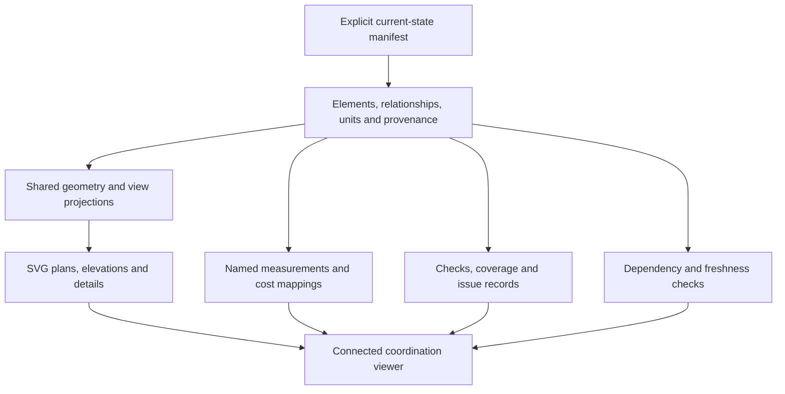
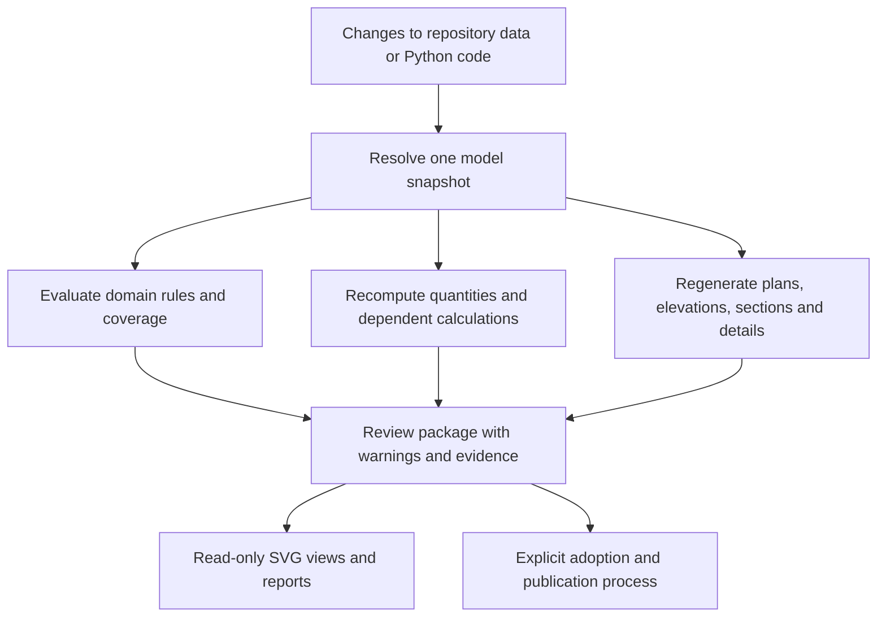
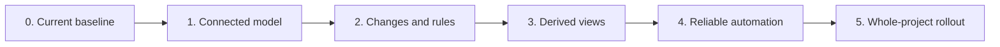

# Connected project coordination — recommended next step

**Status:** implementation authorized; first connected review increment implemented; remaining gates open<br>
**Version:** 0.6<br>
**Date:** 2026-10-02<br>
**Source:** owner's request to understand the repository and recommend meaningful progress
toward clearer, connected, automatically generated project information; repository review,
code inspection, numerical probes and validation performed in the same conversation;
subsequent owner-requested internet research against primary sources, recorded in
[twelve foundation investigations](../08_investigacion/connected_coordination_research_2026_10.md)
and [ten additional delivery investigations](../08_investigacion/connected_coordination_delivery_research_2026_10.md);
the owner's request for a living system with coherent source changes, propagation and
warnings, and explicit clarification that SVGs are generated outputs, supported by [three focused investigations](../08_investigacion/connected_editing_and_validation_research_2026_10.md).<br>
**Reviewed baseline:** Git commit `24479a9`, with a clean working tree before this document.<br>
**Delivery review baseline:** Git commit `d5ea6ca`, containing v0.2 and the first research round.<br>
**Implementation baseline:** Git commit `6808378`; owner authorization recorded in D-084.<br>
**Authority:** software coordination workflow authorized. No changed house design,
construction scope or cost, drawing promotion or professional gate closure is adopted by this plan.

**Revision note:** v0.6 records the implemented first increment and its remaining acceptance
gates. v0.5 corrected the scope: changes originate in repository data, scenario
parameters and Python code. SVGs display generated results and findings; there is no
graphical editing capability in this plan. The implementation has six phases and 19
subphases, each with dependencies, scope, outputs and completion criteria. The 25 research
investigations support source-driven propagation and validation; R23 is revised for
read-only representations. The owner's examples are illustrations, not diagnosed clashes.
Implementation evidence and commands are in the [working workflow](connected_coordination_workflow.md)
and [source inventory](connected_source_inventory.md). The phase specifications below
remain the completion contract; an implemented subset does not close the entire roadmap.

### Implementation checkpoint — 2026-10-02

Run `python3 -m dreamhouse.coordination` to build an isolated review, and append `--check`
to verify its source and artifact freshness. Repository JSON changes feed one resolver,
one evaluator, seven SVG projections and a read-only HTML index. Current aliases remain
separately published. The baseline introduces no hypothetical clash or geometric change.

| Subphase | Implemented evidence | Remaining exit-gate work |
| --- | --- | --- |
| 0.1 | Audited transitive source chain, field ownership, native aliases and all 27 current drawings; machine-readable inventory with source hashes | Complete for the first increment; refresh when consumers change |
| 0.2 | Historical tests retained; current geometry/quantity and source-to-view regression fixtures | Complete for the first increment |
| 0.3 | Current PB b37/P2 b28 adapter; explicit quantity-family mapping; 123.84 m² vertical and 23.04 m² rooflight parity | Complete for enrolled measurements; unknowns remain declared |
| 1.1 | 105 identified entities, shared axes/datums, aliases, host/space relationships and geometry capabilities | Extend beyond enrolled families only from actual sources |
| 1.2 | Reference validation and conservative complete dependency inventory | Finer type/filling relationships and explicit extensible calculation graph; no minimal impact graph claimed |
| 1.3 | Strict JSON/study validation, one resolver, separate input/model hashes, duplicate/non-finite rejection | Broader family schema/migration contract as authoring expands |
| 2.1 | Pinned study JSON, expected-value preconditions, supported parameter updates and atomic failed-build behaviour | Additional operations remain unsupported rather than implicitly accepted |
| 2.2 | Generic opening/host/overlap/known-column rules, module consistency, capability report and professional gates | Adapt existing equipment, programme, structural and engineering evaluators to the current snapshot |
| 2.3 | Full pair reevaluation, before/after entity changes and evidence-preserving finding lifecycle | Automatic evidence invalidation for future discipline consumers |
| 3.1 | New plans/elevations/details/schedule consume the same injected snapshot without hidden source reloads | Migrate relevant existing publication consumers after equivalence review |
| 3.2 | Stable view/occurrence/entity IDs and parameter-derived dimensions | Named anchor lifecycle, section occurrences and callout-target migration fixtures |
| 3.3 | Seven review SVGs, linked entity/issue review, a machine-readable occurrence denominator and explicit unknowns | Complete the section/layer/interface plate specified in §4.4; fixed-font PNG export and dimension-anchor coverage |
| 4.1 | One command, complete manifest, content-addressed packages, deterministic rebuilds, source recheck and atomic candidate pointer | Implemented for the seven-view package |
| 4.2 | Broad source/code CI triggers, full regression run and review artifact upload | Fixed renderer/font environment, contact sheets and visual comparison evidence; slower discipline analysis not yet enrolled |
| 4.3 | Candidate completion, check status and construction authority separated; failed build preserves prior review | Current-catalog promotion transaction and stable-alias reader migration |
| 5.1 | Located doors, space/host context, stair envelopes and plan reservations already identified | Remaining wall/structural families and authoring/view coverage |
| 5.2 | Opening-to-cost mapping uses the same resolved quantities and retains unknown costs | Stair sections, wall mass/load and engineering dependencies |
| 5.3 | No route/product geometry fabricated | Services, operation/removal envelopes and phased handover remain planned |
| 5.4 | All 27 current outputs explicitly labelled pending migration | Full current-set rollout and extension acceptance remain planned |

The next implementation gate is to finish Phase 2's discipline adapters and Phase 3's
section/detail and occurrence coverage, then qualify the broader publication workflow.
The complete gate sequence remains below; later context enrollment is not evidence that
an earlier engineering or visual acceptance gate has passed.

Verification of this increment: **353 repository tests passed**, lint passed, the 27
current SVG/PNG pairs retained valid provenance, and the candidate reproduced and passed
its source/artifact freshness check. The baseline has 53 PASS / 138 OPEN / zero FAIL
findings; seven unresolved PB door spans are recorded under CF-013. See the workflow's
verification table for scope and commands.

## 1. Recommendation and project intent

The target is a living project system: one resolved model per scenario supplies the
drawings, calculations, quantities and coordination findings. Changes are made in the
repository sources and model parameters. Python resolves the resulting state, evaluates
its consequences and regenerates the dependent drawings and reports. Start with one
element family and complete that connection, then extend the same mechanism to the house.

Dream House's purpose is a simple industrial hall that accommodates a rich domestic and
technical life: family, making, work and landscape together. Precision should concentrate
on the relationships that make this possible: how daylight enters, how people sleep while
the ground floor is active, how an installation can be maintained, and how the house can
be completed in phases. The repository should make those relationships visible and
testable.

This interpretation follows the [Project Constitution](../00_gobernanza/constitucion_del_proyecto.md),
[master brief](../01_brief/brief_maestro.md) and
[spatial relationships](../01_brief/relaciones_y_experiencia.md). The active
[source precedence and conflict register](../00_gobernanza/fuentes_precedencia_y_conflictos.md)
continues to govern every value and unresolved interface.

Progress can therefore mean reducing uncertainty, exposing a dependency or making a
proposal easier to evaluate before any new architectural decision is made.

The implemented increment starts with **Phase 0: establish the current baseline and its source ownership**.
Its first output is the source inventory and current-window measurement comparison. The
core change/evaluation mechanism drives all generated outputs. [Section 5](#5-phases-and-subphases)
is the implementation sequence; section 8.1 maps the earlier C01–C06 packages into it.

"Automatic" initially means that one Python command evaluates a complete candidate and
updates all supported dependent outputs. An optional later watcher can rerun that same
command after source-file changes. No supported output may silently retain the old
state; an unsupported affected output must explicitly become stale or unevaluated.

## 2. Review scope and verified starting point

The review covered governance, programme, architecture, the integration pipeline,
quantities, cost reconciliation, drawing generators, publication and graphic pilots.
Rendered ground-floor and pilot-contact images were also inspected.

The existing foundation is substantial:

- deterministic Python generators and machine-readable JSON inputs;
- versioned drawings and explicit promotion to stable current SVG/PNG aliases;
- input and output provenance checks;
- shared coordination inputs for the stair and recent window family;
- an architecture–structure–quantity–cost pipeline;
- five graphic pilots with readability and rendering controls.

Validation during the assessment produced:

| Check | Observed result |
| --- | --- |
| Repository test discovery | 306 tests passed |
| Current-drawing synchronization check | 27 SVG/PNG pairs and their provenance validated |
| Generated README check | Passed |
| Static lint of GP01–GP05 | 0 errors, 11 warning findings |

These results describe the reviewed baseline. They do not demonstrate complete
coordination across the latest discipline models. The commands used were:

```bash
python3 -m unittest discover -s dreamhouse -p 'test_*.py'
python3 .github/scripts/sync_current_drawings.py --check
python3 .github/scripts/build_showcase.py --check-readme
python3 -m dreamhouse.svg.lint planos/piloto_grafico_v0.1 --format markdown
```

For v0.4, code inspection additionally covered current loader/generator call chains,
`vertical_continuity.py`, equipment checks, check aggregation, the static viewer and both
CI workflows. The following existing targeted suite was rerun: **18 tests passed**.
It verifies the existing implementation, not the proposed propagation system:

```bash
python3 -m unittest dreamhouse.structure.tests.test_integrated_pipeline dreamhouse.structure.tests.test_pb_b37 dreamhouse.structure.tests.test_p2_b28 dreamhouse.structure.tests.test_stair_core_coordination
```

## 3. Verified gaps and their consequences

| Finding | Evidence | Consequence |
| --- | --- | --- |
| Current drawings use PB b37 and P2 b28, while the default integration scenario still loads PB b05 and P2 b15. | [Current catalog](../../planos/actual/catalog.json), [scenario manifest](../../dreamhouse/model/project_v04.json), [model loader](../../dreamhouse/model/io.py). | A reproducible integrated calculation can still represent an earlier house state. |
| The earlier integrated opening schedule gives 96.78 m² of vertical glazing; the current inputs give 123.84 m². | Read-only calls to [the opening schedule builder](../../dreamhouse/envelope/openings.py), using the default scenario and then the PB b37/P2 b28 loaders with the same rooflight input. | File provenance alone does not establish that disciplines consume the same state. These are different scenario totals, not an approved scope or cost delta. |
| The reviewed quantity ledger classified current workstation windows as rooflight glazing. **Corrected in the first increment.** | [Quantity ledger](../../dreamhouse/quantities/ledger.py) now explicitly maps `PB.workstation_glazing` to `PB-WORKSTATION-GLAZING`; regression fixtures retain 21.96 m² for `GLZ-WS-A` and 5.40 m² for `GLZ-WS-B`. | Unknown families fail with a diagnostic. The corrected classification supplies no missing price or budget authority. |
| Graphic QA is advanced in five pilots but has not become acceptance coverage for the current drawing set. | [Pilot contact audit v0.7](../08_investigacion/svg_pilot_contact_audit_v0.7.md). | Existing work can support a controlled rollout to current drawings. |
| GP01 assigns model-reference identifiers from positions in the copied source SVG. | [Ground-floor pilot generator](../../dreamhouse/svg/pilot_ground_floor.py), including `PB-SOURCE-{source_index:03d}`. | These identify copied drawing nodes, rather than a persistent building element shared by plan, elevation and quantities. |

The integration lag is partly acknowledged in the existing
[integration plan](parametric_architecture_structure_cost_integration_plan.md), including
its D-080 current-model gap. This assessment extends that observation to the current
PB/P2 window state and its quantity mapping. It does not invalidate historical evidence
for the scenario that evidence actually describes.

The next improvement should make the connections between disciplines verifiable.

### 3.1 Implementation seams verified for the living-system plan

| Existing behaviour and evidence | Consequence for implementation |
| --- | --- |
| [PB b37](../../dreamhouse/generate_pb_b37.py) already maps P2 `W-*` tags to façade `GLZ-*` tags through `p2_id`; both current loaders consume D-083. | Preserve these explicit aliases and shared inputs; introduce persistent identity across existing representations. |
| `generate_pb_b37.generate(model)` reloads P2/rooflights from disk; `workstation_detail()` changes literal strings in an older detail. | A modified in-memory scenario would not automatically reach every output. New render paths need the same injected snapshot and generated dimensional labels. |
| [P2 b28 validation](../../dreamhouse/generate_p2_b28.py) checks exact D-083 values; [vertical continuity](../../dreamhouse/structure/vertical_continuity.py) raises if the expected compatible-column list changes. | Keep historical fidelity checks intact; extract reusable scenario checks that return findings for changed geometry instead of treating every intentional study as a broken historic revision. |
| The continuity audit checks candidate column lines against façade/window and door intervals; [equipment checks](../../dreamhouse/equipment/validators.py) use bodies and operating rectangles. | Useful rule implementations exist, but they do not form a complete collision model for all elements and elevations. Register their applicability, geometry assumptions and coverage. |
| [CheckResult](../../dreamhouse/model/schema.py) already carries rule IDs, outcomes and entity IDs. [Pipeline aggregation](../../dreamhouse/pipeline.py) counts selected groups; support/structural results are separate, and some evidence prose contains fixed scenario facts. | Extend the existing result interface with coverage and purpose-specific blocking policy; generate narratives from evaluated facts and register every claimed check group. |
| [The current viewer](../../showcase/app.js) changes image sources and uses CSS transforms for zoom/pan. | Keep zoom/pan as presentation. Add read-only identity/evidence links where useful; Python-generated artifacts remain the source of displayed geometry and warnings. |
| [Current publication](../../.github/scripts/sync_current_drawings.py) copies explicitly catalogued issues; [showcase CI](../../.github/workflows/showcase.yml) regenerates aliases automatically on main. | Keep source promotion explicit while automating synchronization after promotion; candidate builds must remain separate from that path. |

These are implementation observations, not new architectural conflicts. No actual
door/window/column interference is asserted on the basis of the owner's examples.

## 4. First complete demonstration: windows and their interfaces

Build a first connected coordination viewer around windows and their interfaces. This
is a manageable family with an existing
[shared D-083 source](../../dreamhouse/window_daylight_d083.json). It connects daylight,
plans, elevations, details, secondary structure, envelope performance and quantities.



For example, selecting `GLZ-WS-A`, the Side A workstation window, should:

1. Highlight the same opening in the ground-floor plan, elevation and interface detail.
2. Show its current schematic definition: **7.20 × 3.05 m**, sill **+0.75 m**, nominal
   rectangular opening area **21.96 m²**, source **D-083**. This measured envelope does
   not establish net glass, ventilation free area or a manufacturer's window size.
3. Show its relationships to the workstation, host wall and unresolved interfaces.
4. Distinguish verified geometry from pending header, glazing, drainage, condensation
   and quotation work.
5. Make the differences from the preceding issue available for inspection.

The drawing becomes an entry point to the element's evidence. The viewer exposes the
model's authority and limitations; it does not create dimensional authority of its own.

### 4.1 Minimum element and relationship contract

The following is a proposed internal contract, informed by investigations
[R01–R03](../08_investigacion/connected_coordination_research_2026_10.md#r01) and
[R06–R07](../08_investigacion/connected_coordination_research_2026_10.md#r06). It does not
require IFC export to start.

| Record | Proposed content | Purpose |
| --- | --- | --- |
| Element identity | Persistent `entity_id`, existing human-readable tag and explicit legacy aliases | Preserve links when labels, file order or geometry change; record replacements separately. |
| Scenario occurrence | Scenario ID, element revision and adopted/study status | Compare alternatives without giving a study current authority. |
| Geometry | Declared length units, project axes, placement, host plane, width/height and elevation datum | Derive view geometry and distinguish local sill levels from project elevations. |
| Relationships | Host wall, void/opening, proposed filling/window assembly and relevant space references | Keep opening, frame and glass semantics distinct; leave unidentified assemblies explicitly unresolved. |
| Measurement | Source entity, named quantity kind, unit, formula/version, deductions and inclusion status | Prevent gross opening area being silently treated as net glass or as a priced assembly. |
| Evidence | Source reference/hash, decision/conflict references and applicable rule IDs | Explain both the value and its unresolved obligations. |
| Source ownership | Owning repository file/field, scenario layer and inherited versus derived fields | Ensure a source change reaches every dependent view and calculation. |
| Geometry capability | Supported representation, extents/elevation interval, approximation and missing data | Distinguish an evaluated physical relationship from a diagram or unsupported check. |

Keep existing project tags unchanged and map known aliases explicitly. A content hash
identifies a version of information; it should not replace the persistent identity of
the element. An unresolved host or filling must be reported rather than invented to make
the record appear complete.

Use a small shared geometric representation sufficient for this family: opening extents,
local placement, project levels and declared plan/elevation projection transforms. This
can be implemented without a complete solid-model kernel. Distinguish projected views
from schematic assembly details: a conceptual detail may share element references and
parameters while still having unsupported construction geometry.

### 4.2 Separate status dimensions

The proposed viewer should show these dimensions independently, following
[R04](../08_investigacion/connected_coordination_research_2026_10.md#r04) and
[R09](../08_investigacion/connected_coordination_research_2026_10.md#r09):

| Dimension | Question answered |
| --- | --- |
| Adoption | Is this an active schematic assumption, an unadopted study or historical evidence? |
| Freshness | Was this result generated from the declared current inputs and generator? |
| Automated checks | Which applicable information and geometry rules passed, failed or remain unevaluated? |
| Professional evidence | Which structural, envelope, safety and other reviews remain open? |
| Cost disposition | Is the quantity mapped, is a comparable rate available, and is its use authorized? |
| Publication authority | For which named purpose was this issue promoted? |

Retain existing `PASS`, `OPEN` and `FAIL` outcomes where applicable; add explicit coverage
and freshness information alongside them. An unsupported check must not disappear from
the coverage report. A current, geometrically consistent window can still have open
structural and cost gates. These are proposed project distinctions, not a claim of
standards certification.

### 4.3 Views and dimensions must declare what they represent

Each proposed view record should carry a view ID, scenario, purpose, projection basis,
scale and crop, plus a cut plane and depth range where applicable. Drawing layers should
distinguish cut elements, projected elements and schematic annotations. A plan symbol
above the cut plane can remain useful if identified as such; it should not imply that
the plane cuts that window. Follow [R18](../08_investigacion/connected_coordination_delivery_research_2026_10.md#r18).

Dimensions should reference the element and named geometric anchors, such as opening
left/right limits or sill/head, with a declared measurement direction and datum. Generate
their numbers from those anchors, retaining unrounded values for calculation and applying
rounding only for display. Record label positions separately. A deleted or ambiguous
anchor should produce an unresolved dimension rather than preserve an apparently valid
old number. These are proposed association rules from
[R19](../08_investigacion/connected_coordination_delivery_research_2026_10.md#r19), not an
instruction to replace the SVG generators with a CAD application.

Information requirements should depend on **element + intended use + delivery milestone**.
A coordination view needs location, dimensions, source and open interfaces; a procurement
package additionally needs reviewed performance requirements and comparable product
evidence. Later installation and maintenance uses need different records. Show coverage
against the selected purpose, including what is unknown, without assigning one global
completion percentage to the house. [R20](../08_investigacion/connected_coordination_delivery_research_2026_10.md#r20)
provides the information-delivery basis; project milestones remain governed locally.

### 4.4 First connected detail plate

Use `GLZ-WS-A` to demonstrate one readable review plate. The following proposed views
share the same selected identity and link back to the same source and issue records:

| View or panel | Automatically derived content | Evidence that remains to be developed |
| --- | --- | --- |
| Location plan | Opening position, host reference and affected workstation | An unresolved host identity is visible until mapped. |
| Elevation | Opening width, sill, head and dimensional anchors | Frame subdivisions and net glass require supported assembly data. |
| Vertical interface section | Opening extents and references to head and sill | Header, support, drainage and thermal interfaces need professional detail development. |
| Head / sill / jamb schematics | Parameter links and callouts to the selected opening | Materials, layer thicknesses, fixings and tolerances remain unresolved where no source exists. |
| Quantity and change panel | Named opening measurement, formula and study delta | Glass area, rates and quotation comparability remain separately pending. |
| Interface evidence panel | Open items, responsible roles, source and required evidence | Approval is recorded through existing project governance. |

For each head, sill and jamb, trace the intended water-management, air-control and thermal
continuity across the window-to-wall interface. Use explicit unresolved segments where
the assembly has not been designed. A visually continuous line is evidence of a drawing
relationship only; it is not proof of watertightness, condensation resistance or structural
adequacy. Research [R21](../08_investigacion/connected_coordination_delivery_research_2026_10.md#r21)
supports these questions without selecting an assembly for Boyacá.

This plate should help the owner see which detail matters next: for example, the opening
size may be consistent while the path by which sill water reaches the exterior is still
undefined. That uncertainty is a useful project output in its own right.

### 4.5 One model, generated representations

The information flow is **repository sources → resolved model → Python calculations and
checks → drawings, SVGs, quantities and reports**. SVGs are generated output. They neither
originate model edits nor update other SVG files directly.



| Concern | Proposed ownership and behaviour |
| --- | --- |
| Authoring information | Each parameter has one repository source/owner. Current work changes JSON, scenario inputs or Python as appropriate. Preserve historical hash-locked sources; new studies identify their base and changed inputs. |
| Resolved scenario | Load and normalize sources once into a snapshot with units, placement, identity, relationships and provenance. Pass it to every calculation and renderer. Saved snapshots are derived evidence, not another manually edited master. |
| Presentation | Store projection, annotation layout and styling in generator code or declared presentation configuration. Python generates dimension labels from model values. Browser selection, zoom and overlays only help inspect results. |

During migration, record field ownership and switch each consuming family to the resolved
model as a unit. Compatibility adapters can supply existing dictionary shapes, but may
not silently reread different sources. Preserve historical generators as reproducible
historical entry points.

Provide a small Python coordination interface, provisionally `resolve_project(scenario)`,
`evaluate(snapshot, baseline)` and `build_review(snapshot, evaluation, output_dir)`.
These are proposed interface names, not existing commands. Evaluation compares changed
inputs with the preceding complete snapshot and returns findings, affected outputs and
coverage. Extend model loading and the pipeline at these seams; a small
`dreamhouse/coordination/` module is appropriate only for shared change/evaluation logic.
Keep calculations testable without rendering or writing files.

### 4.6 SVGs show the model state and its consequences

Every generated occurrence carries an element identity, view ID, scenario, source/build
fingerprint and representation role. Plans, elevations and sections project the same
model through explicit transforms and datums. Dimensions reference named model anchors.
Updating a source therefore changes all affected views through regeneration, rather than
through manual drawing edits.

Generate warning overlays and a textual issue list from the same Python findings. Link
an issue to affected elements, its rule/evidence and useful views. Optional selection can
highlight matching occurrences across SVGs, open an evidence panel or navigate to a
related section/detail. Provide keyboard/list access and readable status without relying
only on colour. These are read-only inspection actions.

Display the evaluated scenario/revision and freshness of each view. A skipped or failed
calculation remains visible as unevaluated; a previous successful image cannot be shown
as the latest result. Retain standalone SVG/PNG publication and the static showcase.
Saved issue viewpoints retain their original snapshot and view definitions.

A manually modified generated SVG is a divergent artifact: provenance checks identify it,
and the next controlled build regenerates it from its sources. It does not alter model
geometry. This scope needs no drag handles, property-edit forms, SVG import/write-back,
browser repository writer or graphical editing server.
[R23](../08_investigacion/connected_editing_and_validation_research_2026_10.md#r23)
supports semantic, read-only representations.

### 4.7 Rules, findings and useful warnings

Reuse `CheckResult` and existing validators through a common rule contract. Each rule
declares its version, purpose, applicable element kinds/relationships, required fields,
geometry capability, numerical tolerance, consumed inputs and dependencies. A result
adds coverage, severity, affected identities, scenario/fingerprint, measured evidence,
explanation, relevant view references and its disposition for the selected issue purpose.
Preserve `PASS`/`OPEN`/`FAIL` as check outcomes; use a separate coverage field such as
`evaluated`, `not_run`, `unsupported` or `inapplicable`. An evaluation exception records
its error and leaves dependent work unevaluated. Severity and release blocking depend on
the declared rule and purpose, not merely on the colour of a viewer badge.

| Situation | Required response |
| --- | --- |
| Malformed input, stale study base, duplicate identity, impossible units or broken mandatory references | Reject the candidate build; return the diagnostic; retain the prior complete package. |
| Supported rule establishes an interference or requirement violation | Retain an explicitly problematic study for inspection, report `FAIL` and its evidence, and apply the issue-purpose release gate. Never auto-resolve by moving another element. |
| Candidate overlap with approximate geometry, missing elevations, unsupported shape or unavailable analysis | Report `OPEN` with unevaluated/approximate coverage and the missing inputs; a potential conflict remains distinguishable from a confirmed modeled conflict. |
| Supported applicable rule passes | Report `PASS` together with its actual scope and evidence. This does not close a professional review. |
| Rule is inapplicable | Record the reason in coverage; exclude it from the applicable denominator instead of counting a pass. |

Keep numerical comparison tolerance, physical clearance and construction tolerance
separate under [R16](../08_investigacion/connected_coordination_delivery_research_2026_10.md#r16).
SVG label collision checking remains drawing QA; its sheet-space bounds are not building
collision geometry. For model coordination, distinguish body interference, required free
space, operational envelopes and visual obstruction. A column appearing behind a window
in an elevation is not enough to establish physical intersection or a defined view-quality
violation. Any such rule needs the relevant depth, height and purpose information.

Initially use conservative candidate-pair filtering and supported rectangular/prismatic
checks with explicit elevation intervals. A broad bounding-box overlap is a candidate,
not a final collision verdict. Rotated or complex geometry must either have an adequate
supported test or remain unevaluated. Unknown extents cannot silently eliminate an element
from the applicability list. Legitimate host/opening/filling relations also need explicit
handling so intended assembly relationships are not reported as generic collisions.
[R24](../08_investigacion/connected_editing_and_validation_research_2026_10.md#r24)
supports this separation without requiring IFC adoption or a general solid-model engine.

Findings should have stable keys based on rule and affected entities within a scenario,
so a rerun can identify new, persistent, resolved and no-longer-evaluated findings. An
automatic finding resolving after a study edit does not close a `CF-*` governance record.
Link it to the existing register and retain the evidence revision and responsible role.

### 4.8 Propagation is an explicit dependency contract

Maintain the semantic relationship graph separately from the acyclic calculation/build
graph. Reciprocal building relationships are normal; circular calculated dependencies
must be detected or handled by an explicitly defined solver, never by endless regeneration.
Start by rebuilding the complete pilot package on each Python run over changed inputs. Add selective
recomputation only after it agrees with full rebuilds on the same scenario.

| Change class | Required propagation within declared coverage |
| --- | --- |
| Create, remove or retype an element | Recheck identities, incoming/outgoing references, rule applicability and expected view occurrences. Retire removed identities explicitly; never reuse them for a different physical element or silently discard dependent annotations/issues. |
| Position, size, level, host or orientation | Re-resolve relationships and nearby candidate pairs; update applicable plans/sections/elevations, dimensions, opening/host quantities, rules and interface evidence. Recompute neighbours from the new state, including previously unrelated elements. |
| Type, material or assembly property | Re-evaluate applicable details, mass/load inputs, quantities, rate mapping and performance evidence. Missing engineering/product data stays pending. |
| Rule, generator, transform, schema or font input | Invalidate the affected checks or outputs even when building geometry is unchanged. |
| Annotation or sheet layout only | Regenerate affected views/graphic QA; preserve physical geometry and calculated quantities. |
| Repository input changed | Compare source hashes, re-resolve the declared scenario and invalidate dependent outputs; retained historical baseline guards may require a new version rather than an in-place rewrite. |

A move may leave area unchanged while altering interference and access checks. A material
edit may leave geometry unchanged while invalidating a mass calculation. Unknown dependency
scope requires conservative invalidation. Record why each output was recomputed, unchanged
or left unevaluated; never label a skipped structural calculation current by default.

Resolve a consistent input snapshot before evaluating it. If source files change during
a build, preserve the build's original fingerprint and mark it outdated, or reject/restart
it; never label mixed-source results current. New delta scenarios retain expected-base
checks. Concurrent Python runs must not overwrite one another's candidate directories or
replace the current package using an obsolete source revision.
[R25](../08_investigacion/connected_editing_and_validation_research_2026_10.md#r25)
provides the expected-revision principle, applied here to repository builds.

Stage the snapshot and required outputs before exposing a complete review package.
Recheck the source fingerprint before updating any pointer to the latest complete build.
A failed render may retain diagnostic artifacts, but cannot replace the previous complete
package or publication. A complete review package may contain coordination failures:
completeness and design acceptability are separate conditions.

## 5. Phases and subphases

The phases below replace the earlier C01–C06 delivery order. Every phase has an observable
exit gate; each subphase states its dependencies, scope and completion evidence. Phase
completion means that its software/data contract works for the stated scope, not that
the house is approved for construction. The implementation checkpoint above records
completed subsets and outstanding gates; whole-project rollout is not complete.



Start with windows, their host references, affected spaces and the available structural
context. This is the first complete path through the system, not a permanent window-only
architecture. All formulas, rules and supported source fields remain explicit about the
model families they support. Use the existing Python/JSON/SVG stack and static presentation;
introduce additional geometry or infrastructure only for a demonstrated capability gap.

<a id="phase-0"></a>

### Phase 0 — Establish the current baseline and ownership

**Objective and scope:** understand exactly which present sources, loaders, outputs and
checks describe the current house. Produce a trustworthy baseline for the pilot without
redesigning it. **Entry:** repository governance and current catalog reviewed.

| Subphase | Depends on | Scope and objective | Output and completion criterion |
| --- | --- | --- | --- |
| <a id="phase-0-1"></a>0.1 — Source and consumer inventory | Entry | Inventory current PB b37/P2 b28/D-083, stair, structure and rooflight sources; follow transitive loader/code dependencies. Classify all catalogued drawing outputs (27 at the reviewed baseline) by source scenario and generator. Identify direct inputs, derived fields, aliases and intended edit owner. | Source/consumer matrix with paths, revisions, statuses, source hashes and field ownership. Every pilot input and affected output has an owner or an explicit unresolved mapping; no silently selected conflicting source. |
| <a id="phase-0-2"></a>0.2 — Capture existing behaviour | 0.1 | Run relevant existing tests and generate comparison evidence only in a temporary/review directory. Record current quantities, view extents, datums, aliases and known limitations. | Repeatable baseline fixture/report; original files and current aliases unchanged. The reviewed historical scenario and current scenario are labelled separately. |
| <a id="phase-0-3"></a>0.3 — Reconcile current inputs and measurements | 0.1, 0.2 | Assemble current loaders through a narrow read adapter. Compare same-scenario geometry; explicitly map workstation glazing and other known quantity families. Identify structure/roof inputs that remain preliminary or incompatible. | Per-opening source/geometry/measurement comparison; active/study totals separated; workstation values do not enter rooflights. Unknown families produce a diagnostic. Every unexpected difference is explained before advance. |

**Repository work:** begin at [model I/O](../../dreamhouse/model/io.py),
[current PB loader](../../dreamhouse/generate_pb_b37.py),
[current P2 loader](../../dreamhouse/generate_p2_b28.py),
[opening schedule](../../dreamhouse/envelope/openings.py) and
[quantity ledger](../../dreamhouse/quantities/ledger.py). Retain `project_v04.json`'s
historical scenario definitions; add an explicitly identified current scenario rather
than silently reinterpreting `D059_P2_REFINED_ENVELOPE`.

**Exit gate:** a reviewer can trace each pilot measurement to its source and explain its
scenario. Open engineering gates are visible and do not prevent a labelled schematic
comparison. This is the first useful deliverable before extending automatic generation.

<a id="phase-1"></a>

### Phase 1 — Establish the connected model contract

**Objective and scope:** resolve one authoritative snapshot for the selected scenario,
with sufficient identity, relationships and geometry for pilot calculations and views.
**Entry:** Phase 0 parity and source mapping accepted for this implementation scope.

| Subphase | Depends on | Scope and objective | Output and completion criterion |
| --- | --- | --- | --- |
| <a id="phase-1-1"></a>1.1 — Identity and geometry | Phase 0 | Normalize pilot elements and their actual host/space/structural context; retain `W-*`/`GLZ-*` aliases. Define units, axes, datums, placement, geometry capability and immutable snapshot revision. | Versioned contract and normalized registry. IDs survive ordering/label changes; source-derived dimensions agree with the baseline; missing host/depth/height information is explicit, never invented. |
| <a id="phase-1-2"></a>1.2 — Relationships and dependency inventory | 1.1 | Describe host/opening/filling, located-in-space, type and view occurrences; separately declare data-to-rule/calculation/output dependencies. Identify inherited/derived fields and input source ownership. | Reference validation and dependency report. No dangling mandatory relationships; calculation cycles are diagnosed; affected consumers are enumerable and geometry changes explicitly require a fresh neighbour search. |
| <a id="phase-1-3"></a>1.3 — Validation and adapter interface | 1.1, 1.2 | Put input-shape checks before domain checks. Expose one resolver that supplies the same snapshot to all consumers. Define byte/model/build fingerprints and numerical policies. | Reordered JSON formatting preserves the declared normalized meaning; duplicate keys/non-finite values fail; historical hashes still verify. Adapters reproduce baseline semantics without independent hidden file reads or writable copies. |

**Repository work:** extend [model types](../../dreamhouse/model/schema.py) and model I/O;
reuse [rectangle operations](../../dreamhouse/geometry/rectangles.py). Keep the new contract
small enough for current callers. A source content hash identifies a revision, not an
element. `canonical_json_hash()` currently uses Python sorted-key serialization; define
its policy explicitly and do not label it RFC 8785 compliant without full conformance.
Record numerical tolerance separately from physical requirements and display rounding.

**Exit gate:** a source-to-element-to-consumer path can be followed both ways for every
pilot element. Read-only historical adapters and new scenario authoring have unambiguous
ownership; all consumers can receive the same snapshot without reconstructing it.

<a id="phase-2"></a>

### Phase 2 — Evaluate changes and coordination findings in Python

**Objective and scope:** make changes and their consequences testable without a browser.
Support declared pilot parameters and rules; expose gaps in the remaining model.
**Entry:** Phase 1 contract passes its fixtures.

| Subphase | Depends on | Scope and objective | Output and completion criterion |
| --- | --- | --- | --- |
| <a id="phase-2-1"></a>2.1 — Resolve changed inputs safely | 1.3 | Accept source changes through repository JSON, declared scenario deltas and Python inputs. Resolve a consistent candidate snapshot, compare with the base and validate units/references before calculation. | A Python entry point detects the changed fields and their owners. Malformed inputs, stale delta bases and incomplete reads produce diagnostics without replacing the previous complete package. A study with valid input structure and coordination problems remains inspectable. |
| <a id="phase-2-2"></a>2.2 — Rule registry and geometric coverage | 1.3 | Adapt existing equipment, opening, continuity and programme checks; separate historical fixed-value assertions from generic rules. Register applicable pair types, bounds, height requirements, tolerances and purpose-specific severity. | Unified findings and coverage report. Positive, negative, boundary and missing-data fixtures behave correctly; a plan-only overlap cannot become an unsupported 3D claim. Domain findings remain available even when a legacy evaluator needs an adapter. |
| <a id="phase-2-3"></a>2.3 — Change impact and finding lifecycle | 2.1, 2.2 | Evaluate candidate relationships, measurements and affected calculations. Recompute possible neighbours from the new geometry. Compare findings with the base; link evidence and manual gates. | Before/after report with changed inputs, affected entities/outputs and new/persistent/resolved/unevaluated findings. Move-only cases preserve area while still reevaluating neighbours; changed data invalidates linked professional evidence without auto-closing a conflict. |

**Repository work:** reuse [CheckResult](../../dreamhouse/model/schema.py),
[equipment validators](../../dreamhouse/equipment/validators.py),
[vertical continuity](../../dreamhouse/structure/vertical_continuity.py),
[support comparison](../../dreamhouse/structure/coordination.py) and current quantity
functions behind the evaluation interface. Preserve historical regression tests. Move
scenario-specific expected totals/compatible-ID assertions into the appropriate baseline
checks, while retaining reusable geometry calculations for new trials. Missing essential
geometry must produce a finding/coverage gap before downstream calculation is attempted.

JSON Patch remains optional. If selected for command encoding, address stable entity-map
keys rather than array indices, keep scenario metadata outside the operation list, and
apply expected-value preconditions. Existing historical delta formats remain supported.

**Exit gate:** an unadopted synthetic change produces a deterministic model delta and
traceable findings. The owner's examples guide the general capability, not the choice of
real geometry to alter. No general solver, autonomous layout correction or construction
approval is part of this gate.

<a id="phase-3"></a>
<a id="52-connect-one-element-family-to-multiple-views"></a>

### Phase 3 — Derive connected drawings, dimensions and visual evidence

**Objective and scope:** make the pilot's every supported representation consume the
same evaluated snapshot. **Entry:** Phase 2 can evaluate changes and report consequences.

| Subphase | Depends on | Scope and objective | Output and completion criterion |
| --- | --- | --- | --- |
| <a id="phase-3-1"></a>3.1 — Inject the snapshot into outputs | Phase 2 | Adapt pilot renderers/schedules to accept model inputs explicitly; extract geometry/measurement logic from file loading and presentation. Replace copied numeric prose in the new path with evaluated values. | A candidate passed to the builder reaches all pilot consumers. No migrated output reloads adopted P2/rooflights behind the caller's back; unchanged baseline views remain equivalent within documented graphic changes. |
| <a id="phase-3-2"></a>3.2 — Semantic views and associated annotations | 3.1 | Add persistent view IDs, occurrence IDs and `data-entity-id`; define projection/cut intent and model-to-view transforms. Bind dimensions to named anchors; bind callouts to view/detail IDs. | Same element resolves across plan/elevation/section. Coordinate/datum fixtures agree; deleted anchors flag unresolved dimensions; renaming a sheet preserves callout targets; duplicated DOM IDs fail validation. |
| <a id="phase-3-3"></a>3.3 — Complete pilot review plate | 3.1, 3.2 | Build the section 4.4 plate, schedule and findings. Show warning overlays and readable issue lists; connect read-only element selection, evidence and related views. Separate projected geometry, schematics and graphical QA. | Every inventoried pilot occurrence is refreshed or explicitly unavailable; no stale drawing is presented as current. A dimensional change reaches all represented views and the named quantity; schematic layer continuity remains an open design matter where appropriate. |

**Repository work:** reuse [SVG sheet](../../dreamhouse/svg/sheet.py),
[SVG layout](../../dreamhouse/svg/layout.py), [theme](../../dreamhouse/svg/theme.py) and
existing pilot QA. Keep standalone SVG/PNG export. Replace the new detail path's dependence
on `workstation_detail()` string substitutions with parameter-driven annotations while
leaving historical outputs reproducible.

**Exit gate:** a full pilot rebuild responds coherently to a model edit, including its
dimensions and warnings. Report an occurrence-coverage denominator; a good-looking plan
alone cannot satisfy this phase if the elevation or detail still carries old values.

<a id="phase-4"></a>

### Phase 4 — Make the complete Python workflow reliable and repeatable

**Objective and scope:** one execution builds a coherent review package and prevents
mixed-revision publication. **Entry:** Phase 3's complete pilot path works.

| Subphase | Depends on | Scope and objective | Output and completion criterion |
| --- | --- | --- | --- |
| <a id="phase-4-1"></a>4.1 — One candidate-build command | Phase 3 | Extend the pipeline to resolve/evaluate/build from explicit inputs and a review output directory. Emit manifest, model snapshot, changes, findings/coverage, quantities and drawings together. | One documented Python command reproduces the package in a clean location. Matching inputs/code/environment produce matching deterministic artifacts; late failure cannot alter current aliases or released packages. |
| <a id="phase-4-2"></a>4.2 — Invalidation and CI | 4.1 | Cover transitive data, generator, rule/schema, renderer/font dependencies in CI. Run the fast geometry/contract path routinely; schedule required slower analysis and mark skipped results unevaluated. Begin with full pilot rebuilds. | Data-only and generator-only changes trigger relevant checks; a skipped analysis never reports freshness. Review artifacts include machine-readable findings, visual comparisons and a contact sheet. Selective caching is allowed only after equality with full builds is demonstrated. |
| <a id="phase-4-3"></a>4.3 — Purpose-specific release and recovery | 4.1, 4.2 | Separate candidate availability, coordination findings, issue-purpose eligibility, design adoption and publication. Verify inventory/hashes before explicit catalog promotion; retain previous releases and define stable-alias compatibility. | A warning-bearing study can be inspected without being declared approved. An injected incomplete build leaves current publication intact; readers cannot select a mixed release. Prior complete issues remain recoverable through their manifests. |

**Repository work:** extend [pipeline.py](../../dreamhouse/pipeline.py),
[current-drawing synchronization](../../.github/scripts/sync_current_drawings.py) and
[workflows](../../.github/workflows/). The existing CLI writes to a versioned integration
directory by default; candidate execution must use an explicit isolated destination.
Keep existing command compatibility and label any new CLI examples as proposed until
implemented. Do not conflate the current `issue_ready` aggregate with whole-project
approval; show the purpose, participating checks and coverage behind every new gate.

The showcase job may continue synchronizing already promoted catalog entries. Changing
the catalog's sources is the explicit publication action. If using a release pointer,
first make readers resolve through it and address the stable aliases; separate atomic
file replacements do not constitute a complete-publication transaction.

**Exit gate:** running Python over changed repository inputs updates the connected
model, checks, calculations and generated outputs. Every pilot consumer belongs to the same build or visibly
reports its limitation; automated checks cannot silently promote a design.

<a id="phase-5"></a>

### Phase 5 — Extend the mechanism across the house and keep it maintainable

**Objective and scope:** move from one working family to the current project's elements,
engineering interfaces and outputs without introducing new independent data masters.
**Entry:** Phase 4 demonstrates complete source-change, evaluation and regeneration.

| Subphase | Depends on | Scope and objective | Output and completion criterion |
| --- | --- | --- | --- |
| <a id="phase-5-1"></a>5.1 — All opening, wall and structural-context families | Phase 4 | Extend identity, source ownership, geometry capability and rule applicability to remaining windows, doors, hosts and available column/support context. Add capabilities according to actual source data, not the owner's illustrative clashes. | Family/operation/view/rule coverage matrix includes every inventoried element. Supported changes propagate across relevant views and schedules; unsupported engineering geometry remains explicitly unevaluated. Alias and deletion/reference tests apply to each enrolled family. |
| <a id="phase-5-2"></a>5.2 — Stair, wall/load and cost dependencies | 5.1 | Connect SC-01 across levels, landing/discharge views and support studies; connect wall/opening measurements to available mass/load and cost inputs. Preserve CF-009/010/011/012 and professional review roles. | Changes invalidate/recompute actual consumers, including relevant sections and calculation evidence. Missing product masses, rates or design rules remain unknown. A reviewer can trace a model parameter through a quantity/calculation to the affected decision gate. |
| <a id="phase-5-3"></a>5.3 — Services, interfaces and phased handover | 5.1 | Enrol supported service routes, operating/removal envelopes and Phase 1/2 reservations. Use purpose-specific required information and progressive maintenance records. | Plans, access checks and interface records share IDs; planned/reserved/installed/tested/commissioned states remain distinct. A changed reservation invalidates affected closure/testing evidence; no unselected product or unknown route becomes fabricated geometry. |
| <a id="phase-5-4"></a>5.4 — Current-set rollout and extension protocol | 5.2, 5.3 | Reconcile all catalogued current views and calculations with the capability matrix; finish affected renderer migrations. Document adding a family/rule/view/source and routine rebuild/recovery. Add optional debounced source watching using the same pipeline. | Every active output that consumes enrolled data regenerates coherently; stale or incompatible outputs block a complete current issue until resolved. All exclusions/unknowns are explicit. A fresh checkout reproduces the review package; adding a fixture family proves the extension path without a parallel source of truth. |

**Repository work:** expand existing discipline modules and register their inputs/results
with the shared model and evaluator. Keep family-specific engineering in those modules;
do not collect unrelated physics into one universal clash function. New rule thresholds
need a source and responsible role. Existing semantic relationships may support later
IFC/BCF/IDS exchange, but exchange tooling is not required for the internal rollout.

**Exit gate:** the current set has an auditable coverage matrix linking elements,
supported source changes, views, calculations and evidence. Missing professional inputs
remain visible;
there are no silent, obsolete copies for enrolled data. A future change follows the same
recorded source/dependency path rather than requiring manual edits across sheets.

### Sequencing and cost controls

Phases 0–2 establish source ownership, the shared model and evaluation. Phase 3 makes the
results visible in connected, read-only outputs. Phase 4 automates complete builds and
publication checks. Phase 5 repeats the proven mechanism across the project. Inventories
for later families can be prepared earlier, but each phase must satisfy its dependencies.
Within Phase 2, rule fixtures and changed-input validation can proceed independently
once Phase 1's contract is stable.

Use full pilot rebuilds, existing generators and small repository JSON records first.
Add incremental caches, more general geometry or source watching only when measured work
requires them. The standard workflow is editing repository sources and running Python.
Preserve baseline tests and add behavioural change tests with independent expectations.
No graphical editor, database or hosted write service is needed for this plan. No calendar
commitment or software-cost allowance is established here.

## 6. Acceptance evidence

The main acceptance demonstration is a deliberate dimensional change in an unadopted
study scenario. The plan, elevation, relevant detail and quantity schedule must respond
coherently. Any affected view that cannot yet respond must be identified as outdated or
unsupported. The scenario remains a proposal until adoption under project governance.

Additional cross-layer checks should demonstrate that:

- every represented opening corresponds to a known model element;
- dimensions agree between its views;
- every quantity maps to the correct element family;
- unadopted studies are excluded from active totals;
- an unknown price remains pending rather than becoming zero or an invented allowance;
- a successful geometric check preserves applicable professional gates;
- changing a dependency cannot silently leave an apparently current downstream output.

These checks should complement the existing regression and graphic checks. The purpose
is to test the connections that were missing from the reviewed baseline.

### 6.1 Research-to-acceptance matrix

Each row below is a proposed acceptance fixture, not a statement that the fixture already
exists. The linked research records provide primary sources, findings and limits.

| Research | Concrete acceptance evidence |
| --- | --- |
| [R01 — Identity](../08_investigacion/connected_coordination_research_2026_10.md#r01) | Reordering source records or changing a display label preserves selection, issue links and quantity identity. |
| [R02 — Host/opening/filling](../08_investigacion/connected_coordination_research_2026_10.md#r02) | One void linked to a window assembly is measured once; a missing host or invalid relationship is reported. |
| [R03 — Coordinates and units](../08_investigacion/connected_coordination_research_2026_10.md#r03) | A P2 sill of +0.05 m relative to the +3.80 m floor maps to project elevation +3.85 m in the elevation view; a unit mismatch is rejected. |
| [R04 — Information requirements](../08_investigacion/connected_coordination_research_2026_10.md#r04) | Required window fields are checked for every applicable element; unsupported performance checks remain visible. |
| [R05 — Issues and viewpoints](../08_investigacion/connected_coordination_research_2026_10.md#r05) | Reopening a saved issue selects its original elements and view against the identified scenario, or reports an unavailable reference. |
| [R06 — Quantity meaning](../08_investigacion/connected_coordination_research_2026_10.md#r06) | The 21.96 m² workstation opening retains its nominal-envelope meaning; unknown net glass area remains unknown. |
| [R07 — Schema and semantics](../08_investigacion/connected_coordination_research_2026_10.md#r07) | Unknown kinds, duplicate identities, dangling references and workstation-to-rooflight mappings fail the appropriate validation layer. |
| [R08 — Dependencies](../08_investigacion/connected_coordination_research_2026_10.md#r08) | A relevant data or generator-only edit invalidates affected outputs; equivalent clean builds reproduce results; the edit triggers coordination CI. |
| [R09 — Provenance](../08_investigacion/connected_coordination_research_2026_10.md#r09) | A quantity can be traced to inputs and the producing calculation; successful regeneration never creates professional approval. |
| [R10 — SVG interaction](../08_investigacion/connected_coordination_research_2026_10.md#r10) | Selecting one occurrence highlights the corresponding element in other views without duplicate DOM IDs or coordinate changes. |
| [R11 — Accessibility](../08_investigacion/connected_coordination_research_2026_10.md#r11) | Keyboard and list selection reach the same element; focus and open issues remain understandable without colour. |
| [R12 — Change and visual tests](../08_investigacion/connected_coordination_research_2026_10.md#r12) | A width change updates the expected area; a move preserves area; excluding a study removes it from active totals; reviewed renders remain legible. |

For a rectangular opening with fixed height, the proposed width-change fixture has an
independent arithmetic expectation: `area_delta = height * width_delta`. Add a move-only
case because it changes location and affected interfaces while preserving area. These
fixtures test different dependencies and should not be replaced by screenshot equality.

### 6.2 Additional delivery acceptance evidence

These ten further fixtures turn the second research round into observable behaviour.
They are proposed tests for implementation, not checks claimed to have passed today.

| Research | Concrete acceptance evidence |
| --- | --- |
| [R13 — Migration](../08_investigacion/connected_coordination_delivery_research_2026_10.md#r13) | Current loaders and adapter agree on geometry and source identity for PB b37/P2 b28; the report separately identifies the intended quantity-classification correction. |
| [R14 — Study edits](../08_investigacion/connected_coordination_delivery_research_2026_10.md#r14) | A patch prepared against an older base fails without changing inputs or current output; reordered records cannot redirect the edit to another opening. |
| [R15 — Fingerprints](../08_investigacion/connected_coordination_delivery_research_2026_10.md#r15) | Formatting-only JSON edits change the byte hash but preserve the normalized fingerprint under its declared policy; duplicate keys and non-finite numbers are rejected. |
| [R16 — Numerical boundaries](../08_investigacion/connected_coordination_delivery_research_2026_10.md#r16) | Tests distinguish touching, a small gap and actual overlap; changing printed decimal places changes no geometry or clearance verdict. |
| [R17 — Complete releases](../08_investigacion/connected_coordination_delivery_research_2026_10.md#r17) | An injected late render failure leaves all previously published files unchanged; the failed candidate is not a promotable issue. |
| [R18 — View intent](../08_investigacion/connected_coordination_delivery_research_2026_10.md#r18) | Moving a plan cut plane changes cut/projected membership where supported, while preserving element identity and model quantities. |
| [R19 — Dimensions](../08_investigacion/connected_coordination_delivery_research_2026_10.md#r19) | A width edit updates its associated dimension and area; deleting a referenced anchor creates an unresolved annotation rather than a stale value. |
| [R20 — Information need](../08_investigacion/connected_coordination_delivery_research_2026_10.md#r20) | The same window can satisfy coordination fields while remaining incomplete for procurement; missing product evidence remains visible. |
| [R21 — Envelope interfaces](../08_investigacion/connected_coordination_delivery_research_2026_10.md#r21) | Head, sill and jamb records link to the selected window and show unresolved continuity; dimensional consistency does not close the envelope review. |
| [R22 — Handover](../08_investigacion/connected_coordination_delivery_research_2026_10.md#r22) | A Phase 2 provision is distinguishable from installed equipment; maintenance links survive renaming, and absent manufacturer data stays unknown. |

Advance by demonstrated connections, not by the total number of rendered sheets. For the
pilot, report represented elements versus expected elements, resolved dimension anchors,
valid quantity mappings, current versus stale outputs, and evidence completeness for the
declared purpose. Keep these counts separate so an improved drawing count cannot conceal
missing checks or unresolved engineering.

### 6.3 Source propagation and validation acceptance evidence

| Research | Concrete acceptance evidence | Completion gate |
| --- | --- | --- |
| [R23 — Generated representations](../08_investigacion/connected_editing_and_validation_research_2026_10.md#r23) | Change a supported repository parameter and run Python: all affected SVG occurrences, dimensions, quantities and warning overlays use the resulting snapshot. Read-only selection or zoom changes no source. | Phases 3–4 |
| [R24 — Meaning of a conflict](../08_investigacion/connected_editing_and_validation_research_2026_10.md#r24) | Synthetic fixtures distinguish true overlap, containment, contact, separate heights and unsupported shapes; expected results are independently specified. Missing geometry never counts as a successful check. | Phase 2, then each family in Phase 5 |
| [R25 — Input revision and complete builds](../08_investigacion/connected_editing_and_validation_research_2026_10.md#r25) | Change an input while a build is in progress: its results cannot appear current against the newer sources. An incomplete build retains the previous complete package, and saved warnings survive reload. | Phases 2 and 4 |

The integrated demonstration should cover both a model-parameter change in repository
data and a presentation-only change in generator code or layout configuration. For the former, inspect the model delta, dependent calculations, represented
occurrences, findings and output fingerprints. For the latter, confirm that physical
geometry, quantities and engineering results remain unchanged. Introduce a synthetic
candidate that gains a new neighbour after movement, so invalidation cannot pass merely
by rechecking the old neighbour list. Introduce a generator-only edit as a separate test.

Complete each phase with its recorded evidence, supported scope, unresolved limitations
and next dependencies. Maintain a coverage matrix whose rows identify family/operation/
view/rule combinations and whose columns distinguish implemented, evaluated, current and
professionally reviewed. Never combine those into a single completion percentage.

## 7. Subsequent applications with practical decision value

### 7.1 Shared stair core and section relationships

The next application should connect the ground floor (PB), upper floor (P2), longitudinal
section, doors, landings and four columns through the same
[SC-01 geometry](../../dreamhouse/stair_core.json).

The existing conflict register documents that **CF-011** places the rear opening at the
**+1.90 m intermediate landing**, rather than at ground-floor grade. A connected section
and plan comparison would make that relationship explicit and help evaluate alternatives.
This is a recommendation for better evidence; it does not resolve discharge, headroom,
fire protection or structural design.

### 7.2 P2 wall assemblies, loads and quantities

Extend the mechanism to the current P2 wall family, measured wall/opening quantities and
their structural-load and cost dispositions. Retain **CF-009** and **CF-010** until the
required professional evidence resolves them. Installed masses, product performance and
costs remain unknown where supporting inputs are absent.

### 7.3 Services, maintenance and phased completion

Then connect service routes, access for maintenance and the provisions needed between
construction Phases 1 and 2. This would make future equipment replacement, reserved
capacity and completion work easier to understand before those details are frozen.

Begin with location, system, phase, access/removal envelope and evidence links for a few
maintainable components and service reservations. Distinguish planned, reserved, installed,
tested and commissioned states. Add manufacturer, serial number, warranty and maintenance
interval only when supported. A protected Phase 1 reservation should retain its location,
test and reactivation obligations without masquerading as installed Phase 2 equipment.
[R22](../08_investigacion/connected_coordination_delivery_research_2026_10.md#r22)
supports progressive handover information within the existing repository.

## 8. Delivery approach and authority

Use the existing Python, JSON, SVG and static-site foundation. Prioritize one complete,
verifiable element family and expand only after that connection works. This keeps the
software effort proportionate to the project's needs and reuses the drawing, validation
and publication work already completed.

The [foundation research](../08_investigacion/connected_coordination_research_2026_10.md),
[delivery research](../08_investigacion/connected_coordination_delivery_research_2026_10.md)
and [propagation/validation research](../08_investigacion/connected_editing_and_validation_research_2026_10.md)
support adopting useful information patterns before taking on additional platforms.
Full IFC/IDS/BCF exchange, an RDF database, a general solid-model engine and a new build
framework remain deferred until a real exchange or engineering task requires them. The
immediate proposed deliverables are the current-state manifest, a validated window
registry, connected SVG views, named quantity records, linked issue evidence and a
repeatable review package. The phased target connects source changes to reusable rules,
dependent calculations and regenerated SVGs through the same Python workflow.

Measure progress by how easily the project team can determine:

- what is known and what remains uncertain;
- which source governs a value;
- which elements and outputs depend on it;
- what a proposed change would affect;
- what evidence is still needed for a decision.

Saving this recommendation is documentation work only. It does not adopt its proposed
implementation, change the construction scope or cost baseline, or promote a drawing.
Consequently, it creates no new entry in the decision register or cost-control record.
Any later adopted change remains subject to the existing governance and recording rules.

### 8.1 Continuity with the preceding plan

The v0.3 work packages remain traceable below, but section 5 is now the delivery order.
Source evaluation, output generation and reliable builds form one Python workflow.
SVGs and the static showcase display its results.

| Earlier package | Current phase ownership |
| --- | --- |
| C01 — Current sources and measurements | Phase 0 establishes the baseline; Phase 1 supplies the lasting resolver. |
| C02 — Small element contract | Phase 1, including geometry capability, source ownership and dependencies. |
| C03 — Linked view geometry | Phase 3, after Phase 2 establishes change evaluation. |
| C04 — Evidence navigation | Phase 3.3 provides read-only views, warning overlays and linked evidence. |
| C05 — Controlled change demonstration | Phase 2 evaluates changed repository inputs; Phases 3–4 demonstrate propagation. |
| C06 — Delivery reliability | Phase 4 verifies complete, repeatable builds and controlled publication. |

The first implementation should deliver Phase 0's source/consumer inventory, baseline
fixtures and current-window comparison. Its review questions are concrete: which source
owns each input, which current views and calculations consume it, which historical checks
must remain unchanged, and which outputs still require migration. Then advance through
the phase gates; an attractive viewer is not a substitute for resolving those questions.

### 8.2 Evidence retained at each phase gate

Store a concise gate record beside the implementation's review artifacts: phase/subphase
IDs, scenario and source/build fingerprints, supported operations and scope, checks run,
results, coverage gaps, open professional gates and links to generated outputs. The
implementation reviewer verifies software/data behaviour; responsible project disciplines
continue to review their engineering evidence under existing governance. These are distinct
responsibilities, not a new approval board.

For the first candidate, proposed artifact names are `model.json`, `changes.json`,
`findings.json`, `coverage.json`, `opening_schedule.json`, `quantity_ledger.json`,
`views/`, `review.md` and `manifest.json` in an isolated review directory. These names are
an implementation proposal, not files created by this planning update. Keep volatile run
logs separate from deterministic technical content. List each expected artifact and its
hash; a complete candidate contains every required result or an explicit unevaluated
result allowed for its stated review purpose.
