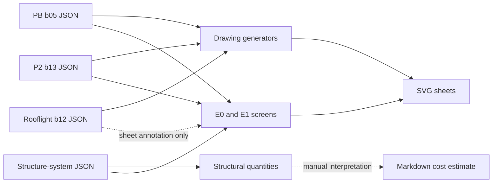
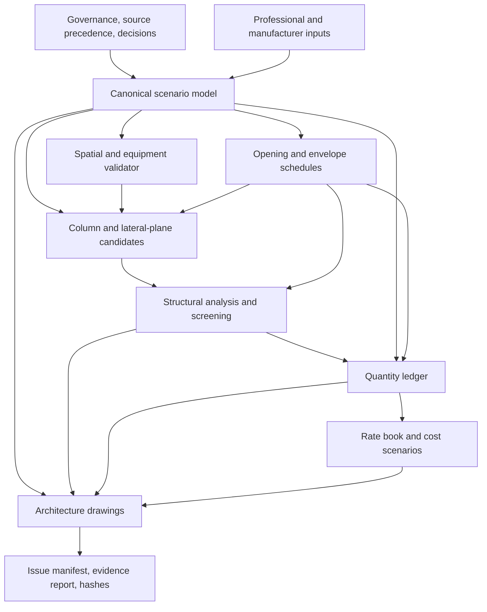

# Parametric Architecture–Structure–Cost Integration Plan

**Status:** implementation issue 0.4-I04 active; coordination basis; not for construction
**Version:** 0.6
**Date:** 2026-08-13  
**Planning horizon:** next coordinated design stage, before architectural or structural
freeze  
**Primary authority:** Project Constitution, source-precedence register, D-043,
D-045–D-048, D-050–D-059, and the active discipline records listed below
**Prepared from:** complete repository review, active drawings and JSON models, Python
call-path and test audit, cost-control records, and protected legacy source review  
**Required reviewers:** owner, architect, structural engineer, cost planner/quantity
surveyor, MEP designer, fire/life-safety professional, geotechnical engineer, and
applicable manufacturers/fabricators

> This document plans the work. It does not select a structural system, approve a member,
> establish a construction quantity, set a contractual price, or freeze PB/P2 geometry.
> Every numerical value is classified below as a requirement, active coordination
> hypothesis, benchmark, or measured current-model condition.

## Implementation issue 0.4-I01

The first executable vertical slice was issued on 2026-08-13. The command
`python -m dreamhouse.pipeline` now loads a hash-locked scenario, checks cross-model
geometry, validates the current P2 programme and real-equipment envelopes, enforces the
D-054 rooflight rule, injects roof openings into the E1 screen, compares four declared
Great Wall/stair support concepts, derives opening and quantity schedules, and reconciles
those quantities to cost-control codes. It writes a deterministic evidence package at
[`planos/integracion_v0.4_i01/`](../../planos/integracion_v0.4_i01/).

The issue closes no professional design gate. Its current result is **47 PASS, 6 OPEN,
0 FAIL**. The open items include rooflight trimmers/diaphragm detailing, a 0.101 m
refrigerator-to-cabinet-depth mismatch, the primary-suite gross/net target, structural
system selection, and cost-code/rate eligibility. The package therefore reports
`COORDINATION_OPEN`, `issue_ready=false`, and no approved budget total.

## Implementation issue 0.4-I02

D-057 adds `D057_P2_W01` as the active hash-locked scenario and retains the D-054/P2-b10
scenario for comparison. The active P2 source is now `dreamhouse/p2_b13.json`; its R10
plan and P2-W01 detail derive from the same model. The new 250 mm nominal dry-partition
control is validated together with room tessellation, child equivalence, circulation,
access, windows, stair reservations, and the existing rooflight/structure interfaces.
This issue does not convert the wall detail into a tested acoustic/fire assembly or a
construction quantity.

The deterministic package is written to
[`planos/integracion_v0.4_i02/`](../../planos/integracion_v0.4_i02/) and reports
**48 PASS, 6 OPEN, 0 FAIL**. It remains `COORDINATION_OPEN` and `issue_ready=false`;
the D-057 structural dead-load comparison is tracked separately in CF-009 and must be
added to the next structural issue rather than inferred from this pipeline result.

## Implementation issue 0.4-I03

D-058 adds `D058_P2_HALL_EDGE` as the active hash-locked scenario and retains
`D057_P2_W01` for comparison. The active P2 source is now `dreamhouse/p2_b14.json`; its
R11 plan, P2-W01 build-up detail and new P2-W04 hall-edge detail derive from the same
model. Validation requires a continuous 18.00 m full-height enclosure at X=21, assigns
the correct 250 mm net-dimension deduction to rooms on that edge, and permits GLZ-DECK
as the only scheduled acoustic opening.

The deterministic package is written to
[`planos/integracion_v0.4_i03/`](../../planos/integracion_v0.4_i03/) and reports
**49 PASS, 6 OPEN, 0 FAIL**. It remains `COORDINATION_OPEN` and `issue_ready=false`.
CF-009 now includes P2-W04 mass and CF-010 keeps the exposed-truss/wall interface open;
the pipeline does not claim acoustic, fire, structural, guarding or construction
performance.

## Implementation issue 0.4-I04

D-059 adds `D059_P2_REFINED_ENVELOPE` as the active hash-locked scenario and retains
`D058_P2_HALL_EDGE` for comparison. The active P2 source is now
`dreamhouse/p2_b15.json`; its R12 plan and five coordinated details derive from the same
model. Validation requires 300 mm nominal P2-W05 on the north, south and rear/east
exterior edges, keeps P2-W04 at the hall edge, cuts only scheduled windows and the
egress reserve, and recalculates net dimensions without moving the 270 m² gross envelope.

The deterministic package is written to
[`planos/integracion_v0.4_i04/`](../../planos/integracion_v0.4_i04/) and reports
**50 PASS, 7 OPEN, 0 FAIL**. It remains `COORDINATION_OPEN` and `issue_ready=false`.
The added open gate covers hygrothermal, wind, fire and window-interface design for
P2-W05; no thermal/acoustic rating, structural capacity, quantity, cost or construction
authority is inferred.

## 1. Executive recommendation

The next stage should not begin by independently redrawing P2 or selecting steel
profiles. It should establish one versioned computational model from which architecture,
structural coordination, quantity schedules, cost scenarios, and drawings are derived.
The present repository already contains capable but separate parametric subsystems. They
need a shared domain model, explicit provenance, and fail-closed interfaces.

The recommended implementation sequence is:

1. preserve the Constitution and the project's spatial idea as immutable acceptance
   tests;
2. migrate active PB, P2, roof, opening, and structural hypotheses into one canonical
   scenario model without changing their geometry;
3. replace drawn furniture symbols and equipment names with real product envelopes,
   operating clearances, service zones, and source records;
4. generate wall-integrated column candidates, including but not limited to the Great
   Wall and stair enclosure, and reject any candidate that conflicts with usable space,
   openings, egress, maintenance, or the protected architectural view;
5. make windows, rooflights, floor zones, wet areas, and equipment reservations direct
   inputs to structural screens and derived schedules;
6. derive a traceable bill of quantities and cost scenarios from accepted geometry and
   structural candidates, while keeping unapproved structural quantities explicitly
   ineligible for pricing;
7. issue one coordinated architecture–structure–cost evidence package with hashes,
   assumptions, rejected alternatives, and professional approval gates.

The first design study inside that workflow should compare Great Wall/stair-column
continuity alternatives and redistribute the two rooflights, because those decisions
simultaneously affect architecture, lateral stability, roof framing, drainage, glass,
MEP, and cost.

## 2. The project idea that the integration must protect

### 2.1 Origin and architectural soul

The protected legacy sources describe a house that is not a conventional residence
inside a warehouse shell. Its essential idea is:

- one calm rectangular industrial hall;
- one legible, honest, dominant steel structure;
- one great double-height volume in which domestic life, a project car, RC/DIY work,
  cooking, and technical objects coexist without visual clutter;
- one simple continuous roof and a small number of deliberate light events;
- one inhabited upper floor held at the rear, acoustically private but still related to
  the hall;
- one final transverse plane—the Great Wall—that gives the long hall an architectural
  end and conceals the stair, services, storage, and other necessary complexity;
- economy achieved by spatial generosity, repetition, integrated engineering, and
  disciplined scope, not by compromising safety or pretending that unresolved work is
  cheap.

The Great Wall was therefore architectural before it was structural. It is the final
surface perceived from the hall, nominally at X=31.50 m, with timber/acoustic expression
and flush access to the concealed rear core. D-043 legitimately gives it a gravity role
through a hidden steel frame, but that later structural use must reinforce—not replace—
its original purpose.

### 2.2 Non-negotiable spatial tests

The integration is unsuccessful if it produces a lighter or cheaper frame while breaking
any of the following:

- PB ceases to read as one continuous room;
- columns, braces, stair structure, or services become arbitrary objects in the usable
  hall;
- the principal view from the mini deck no longer reads one large authentic X=21
  structural object;
- the Great Wall loses its continuous final-plane reading;
- the front ceases to have exactly three entrances in the established hierarchy;
- the four-suite requirement or child-bedroom equivalence is lost;
- the primary suite is no longer recognizably dominant, spacious, and private;
- the visible structure becomes decorative while real technical structure is concealed;
- cost reduction depends on deleting required safety, climate, fire, acoustic, service,
  or maintenance performance.

These rules belong in automated scenario acceptance tests as well as in drawings.

## 3. Authority and information classification

### 3.1 Active coordination inputs

| Domain | Active source or model | Present authority |
| --- | --- | --- |
| Governance | `docs/00_gobernanza/constitucion_del_proyecto.md` | project rules and stage gates |
| Precedence | `docs/00_gobernanza/fuentes_precedencia_y_conflictos.md` | conflict resolution and open conflicts |
| Decisions | `docs/00_gobernanza/registro_decisiones.md` | owner/project decisions |
| Program | `docs/01_programa/programa_arquitectonico.md` | program and performance basis |
| PB | `dreamhouse/pb_b05.json` and PB R04 sheet | active schematic hypothesis |
| P2 | `dreamhouse/p2_b15.json` and P2 R12 sheets | issued for coordination under D-059; not for construction |
| Roof | roof b07 record/model | active schematic hypothesis |
| Rooflights | `dreamhouse/rooflight_b11.json` superseded in position by D-054 | geometry to revise |
| Structure | `dreamhouse/structure/structure_system.json`, E0/E1 records and sheets | research/screening only |
| Cost | cost basis, detailed control estimate, and 2026-08 audit | target and control hypotheses |
| Legacy | protected files under `docs/BORN_Legacy/` | source intent at their precedence level |

### 3.2 Required status vocabulary

Every model value and derived record shall carry one of these statuses:

- **requirement:** frozen or active rule under the governing precedence;
- **coordination hypothesis:** current geometry or system assumption, open to revision;
- **benchmark:** a real product, reference project, or preliminary target used for a
  test, not selected;
- **derived:** reproducible result from identified inputs and code version;
- **professional design input:** value supplied and signed by the responsible designer;
- **approved for issue:** accepted for a named design issue, but not automatically for
  procurement or construction;
- **superseded:** retained for traceability but unavailable to current generators.

No unlabeled scalar should enter drawings, structural calculations, quantities, or costs.

## 4. Current computational state

### 4.1 What already works

The repository is more advanced than a drawing-only project:

- PB, P2, rooflights, the roof, and structural studies have deterministic Python
  generators and machine-readable JSON inputs;
- P2 validation checks tessellation, overlap, access topology, suite components,
  child-bedroom equivalence, windows, phase boundaries, the stair, and D-048 column
  reservations;
- the structural package compares portal/truss concepts, generates roof-truss grammars,
  enumerates profiles, retains Pareto alternatives, runs member/system screens, maps
  ground-structure load paths, and produces E1 evidence sheets;
- the current 107-test structural/coordination suite passes;
- structural quantities can be generated for defined hypotheses;
- the cost record has atomic cost codes, confidence, phase allocation, measurement
  corrections, and economic gates.

This is a strong foundation. The main deficiency is not lack of algorithms; it is the
absence of a single authoritative dependency graph connecting them.

### 4.2 Present data flow



The dotted connections are the principal risk. Rooflights are visible on structural
sheets but do not yet alter the calculated roof framing/diaphragm model. Cost lines are
manually reconciled rather than derived from an auditable quantity ledger.

### 4.3 Fragmentation to remove

- Hall, roof, P2, and Great Wall dimensions are duplicated across JSON files with comments
  that they “must match,” rather than with one shared source.
- Historical `project.json`, `project_b02.json`, older P2 revisions, and active inputs can
  all be imported by code unless the caller knows which generator is current.
- Equipment exists partly as names, partly as drawing-only rectangles, and partly in
  superseded project files.
- Structural quantities read the structural configuration rather than the actual wall,
  opening, wet-zone, and equipment model.
- The cost estimate does not consume structural output or the active window schedule.
- Some obsolete reporting code in `dreamhouse/structure/e0.py` still contains superseded
  structural language, creating a reuse hazard even though the active report is correct.

## 5. Verified findings and required remedies

| ID | Severity | Verified condition | Consequence | Planned remedy |
| --- | --- | --- | --- | --- |
| F-01 | Critical | Multiple files duplicate the same envelope and level geometry. | A valid local file can contradict another valid local file. | One canonical scenario model; derived discipline views; cross-file hashes during migration. |
| F-02 | Critical | Cost is not computationally linked to geometry or structural candidates. | Geometry changes can leave quantities and totals apparently unchanged. | Quantity ledger plus rate book plus cost engine; no manual quantity in a derived cost line. |
| F-03 | High | Rooflights reach E1 drawings but not roof member, diaphragm, or trimmer calculations. | A structural candidate can pass while ignoring two large openings. | Make openings first-class structural exclusions and load-path objects before E1 reruns. |
| F-04 | High | D-053 validates the centre of the pair, not one rooflight per longitudinal half. | Both current rooflights share X=10.50 m and are perceptually clustered. | Implement D-054 half-centre objective and compare offsets/orientations against frames and drainage. |
| F-05 | High | Rooflight validation checks count and total declared area but not equal dimensions, `area = length × width`, unique IDs, or separation. | Incorrect or overlapping rooflights can pass. | Add geometric equality, area, uniqueness, containment, separation, and half-assignment invariants. |
| F-06 | High | Current P2 validation checks primary bathroom and dressing minima but not total primary-suite program, king-bed fit, circulation, furniture collisions, or private transition. | “PASS” does not demonstrate a spacious or luxurious primary suite. | Add suite-level performance and real-equipment clearance tests; retain multiple P2 scenarios. |
| F-07 | High | Furniture is hard-coded by the SVG generator; all beds use approximately the same 2.05 × 2.00 m symbol. | Drawings can imply fit without modelled clearances or procurement reality. | Equipment catalogue with product/body/operation/service envelopes and accessibility tags. |
| F-08 | High | The primary suite's explicitly tagged components total 66.28 m², while the protected source target is approximately 75–78 m² including transition. | The current result may be generous by bedroom components yet incomplete as a suite sequence. | Test an exclusive transition/arrival and spatial redistribution; do not assume the shared ARR is part of the suite. |
| F-09 | High | Only the four D-048 stair-enclosure lines currently pass the full-height architectural continuity screen. Other simple Great Wall continuations cross glazing or rooms. | Blind foundation-to-roof continuation would place structure in primary/guest space or openings. | Generate discrete wall-integrated candidates and permit controlled wall/window/room movement before rejection. |
| F-10 | High | The Great Wall can take gravity but has no demonstrated longitudinal lateral role. | Calling it a shear core would falsely close the lateral-system problem. | Keep gravity, transverse-plane, diaphragm/collector, and longitudinal-lateral roles separate in the schema and gates. |
| F-11 | High | P2 gravity screening currently assumes six long beams, a wall line, and a rear overhang; the real rear support alternative remains unresolved. | Weight, deflection, vibration, connection, erection, and foundation costs are highly sensitive. | Compare D-045 cantilever, a real rear line, and rationalized wall/stair frames under one scoring model. |
| F-12 | High | Current trial bracing lines conflict with major glazing and/or roof openings. | A computationally stable system may be architecturally impossible. | Opening-aware bracing planes and protected-view collision rules; require at least two feasible orthogonal lateral paths. |
| F-13 | High | Active P2 windows measure 55.02 m², versus the 40 m² P2 window control placeholder. | A 15.02 m² scope difference is currently unpriced or ambiguously assigned. | Generate the window schedule and map each opening once to façade, frame, glass, flashing, guard, shading, and MEP implications. |
| F-14 | High | Two PB technical windows measure 41.76 m²; the estimate also contains a 12 m² service-window placeholder. | Large risk of omission or double counting. | Entity-to-cost-code mapping with duplicate-coverage checks and explicit exclusions. |
| F-15 | Medium | The active rooflight geometry is 23.04 m², but relocation will change trimmers, purlin cuts, curbs, drainage, and possibly safety access even if glass area stays constant. | Area-only cost control misses consequential scope. | Assembly-based quantities and scenario deltas rather than glass-area-only costing. |
| F-16 | Medium | PB kitchen geometry contains a 4.50 m wall run and 3.60 × 1.20 m island, while source benchmarks discuss a 7–7.5 m wall and a larger island test. Appliances are not individually placed. | Kitchen comfort, services, cost, and circulation are unverified. | Treat both as scenarios; place the selected six-burner range, refrigerator, dishwasher, sinks, ovens, landing zones, and clearances. |
| F-17 | Medium | The relocated PB laundry is a 3.40 × 1.30 m reserve with equipment names but no door swing, appliance depth with open doors, ventilation, connections, or maintenance access. | A rectangle can pass while the laundry is unusable. | Model washer/dryer bodies, doors, hoses, valves, drains, ventilation, working aisle, and replacement route. |
| F-18 | Medium | The lint run reports 58 issues despite all tests passing, including unused imports/variables and stale report code. | Technical debt obscures meaningful warnings and makes old logic easier to reuse. | Baseline then clear lint debt in touched modules; delete or explicitly archive superseded report paths with tests. |
| F-19 | Medium | The code has no single current-model manifest. | A generator can silently use a superseded revision. | One manifest declaring active inputs, versions, statuses, source decisions, code hash, and output directory. |
| F-20 | Medium | Site, geotechnical parameters, occupancy/fire basis, exact design vehicle/lift, and final appliance models remain open. | Foundation, egress, services, roof/drainage, and cost cannot close. | Keep blocking gates explicit; allow benchmarks only for spatial reservation and sensitivity studies. |

The passing test suite is evidence of deterministic behavior inside current boundaries. It
is not evidence that the boundaries cover the owner's new requirements.

## 6. Target system architecture

### 6.1 Single-source dependency graph



Each arrow shall be executable and tested. No downstream file may redefine an upstream
value.

### 6.2 Canonical model scope

Use a versioned, SI-unit, JSON-based model with a small typed Python layer. Prefer the
standard library and existing numerical dependencies; do not add a BIM platform or a
heavy geometry dependency until rectangular/polygonal coordination demonstrably requires
it.

The canonical model shall contain:

- project, scenario, coordinate system, units, version, and status;
- sources, decisions, assumptions, approvals, and unresolved gates;
- site placeholder and environmental/professional input references;
- envelope, levels, roof planes, structural zones, and phase zones;
- spaces, space groups/suites, boundaries, wall layers, and access graph;
- doors, windows, rooflights, openings, guards, and replacement routes;
- equipment, furniture, fixtures, body envelopes, movement envelopes, service envelopes,
  and required clearances;
- structural grids, protected no-column/no-brace volumes, support candidates, columns,
  beams, trusses, decks, diaphragms, collectors, and foundations;
- construction assemblies and measurement rules;
- quantity ledger entries and rate-book mappings;
- scenario metrics, validation results, rejected alternatives, and output hashes.

### 6.3 Stable IDs and provenance

Every entity shall have:

```text
id
entity_type
scenario_id
revision_introduced
status
source_ids[]
decision_ids[]
assumption_ids[]
geometry_or_value
unit
confidence
approved_by[]
```

Derived records additionally require `input_hash`, `generator_version`, and
`generated_at`. IDs such as `M-D`, `W-M-REAR`, `RL-CAR`, and cost codes must be preserved
during migration.

### 6.4 Scenario model, not premature freeze

The base scenario should reproduce active b05/b10/b11 geometry exactly before any design
change. Branches then contain only deltas:

- `BASELINE_B10_D053_REPRODUCTION`—audit-only reproduction;
- `RL_D054_HALF_CENTRES`—one rooflight near each longitudinal half centre;
- `GW_A_D048_ONLY`—four full-height stair-enclosure columns plus floor-only wall piers;
- `GW_B_WALL_CONTINUITY`—additional full-height concealed wall columns with controlled
  P2/windown adjustments;
- `GW_C_REAR_FRAME`—real rear support line or rationalized perimeter support;
- `P2_LUXURY_TRANSITION`—private primary-suite transition and equipment-based layout;
- combined alternatives after the individual deltas pass.

This preserves openness while making comparisons reproducible.

## 7. Required cross-domain contracts

### 7.1 Windows and glazed openings

One window entity must drive all of the following:

- architectural location, daylight/view intent, room association, sill, head, operability,
  safety, guard, shading, and privacy;
- wall-panel subtraction, reveal, flashing, seal, thermal-bridge, and water-management
  quantities;
- structural jamb/header/trimmer demands and conflicts with columns/braces;
- wind-design input supplied by the structural/envelope professionals;
- glazing, frame, perimeter, hardware, access, cleaning, curtain, and HVAC implications;
- cost-code coverage with no omission or double count.

Required invariants include containment in an exterior boundary, valid orientation,
positive dimensions, unique ID, room-to-opening connection, no prohibited collision, and
exactly one quantity/cost coverage disposition.

### 7.2 Rooflights

Rooflights must be structural openings, not drawing annotations. Each entity shall drive:

- roof-plane cutout and effective diaphragm opening;
- intersected primary and secondary members;
- trimmers, curb, deck edges, fasteners, fall protection, maintenance path, and replacement
  route;
- drainage/diversion, condensation, waterproofing, and manufacturer slopes;
- glass, shading, glare, solar-gain, ventilation, and cleaning scenarios;
- quantities and cost impacts even when total glass area is unchanged.

Validation must prove equal geometry where equality is required, declared versus
calculated area, unique IDs, containment, non-overlap, minimum separation, half
assignment, and distance to protected primary-frame/edge zones.

### 7.3 P2 floor and wet zones

The P2 spatial model must produce:

- floor polygon and openings;
- space-by-space imposed-load class supplied by the structural engineer;
- partition line loads or declared distributed allowances;
- wet-zone build-ups, falls, waterproofing, drainage, and localized dead loads;
- deck span direction, support lines, vibration-sensitive areas, and ceiling/plenum zones;
- concrete, deck, reinforcement, studs, partitions, ceilings, acoustic layers, and finish
  quantities.

Changing a room boundary must therefore trigger floor load, member, partition, MEP, and
cost recalculation.

### 7.4 Columns and braces

Column candidates shall be generated only from named architectural host zones:

- perimeter wall build-ups;
- Great Wall piers and portal jambs;
- protected stair-enclosure corners;
- selected internal fixed cabinetry/service spines only if approved;
- other explicitly created structural zones.

Candidates must carry a vertical extent and role: foundation-to-roof, foundation-to-P2,
P2-to-roof, floor-gravity support, roof support, collector support, or lateral-system
member. A single coordinate is not permission to assign every role.

Automatic rejection tests shall include intersections with:

- required clear space and working aisles;
- doors, windows, portals, and replacement paths;
- beds and bedside circulation;
- vehicle/lift body, door-opening, lift-post, and service envelopes;
- stair/landing/egress/guard zones;
- primary view corridors and the continuous Great Wall finish;
- MEP shafts, valves, equipment access, and drainage paths.

### 7.5 Quantity and cost contract

The quantity ledger shall be an append-only derived table with, at minimum:

```text
quantity_id
scenario_id
assembly_id
source_entity_ids[]
measurement_rule_id
net_quantity
waste_or_lap_factor
procurement_quantity
unit
status
confidence
input_hash
```

The rate book shall be independent of geometry and record source, access date, location,
currency, tax treatment, delivery, installation, exclusions, escalation basis, and
confidence. The cost engine joins eligible quantities to rates and reports unmapped,
multiply mapped, provisional, and blocked records.

No E0/E1 structural mass may become a control or procurement quantity unless its status
passes the structural and PE-1 gates. Research mass can appear only in an explicitly
named sensitivity scenario.

## 8. Great Wall and continuous-column strategy

### 8.1 Exact interpretation

The Great Wall is a layered system:

1. **architectural face:** one continuous timber/acoustic final plane toward the hall;
2. **access layer:** flush doors, stair portal, service access, acoustic seals, and a
   maintainable lower technical zone;
3. **concealed coordination depth:** structure, fire protection, acoustic separation,
   ducts, pipes, cable paths, and tolerances;
4. **rear service core:** stair, storage, laundry reserve, technical spaces, and exits.

Its nominal 0.20 m graphic thickness is not a structural requirement and may grow where
the concealed assembly requires it. Any growth must be measured against usable areas,
door reveals, acoustics, fire protection, and cost.

### 8.2 What can already continue to the roof

The four D-048 stair-enclosure corner lines at:

- (31.50, 7.40),
- (31.50, 11.00),
- (36.00, 7.40), and
- (36.00, 11.00)

are the only currently documented foundation-to-roof candidates that survive the narrow
architectural continuity audit. They remain hypotheses; no member, joint, base,
foundation, bracing, collector, fire protection, or roof gravity function is selected.

The existing Great Wall gravity piers can support the P2 floor and terminate at its top
transfer system. They do not need to continue through bedrooms merely to create visual
regularity.

### 8.3 Alternatives to compare

| Alternative | Description | Architectural opportunity | Principal risk |
| --- | --- | --- | --- |
| GW-A | D-048 full-height stair frame; other Great Wall piers support P2 only. | Least P2 disruption; structure concentrated in concealed core. | May require heavier transfers, cantilevers, collectors, and another lateral system. |
| GW-B | Add selected full-height columns within Great Wall/P2 wall alignments; allow controlled movement of P2 walls and windows. | More direct gravity/roof path; columns remain hidden. | Can erode suite proportions, glazing, and Great Wall access if optimized only for weight. |
| GW-C | Add a real rear/perimeter support line and rationalize P2 beams with the stair frame. | Reduces the D-045 rear overhang and connection demand. | Foundations, façade, exits, and rear access may become more complex. |
| GW-D | Hybrid of GW-B/C with an independently located longitudinal lateral plane. | May balance mass, architecture, and fabrication. | More system interfaces and erection sequencing. |

Each alternative must be tested under the same geometry, load basis, fire assumptions,
member catalogue, connection allowances, quantity rules, and rates.

### 8.4 Candidate objective function

Use a Pareto comparison rather than a single weighted answer. Retain non-dominated
alternatives across:

- structural utilization, drift, vibration, robustness, and sensitivity;
- total primary and secondary steel mass;
- connection count and connection complexity proxy;
- transfer/cantilever penalty;
- foundation reaction sensitivity;
- number and severity of architectural conflicts;
- lost usable area and affected premium-suite area;
- Great Wall continuity and protected-view compliance;
- erection, fire-protection, inspection, and maintenance complexity;
- measured construction cost and confidence, when eligible.

The responsible professionals and owner select from the feasible frontier. The algorithm
does not silently choose the design.

## 9. Rooflight correction and study

### 9.1 Owner-directed geometry objective

D-054 supersedes only D-053's combined-bounding-box centre rule. For study purposes,
divide the 21.00 × 18.00 m double-height area into two longitudinal halves:

- front half: X=0.00–10.50 m, nominal centroid (5.25, 9.00);
- rear half: X=10.50–21.00 m, nominal centroid (15.75, 9.00).

Place one equal nominal rooflight near each centroid. “Near” is a design objective, not a
construction tolerance. Final offset, orientation, and size may move to protect primary
frames, purlins, diaphragm action, drainage, daylight distribution, glare control,
maintenance, and manufacturer constraints.

The present two 4.80 × 2.40 m hypotheses have centres at (10.50, 7.20) and
(10.50, 10.80). They are centred only as a group and are separated by 1.20 m edge-to-edge,
which explains the owner's perception that they are too close.

### 9.2 Required study set

For each half, compare at least:

- long direction parallel to the hall;
- long direction transverse to the hall;
- a modest centroid offset that clears primary members and rationalizes trimmers;
- a size/proportion variant preserving daylight performance if the 4.80 × 2.40 m module
  conflicts with the selected roof system.

Report centroid offset, member intersections, added trimmer mass, diaphragm effect,
curb/perimeter length, drainage interference, solar/daylight metrics, maintenance route,
glass area, assembly cost, and confidence. Count, size, and 23.04 m² total area remain
coordination hypotheses until this comparison and manufacturer input are complete.

## 10. P2 room and primary-suite review

### 10.1 Current measured condition

The active b10 model produces these explicitly tagged suite components:

| Suite | Current component area | Planning interpretation |
| --- | ---: | --- |
| Primary M | 66.28 m² | 31.08 bedroom + 17.60 bathroom + 17.60 dressing/filter; no exclusive transition tagged |
| Child H1 | 38.00 m² | meets the source suite target by component area |
| Child H2 | 38.08 m² | equal to H1 within the D-042 tolerance |
| Guest G | 29.12 m² | includes entry/filter, bath, closet, and bedroom; review against program and furniture performance |

The primary bedroom itself is within the source's approximate 30–34 m² benchmark and its
bathroom/dressing components are generous. The unresolved issue is the total private
sequence: the source envisioned approximately 75–78 m² including transition. The current
10.44 m² protected arrival `ARR` is shared and therefore cannot silently be counted as
primary-suite area. A dedicated portion could close much of the numerical gap, but only
if privacy, stair access, family circulation, fire separation, and the other suites still
work.

### 10.2 Luxury as a performance test

Do not define luxury only by square metres or finishes. The primary-suite validator shall
test:

- an actual selected bed/frame envelope, two accessible sides, foot circulation, bedside
  tables, seating, luggage, and a clear route to bathroom/dressing without crossing the
  sleeping zone unnecessarily;
- views, privacy from shared circulation, acoustic separation, blackout/shading, and
  daylight control;
- two-person wardrobe use, door/drawer movement, dressing aisle, full-height storage, and
  luggage/linen capacity;
- two-person bathroom use, dry/wet separation, shower operation, WC privacy, fixture
  service access, ventilation, waterproofing, and maintenance;
- clear structural and MEP zones with no exposed column, brace, downpipe, shaft, or beam
  intrusion that contradicts the intended calm space;
- a coherent arrival/threshold that makes the suite feel dominant before expensive
  finishes are added.

### 10.3 P2 design branches

Develop at least three comparable layouts within the same approximately 270 m² envelope:

1. **B10 refined:** retain room boundaries, replace symbols with equipment/clearance
   tests, and correct only failed details;
2. **Private-transition variant:** dedicate a controlled part of ARR/FAM-A to the primary
   threshold while preserving shared access and fire logic;
3. **Structure-led variant:** move selected partitions/windows enough to hide additional
   continuous columns and improve the gravity path, but hold suite performance as a hard
   feasibility gate.

Do not advance a variant that improves primary-suite area by making child bedrooms
unequal beyond D-042, shrinking the guest below accepted performance, or consuming
required circulation/egress.

## 11. Real equipment and furniture benchmarks

### 11.1 Modelling rule

A product record must distinguish:

- body dimensions;
- installation/cutout dimensions;
- door, drawer, lid, or vehicle-door movement;
- operating clearance and working aisle;
- ventilation/combustion/exhaust clearances;
- water, waste, gas, electrical, data, and condensate zones;
- service/removal route and mass where relevant;
- source URL/document, model, market, access date, and status.

The table below establishes real benchmark envelopes for programming. It does not select
products.

### 11.2 Reference envelopes for first tests

| Object | Real benchmark | Modelled first-pass envelope | Use in the plan |
| --- | --- | --- | --- |
| King bed | IKEA Colombia describes King as 1.80 × 2.00 m; frames are larger. | Product frame, not mattress only; test 1.80 × 2.00 m and an owner-requested larger alternative. | Primary bedroom and replacement route. |
| Classic full-size car | GM's 1970 full-size Chevrolet data gives approximately 5.49 m length and 2.03 m width before working/door clearances. | Use at least 5.50 × 2.05 m body for sensitivity until D-022 names the vehicle. | Workshop bay, turning/door/lift/egress envelope. |
| Six-burner range | Wolf GR366: approximately 0.911 m W × 0.721 m D, plus 0.495 m oven-door clearance and installation requirements. | Body, door swing, landing zones, hood, gas/electrical, and combustible-clearance zones. | Kitchen run, ventilation, MEP, cost. |
| Dishwasher | Bosch 24-inch example: approximately 0.598 m W × 0.573 m D; approximately 0.610 m cutout depth. | Body, open-door/rack zone, plumbing/electrical and service access. | Kitchen adjacency and working aisle. |
| Refrigerator >700 L | Samsung Colombia 758 L example: 0.912 m W × 1.780 m H × 0.851 m D. | Body plus manufacturer side/top/rear clearances, full door/drawer sweep, water/electrical, ventilation, and removal route. | Kitchen wall depth and landing space. |
| Washer | LG WM4000: approximately 0.686 m W × 0.991 m H × 0.768 m D; approximately 1.397 m deep with door open. | Body, open door, hoses/valves/drain, vibration and service allowances. | PB laundry reserve. |
| Dryer | LG DLEX4000: approximately 0.686 m W × 0.991 m H × 0.765 m D; approximately 1.305 m deep with door open; venting affects cutout. | Body, open door, exhaust/condensate, electrical/gas variant, service and ventilation. | PB laundry reserve. |

Owner selection can later replace any benchmark without rewriting geometry logic. Until
then, benchmark status must remain visible in drawings and reports.

## 12. Quantity and cost integration

### 12.1 Immediate measurement reconciliation

The canonical migration must reproduce and flag these present-model measurements:

| Scope | Active geometric quantity | Present cost-control quantity/status | Required action |
| --- | ---: | --- | --- |
| P2 windows, including wellness | 55.02 m² | 40 m² P2 window placeholder | map each opening; resolve 15.02 m² difference |
| PB technical side glazing | 41.76 m² | ambiguous against 12 m² service-window placeholder and other glass lines | prevent omission/double count |
| Rooflights | 23.04 m² glass hypothesis | added scope without price under 0.3-H/J | price full assemblies, not glass only |
| P2 gross floor | 270 m² | 270 m² metaldeck basis | retain, then derive openings/build-ups and structural steel separately |
| Great Wall P2 steel | approximately 11.6 t E0 lower-bound subtotal | not eligible for target change | retain as research sensitivity until E1/PE-1 |
| Total structural steel | current cost control 28.35 t versus audited 30–45 t realistic band and wider E0 lower-bound alternatives | critical uncertainty | compare coordinated eligible alternatives; no silent total change |

These are control findings, not a new budget. The $941 M physical-work target and
$988.05 M target including its inherited 5% contingency remain unchanged until the
economic gates are passed.

### 12.2 Cost mapping by interface

At minimum, the engine must map:

- primary/secondary steel, connections, coatings, fire protection, transport, erection,
  and foundations to 03/05/06 and future explicit fire lines;
- deck, slab, reinforcement, edge trims, and finishes to 07/14/23;
- rooflights to 05/06/08/10/13/19/22 and applicable safety/maintenance scope;
- wall openings to 06/09/10/12/13/17/19/23;
- Great Wall layers to 05/06/10/14/17/18/19/21/22/23/26;
- equipment services to 15/17/18/19/20/25 and equipment exclusions;
- structural alternatives to foundation, connection, fire, erection, and inspection
  deltas, not steel kilograms alone.

### 12.3 Economic outputs

Every scenario report shall show:

- measured quantities with source entities and confidence;
- unmapped and multiply mapped quantities;
- rate source/date/location and exclusions;
- base target comparison without overwriting the target;
- delta from the reproduced baseline scenario;
- low/central/high or sensitivity values where selection is open;
- construction cost versus promoter cost and excluded equipment;
- contingency treatment and economic gate status;
- the ten largest uncertain cost drivers.

## 13. Python implementation work packages

### WP-0 — Controlled baseline and manifest

**Purpose:** prove the migration starts from the current record.  
**Planned changes:**

- maintain an active-model manifest referencing PB b05, P2 b13, roof b07, revised rooflight
  branch, structural input versions, decisions, and status;
- generate file hashes and a baseline metrics snapshot;
- preserve the original 97-test baseline and reproduce the expanded 107-test pass plus
  drawing/quantity outputs;
- mark old inputs as superseded in manifests without deleting historical files;
- isolate/delete stale executable reporting paths that contain superseded design language.

**Exit:** a single command identifies the exact current input set and reproduces its
metrics.

### WP-1 — Canonical typed domain model

**Purpose:** eliminate duplicated authority.  
**Candidate modules:**

- `dreamhouse/model/schema.py`—typed dataclasses/enums and validation;
- `dreamhouse/model/io.py`—versioned JSON load/save and migration;
- `dreamhouse/model/provenance.py`—sources, decisions, assumptions, hashes;
- `dreamhouse/model/units.py`—explicit SI-unit helpers;
- `dreamhouse/model/scenarios.py`—base plus delta composition;
- `dreamhouse/model/project_v04.json`—canonical active scenario package.

Migrate without geometric change. Existing JSON files remain traceable import sources,
not concurrent authorities.

**Exit:** all active dimensions have one source and every migrated entity has stable ID,
status, and provenance.

### WP-2 — Geometry, access, and clearance kernel

**Purpose:** turn program and equipment into measurable constraints.  
**Candidate modules:**

- `dreamhouse/geometry/rectangles.py`—containment, overlap, adjacency, offsets;
- `dreamhouse/geometry/access.py`—doors and circulation graph;
- `dreamhouse/geometry/clearances.py`—body, movement, service, and protected zones;
- `dreamhouse/geometry/measurement.py`—net/gross/assembly measurement rules.

Start with deterministic rectangles and line segments. Add a polygon library only after a
documented case exceeds the simple kernel.

**Exit:** PB/P2 spaces, furniture, vehicles, appliances, openings, and replacement paths
are validated from model data rather than SVG symbols.

### WP-3 — Equipment catalogue and room-performance rules

**Purpose:** verify real-world fit.  
**Candidate modules/data:**

- `dreamhouse/equipment/catalog.json`;
- `dreamhouse/equipment/models.py`;
- `dreamhouse/equipment/validators.py`;
- source snapshot/metadata records for each benchmark or selected product.

Implement primary-suite, kitchen, laundry, vehicle/lift, wellness, bathroom, and workshop
rules. Separate owner targets from code/professional requirements.

**Exit:** equipment swaps rerun spatial, service, quantity, and cost checks.

### WP-4 — Opening and envelope schedules

**Purpose:** make every opening one cross-discipline entity.  
**Candidate modules:**

- `dreamhouse/envelope/openings.py`;
- `dreamhouse/envelope/schedules.py`;
- `dreamhouse/envelope/rooflights.py`;
- `dreamhouse/envelope/assemblies.py`.

Implement D-054 scenarios, equality/area/separation validation, wall/roof subtraction,
perimeters, trimmer interfaces, and cost coverage.

**Exit:** generated window/door/rooflight schedules reconcile exactly with drawings,
structure, quantities, and cost dispositions.

### WP-5 — Architecture-aware structural candidate layer

**Purpose:** compare feasible structure, not structure in an empty box.  
**Candidate modules:**

- `dreamhouse/structure/coordination.py`—protected zones and conflicts;
- `dreamhouse/structure/support_candidates.py`—perimeter/Great Wall/stair candidates;
- `dreamhouse/structure/load_transfer.py`—vertical roles and load paths;
- `dreamhouse/structure/openings.py`—roof/window/bracing exclusions;
- extensions to E1 screening and quantities.

Keep existing truss grammar, profile enumeration, Pareto logic, and fail-closed E1 gates.
Pass the actual rooflight and P2 models into structural calculations, not only sheets.

**Exit:** GW-A/B/C/D and rooflight variants produce reproducible feasible/rejected sets
with reasons. No selection is automatic.

### WP-6 — Quantity ledger and rate book

**Purpose:** connect design changes to money without confusing research with authority.  
**Candidate modules/data:**

- `dreamhouse/quantities/ledger.py`;
- `dreamhouse/quantities/rules.py`;
- `dreamhouse/cost/rate_book.py`;
- `dreamhouse/cost/engine.py`;
- `dreamhouse/cost/mappings.json`.

Represent waste, laps, fabrication allowances, and exclusions explicitly. Structural
status controls price eligibility.

**Exit:** every priced quantity is derived and traceable; every unpriced quantity is
reported.

### WP-7 — Orchestrator and parallel-safe pipeline

**Purpose:** make synchronization routine.  
**Candidate entry point:** `python -m dreamhouse.pipeline --scenario <id> --issue <id>`.

Execution order:

1. load governance snapshot and scenario;
2. validate canonical model;
3. run independent spatial, equipment, opening, and source-conflict checks in parallel;
4. generate support/lateral candidates;
5. run structural screens for feasible candidates;
6. derive quantities;
7. join eligible rates and calculate cost scenarios;
8. generate drawings, schedules, reports, and issue manifest;
9. fail the issue if any critical invariant, unresolved mapping, stale input, or authority
   breach exists.

Cache outputs by input hash. Parallelism may reduce run time but must not change ordering,
candidate IDs, or results.

**Exit:** one command produces or refuses the complete coordinated issue.

### WP-8 — Drawings and evidence package

**Purpose:** ensure visual outputs communicate authority and uncertainty.  
**Outputs:**

- coordinated PB/P2/roof plans;
- column/bracing and protected-zone overlays;
- Great Wall architectural/structural/service layers;
- rooflight/frame/diaphragm overlay;
- primary-suite equipment and clearance plan;
- window, opening, equipment, quantity, and cost schedules;
- scenario comparison and rejected-candidate report;
- issue manifest with inputs, hashes, approvals, warnings, and “not for construction”
  status where applicable.

**Exit:** a reviewer can trace any drawn element to the model, source, structural result,
quantity, and cost disposition.

### WP-9 — Tests, cleanup, and documentation

**Purpose:** make the integrated model maintainable.  
**Tasks:**

- preserve existing regression tests;
- clear lint findings in all touched modules and remove dead/stale output logic;
- add unit, cross-domain integration, property/invariant, and golden-output tests;
- document schema, measurement rules, cost mappings, scenario creation, and professional
  approval workflow;
- reindex the code knowledge graph after implementation.

**Exit:** all tests pass, touched code is lint-clean, current/superseded paths are
unambiguous, and the repository index represents the new architecture.

## 14. Test and acceptance strategy

### 14.1 Essential invariants

The pipeline shall fail when:

- canonical hall/P2/roof dimensions disagree;
- an active entity lacks provenance or has a superseded source;
- spaces overlap or fail the access graph;
- suite count, private bathrooms, child equivalence, or phase boundary fails;
- equipment or its operating/service envelope collides with structure, openings, or
  circulation;
- a column/brace enters a prohibited space or view;
- a rooflight is unequal when equality is required, has incorrect area, overlaps another,
  is outside its half, or intersects an uncoordinated primary member;
- an opening lacks structural/envelope/cost disposition;
- structural output omits an active opening, support, load zone, or professional input;
- a quantity has no source entity or measurement rule;
- a cost line contains a manual quantity where derivation is required;
- a research structural result is treated as approved/priceable;
- a generated output hash does not match current inputs.

### 14.2 Golden scenarios

Maintain small reference fixtures for:

- exact b10/D-053 reproduction;
- D-054 rooflights;
- one accepted and one rejected Great Wall column candidate;
- a king-bed clearance pass/fail pair;
- washer/dryer door-and-service collision;
- a window moved across a brace line;
- an unchanged glass area with changed rooflight trimmer cost;
- a structural candidate ineligible for cost despite a computed mass;
- a fully mapped cost scenario with no orphan quantities.

### 14.3 Professional gates

Automated PASS never replaces:

- architectural approval of composition, privacy, material expression, and spatial
  quality;
- structural-engineer approval of actions, analysis, systems, members, joints,
  diaphragms, fire, erection, anchors, and foundations;
- fire/life-safety approval of occupancy, exits, travel, separations, guards, glazing, and
  the retractable-stair reserve;
- geotechnical and civil approval of the site, drainage, foundations, slabs, and access;
- MEP approval of loads, ventilation, combustion, drainage, water, controls, and
  maintenance;
- quantity-surveyor/cost-planner approval of measurement rules, rates, exclusions,
  escalation, and contingencies;
- manufacturer/fabricator confirmation of actual products and installation constraints.

## 15. Stage gates and deliverables

| Gate | Minimum evidence | Decision enabled | Explicitly not enabled |
| --- | --- | --- | --- |
| I-0 Baseline | manifest, hashes, reproduced metrics, 97 tests, active/superseded map | start migration | design change |
| I-1 Canonical model | one-source geometry, provenance, scenario deltas, cross-model tests | coordinated option studies | structural selection or pricing |
| I-2 Spatial/equipment | real benchmark catalogue, P2/kitchen/laundry/vehicle clearance reports | select layouts for structural comparison | procurement |
| I-3 Architecture–structure | opening-aware E1, GW alternatives, vertical/lateral paths, professional review comments | shortlist structural schemes and rooflight/P2 geometry | final sections, joints, foundations |
| I-4 Quantities/cost | quantity ledger, rate book, mappings, scenario costs, PE-1 comparison | value-engineering and target decision | contract sum |
| I-5 Coordinated v0.4 issue | approved architecture/structure/MEP/fire/site inputs at the declared level, sheets/schedules/manifest | advance to developed design | construction |
| PE-2/PE-3 | governed by the cost basis and professional pathway | procurement/contracting decisions | any work beyond signed scope |

## 16. Priority sequence

| Priority | Work | Dependency | Effort | Immediate output |
| ---: | --- | --- | --- | --- |
| 1 | WP-0 baseline/manifest and stale-path isolation | none | S | trusted starting point |
| 2 | WP-1 canonical model and migration | 1 | L | single source of geometry/status |
| 3 | WP-2 geometry/clearance kernel | 2 | M | reusable collision/access engine |
| 4 | WP-4 opening schedules and D-054 branches | 2–3 | M | corrected rooflight/window coordination |
| 5 | WP-3 equipment/room rules and P2 branches | 2–3 | M | primary-suite, kitchen, laundry, vehicle evidence |
| 6 | WP-5 Great Wall/structural alternatives | 4–5 | L | feasible Pareto frontier and rejected set |
| 7 | WP-6 quantities/cost | 2, 4–6 | L | traceable scenario economics |
| 8 | WP-7/WP-8 orchestrator and evidence issue | 2–7 | M | one-command coordinated package |
| 9 | WP-9 final cleanup/docs/index | continuous; closes after 8 | M | maintainable baseline for v0.4 |

Effort bands are comparative only: S, M, and L do not establish a programme or fee.

## 17. Risks and controls

| Risk | Probability/impact | Control |
| --- | --- | --- |
| Canonical migration accidentally changes geometry | medium/high | baseline hashes, exact reproduction fixture, metric diff, no-change first commit |
| Optimizer privileges steel mass over architecture | high/high | feasibility rules first; Pareto frontier; owner/architect selection |
| Great Wall becomes a false “shear core” | medium/high | separate gravity/transverse/lateral roles and professional gates |
| Rooflight daylight goal conflicts with primary frames/diaphragm | high/high | half-centre as objective, not tolerance; orientation/offset/size variants |
| Real equipment grows service zones beyond current rooms | high/medium | benchmark and selected-product scenarios before walls freeze |
| Cost appears precise while structural design is immature | high/high | status-based price eligibility, confidence bands, unmapped report |
| Historical generators remain callable | high/medium | active manifest, explicit superseded status, entry-point tests |
| Added software becomes expensive or fragile | medium/medium | standard library first, rectangular kernel, no paid platform dependency |
| Parallel execution produces non-determinism | low/high | stable sorting/IDs, hash caching, repeatability tests |
| Site/fire/geotechnical inputs arrive late | high/high | visible blocking gates; sensitivity only; no false closure |
| Cost target drives unsafe scope removal | medium/high | Constitution and professional safety gates precede economic scoring |

## 18. Decisions and inputs still required

The computational work can start without answering every item, but the following must
remain visible blockers:

- D-017 site/municipality, survey, utilities, access, climate, orientation, and drainage;
- D-018 exact cost ceiling and maximum Phase 1 cash requirement;
- D-019 selected conceptual structural system/module;
- D-020 comfort, ventilation, heating, and energy strategy;
- D-021 occupancy/fire/hazard separation and protection basis;
- D-022 exact project car and automotive-lift model;
- D-023 side assignment at the front;
- D-024 kitchen-island/equipment decision;
- D-025 hot-tub decision;
- actual bed/frame preference and primary-suite storage/use brief;
- appliance market/voltage/fuel choices and exact product models;
- Great Wall material sample, acoustic target, fire rating, door hardware, and maintainable
  service-zone depth;
- roof panel/deck manufacturer, allowable slope, opening details, and diaphragm data;
- structural fabricator input on available profiles, connections, AESS category, erection,
  coatings, and local supply;
- professional design assignments, issue responsibilities, and review dates.

## 19. Definition of done for this integration stage

The stage is complete only when:

1. one manifest and canonical scenario model govern active geometry;
2. the active PB/P2/roof/opening/structure models contain no duplicated authoritative
   dimensions;
3. room, equipment, opening, column, and access checks operate on model data;
4. the primary suite passes an owner-approved luxury/performance brief using real
   equipment envelopes;
5. one rooflight is coordinated near the centre of each longitudinal half, or an approved
   documented alternative explains the deviation;
6. Great Wall/stair/rear support alternatives are compared and all rejected candidates
   retain reasons;
7. no column or brace occupies an unapproved usable or protected space;
8. openings participate in structural and diaphragm screening;
9. every quantity is derived, sourced, unitized, and status-classified;
10. every cost line has a traceable quantity/rate or is reported as unmapped/blocked;
11. economic comparison preserves the target and separately shows scenario deltas and
    confidence;
12. existing and new tests pass, touched code is lint-clean, current-drawing promotion
    is explicit in `planos/actual/catalog.json`, every SVG/PNG alias and provenance hash
    validates, and superseded generators cannot promote current drawings;
13. the coordinated evidence package carries input/output hashes and the required
    professional approvals/warnings;
14. the decision, conflict, risk, and cost-control records are updated for every adopted
    change.

## 20. Reference basis and inspiration

These sources inform benchmarks and workflow; none overrides Colombian regulation,
project decisions, or responsible-professional design.

### 20.1 Regulatory and technical sources

- [Ministry of Housing—NSR-10 and current modification context](https://www.minvivienda.gov.co/normativa/decreto-1401-2023): current official modification
  record; architectural, structural, review, fire, and construction responsibilities must
  remain professional gates.
- [Ministry of Housing—Urban and Territorial Space / seismic-resistance framework](https://www.minvivienda.gov.co/viceministerio-de-vivienda/espacio-urbano-y-territorial): official
  institutional and update context for NSR-10.
- [Steel Deck Institute design manuals](https://sdi.org/design-manuals/): roof, floor, and
  diaphragm manuals to be used by the structural professional and selected manufacturer;
  the current model must not assume diaphragm behavior around rooflights.
- [AISC Architecturally Exposed Structural Steel](https://www.aisc.org/architecture-center/architecturally-exposed-structural-steel/): supports explicit coordination of viewing
  distance, fabrication, finishes, connections, expectations, and cost for the one visible
  structural object.

### 20.2 Dimensional benchmark sources

- [IKEA Colombia bed-size guide](https://www.ikea.com/co/es/rooms/bedroom/how-to/guia-para-elegir-tu-nueva-cama-pub42c6b130/)
- [General Motors 1970 Chevrolet information kit](https://news.chevrolet.com/content/dam/company/no_search/heritage-archive-docs/vehicle-information-kits/chevrolet/1970-Chevrolet.pdf)
- [Wolf GR366 six-burner range technical data](https://ca.subzero-wolf.com/en/trade-resources/product-specifications/product-specifications-detail/36-inch-gas-range-6-burners)
- [Bosch 24-inch dishwasher technical example](https://media3.bosch-home.com/Documents/specsheet/en-CA/SHE89PW75N.pdf)
- [Samsung Colombia 758 L refrigerator technical data](https://www.samsung.com/co/business/refrigerators/side-by-side/758l-black-doi-rs27t5561b1-co/)
- [LG WM4000 washer specification](https://www.lg.com/us/support/products/documents/WM4000H_A_spec_sheet.pdf)
- [LG DLEX4000 dryer builder specification](https://www.lg.com/us/business/download/resources/CT00021979/DLEX4000_%20DLGX4001_%20LG%20Pro_Builder_Spec_Sheet%5B20250528_060503%5D.pdf)

### 20.3 Architectural references

- [Lacaton & Vassal—Latapie House](https://www.lacatonvassal.com/index.php?idp=25): a
  simple metal-framed rectangular volume uses economical industrial enclosure to create
  more climatic and spatial capacity than a conventional low-budget house.
- [Lacaton & Vassal—House, Coutras](https://www.lacatonvassal.com/?idp=16): a rural,
  low-cost house whose long clear form and agricultural construction logic offer a useful
  reference for generosity through disciplined means.
- [AISC Architecture Center](https://www.aisc.org/architecture-center/): reference for
  treating exposed steel as architecture and coordinating it early with fabrication,
  connections, fire protection, and cost.

The lesson is methodological, not stylistic: protect the large useful volume, make the
real structure legible, concentrate complexity, use industrial repetition intelligently,
and spend precision where the user touches or sees it.

## 21. Adoption note

D-054 records the revised rooflight study objective. D-055 adopts this integrated
workflow for the next stage. Adoption authorizes implementation of the planning and
validation infrastructure only; it does not adopt any scenario outcome, product,
structural system, profile, quantity, rate, or construction detail.

D-057 subsequently fixes the P2-W01 assembly principle and nominal thickness for design
coordination. It does not remove the professional, structural-load, fire, moisture,
penetration, door-seal, mock-up, or field-performance gates recorded in the active P2
wall detail.

D-058 subsequently closes the entire X=21 hall/workshop edge with full-height P2-W04,
retaining only GLZ-DECK as a planned opening. This does not resolve the D-052 truss
interface, structural support, roof movement, fire/smoke separation, guarding, glazing
specification, measured acoustic performance, quantities or costs.

D-059 subsequently replaces the exterior P2 study wall with the 300 mm nominal P2-W05
double-frame envelope and freezes the smooth, concealed-structure residential interior
experience. This does not establish vapour-control placement, U-value, wind capacity,
fire rating, window details, selected products, measured performance, quantities or
costs.
