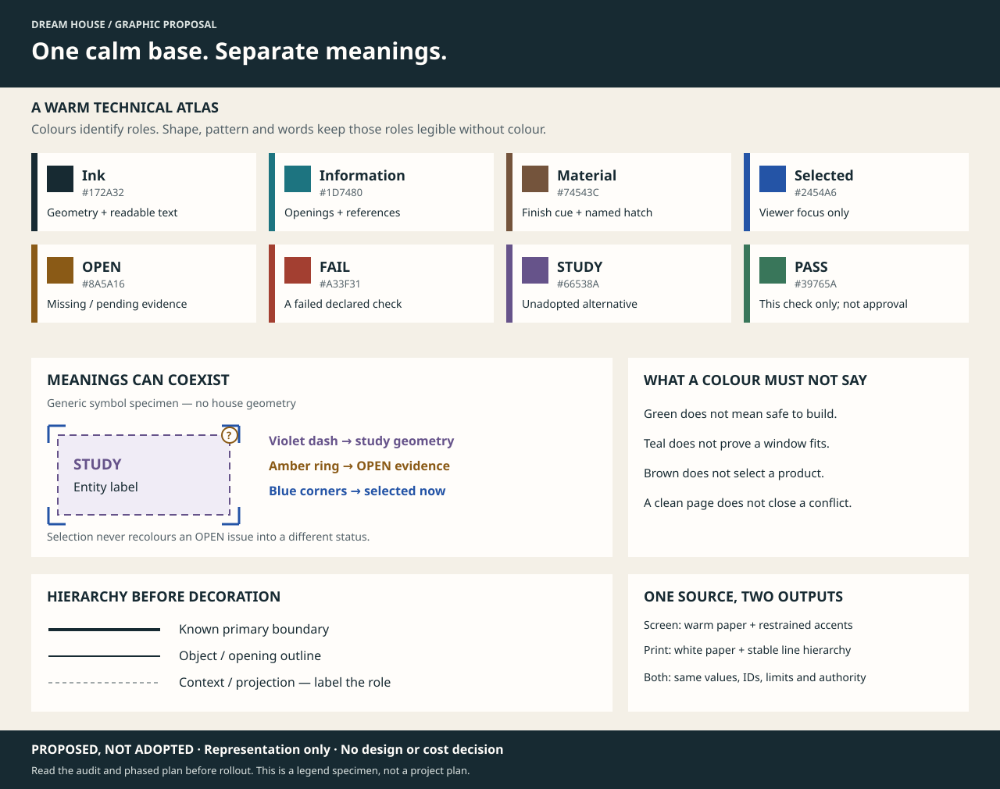
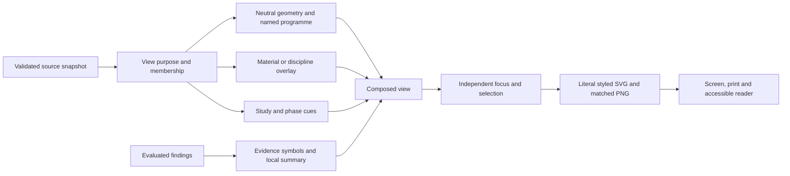
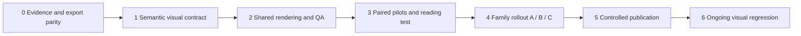

# Dream House — a coherent visual language for the connected drawing set

**Version:** 0.2<br>
**Date:** 2026-10-03  
**Status:** retained pre-implementation audit and plan; D-085 implementation tracked separately<br>
**Source:** owner's request to examine all SVGs, images and colours for beauty and usefulness; repository snapshot `77b380022f14837eb82c61e2c4bec0986815b53a`; current drawing catalog; verified connected release; primary-source research linked below.  
**Authority:** presentation, communication and software quality only. No geometry, product, scope, cost, source precedence or construction authority changes. SVGs remain generated outputs, never graphical editing inputs.

## Implementation follow-through — 2026-10-03

The owner subsequently authorized implementation. [D-085](../00_gobernanza/decision_d085_connected_visual_language.md)
records the graphic/software direction. The [implementation record](../06_gestion_y_obra/connected_visual_language_implementation_2026_10.md)
tracks delivered coverage, tests and remaining acceptance tasks. The census, colour
measurements and defects below describe the **pre-implementation** snapshot; they are
retained as comparison evidence rather than silently updated to the new output.

## 1. Recommendation

Build **one visual language with several reading modes**, rather than recolouring each drawing independently. The house should become the first thing a reader understands: one long hall, the great void, the technical–domestic sequence, the rear core and the partial upper floor. Evidence and uncertainty should remain easy to find without overwhelming that spatial reading.

The recommended direction is a **warm technical atlas**: warm off-white screen backgrounds, dark clear linework, quiet programme surfaces, restrained teal references, and carefully separated status symbols. Preserve the industrial precision and domestic warmth already present in the project. Beauty should come from proportion, alignment, consistent type, controlled contrast and readable relationships.

**The first implementation step is colour fidelity, not a new palette.** A local experiment confirmed that the installed rasterizer and Chromium do not render CSS-variable colours identically. Until that is addressed, a nominally consistent theme can produce inconsistent images.



*This newly authored legend specimen is a proposal, not a project drawing or a theme adoption. Its generic rectangle is not house geometry. Its colours illustrate the intended roles; final acceptance requires the tests and pilots below.*

Read this report with the [fourteen primary-source investigations](connected_svg_visual_language_research_2026_10.md), [file-by-file inventory and renderer experiment](connected_svg_visual_inventory_2026_10.json), [existing graphic roadmap](svg_drawing_system_improvement_plan.md), and [completed local graphic repairs](../02_arquitectura/connected_svg_architectural_visual_review_2026_10.md). This report develops the remaining visual-system work; it does not reopen the repaired label positions or claim that the previous software checks certified aesthetic quality.

## 2. What was examined

### 2.1 Complete census, with explicit review depth

| Collection | Files examined | Method and authority |
| --- | ---: | --- |
| Current adopted aliases, `planos/actual/` | 27 | XML/colour inventory and visual contact review of every existing PNG; preserve catalog provenance. |
| Other versioned drawings under `planos/`, excluding aliases and pilots | 190 | XML/colour inventory and contact-scale visual review of every SVG, including superseded issues and retained studies. This is not a line-by-line historical annotation audit. |
| Presentation pilots, `planos/piloto_grafico_v0.1/` | 5 | XML/colour inventory, contact review and review of GP01–GP05 evaluation records. Pilots are not current drawings. |
| Other tracked SVGs | 9 | Five README coordination snapshots, three cover/icon assets, and one structural-research illustration. |
| Current generated connected release | 36 | All 27 catalog consumers and nine review projections: static inventory and complete contact review; full-sheet inspection of six representative sheets listed below. |
| **Total** | **267 file occurrences** | **231 tracked SVGs + 36 release SVGs; 227 distinct SHA-256 contents.** Copies and aliases are not independent designs. |

The detailed full-sheet selection was `architecture-ground-floor`, `architecture-upper-floor`, `structure-e1-synthesis`, `plan-p2`, `window-details`, and `window-sections`. Other sheets were inspected together at contact scale to evaluate family consistency, composition and colour distribution. The previous repair review provides additional detailed evidence for façades, structural layouts, core and Great Wall. No full-size readability certification is claimed for all 190 historical drawings.

All 267 source files parsed and produced a usable preview for this audit. For adopted and connected sheets, their existing PNGs were used. Other contact previews were rendered with the repository's pinned IBM Plex fonts; they are an audit aid, not proof of the original historical font appearance. Fifteen contact sheets are retained locally under `.build/svg-language-audit/`; that generated directory is not required to read this report. The JSON inventory preserves paths, hashes, group, root metadata and literal-colour counts.

The census excludes dependency directories, old `.build/` candidates, baseline copies inside the release, and the new proposal specimen above. The old August audit's 217-file count is a historical baseline; this census finds **222 tracked SVGs under `planos/`**. README's preserved-sheet count comes from its own manifest selection and is not this all-file census.

### 2.2 Package identity

- Connected release: `6f9ff2314f3bd7e2e2f2b9c15084b3375b6dec176a248457dd46af8ee751793e`.
- Candidate: `deb65118faab51e68f2c45fbf92c3f979dcd6e0eb080165d3ab0e26d0e81bc90`.
- Physical model: `7386d33026a4a1e22f5b68df1c4187a18a9d01831c5f1f53f2bf06d3010fb6d3`.
- Existing annotation coverage: 322 source-bound anchors, 166 checked dimensions/labels, five callouts.
- Existing software record: 545 passing tests; 57 PASS / 186 OPEN / 0 FAIL coordination findings. These are not visual-design scores.

### 2.3 Measured evidence, without overstating it

| Measure | Result | What it means |
| --- | ---: | --- |
| Distinct six-digit colour literals across adopted aliases | 351 | Source includes styles, definitions and hidden content; not 351 simultaneously visible meanings. |
| Distinct six-digit colour literals across connected release | 356 | The native consumers retain substantial inherited palette variation. |
| Connected PB architectural plan | 116 colour literals; 114 text elements | Highest palette complexity in the connected architectural plan sample. |
| Connected P2 architectural plan | 58 colour literals; 118 text elements | More coordinated styling, but many competing semantic uses. |
| Connected `plan-p2.svg` | 18 colour literals; 67 text elements | A smaller palette alone does not create a self-explanatory plan. |
| Adopted aliases lacking both title and description | 18 of 27 | Historic accessibility/document-root debt remains. |
| Adopted aliases without `viewBox` | 1 of 27 | The connected consumers already repair this; the adopted issue remains separate. |
| Connected SVGs lacking title/description or `viewBox` | 0 of 36 | A useful improvement to preserve; this does not establish complete accessibility. |
| Standard review projections containing CSS `var(...)` | 8 of 9 | Colour-parity test coverage must include these; the stair sheet uses a different literal-colour path. |

Counts are case-normalized six-digit hex literals, not CSS-computed colour counts. Text counts include source XML elements, not measured readable words. The existing pilot contrast profile excludes inherited model text; do not extend its pass result to the entire connected set.

## 3. What the existing colours actually mean

The repository already contains several visual grammars. A single universal interpretation of every current hue would be inaccurate.

### 3.1 Connected review projections — including the active `plan-p2.svg`

Evidence: [`render.py`](../../dreamhouse/coordination/render.py), especially `COLOURS`, `SVG_STYLE`, `_style_for`, `_finding_marker` and `_draw_finding_panel`; [`theme.py`](../../dreamhouse/svg/theme.py).

| Current colour / treatment | Intended meaning in the generator | Why it is useful | Current ambiguity |
| --- | --- | --- | --- |
| `#F4F0E7` paper / `#FFFDFA` panel | Background and separation of content areas | A calm base with restrained contrast between regions | Large empty panels can look unfinished; warm paper is not needed for every printed square centimetre. |
| `#172A32` ink / `#536168` muted | Main geometry/text versus secondary information | Provides a clear neutral foundation | CSS-variable text can rasterize black instead of the intended values. |
| `#1D7480` teal + pale `#DCE9EC` | Openings/doors; also information, references, equipment outlines and semantic anchors | Makes openings and navigable evidence recognizable | A teal line does not identify one unique object type; a local legend is needed. |
| `#F2E8DE` space fill with dashed muted outline | Every `kind=space` rectangle | Separates source space envelopes from stronger geometry | Bedrooms, bathrooms, circulation and family space look alike. This is a data projection, not the full architectural plan. |
| `#E4E0D7` + brown `#74543C` | Columns and stairs | Distinguishes structural/stair envelopes from spaces | Brown can look like a material selection although these are object types. |
| `#66538A` + `#F0ECF6`, dashed | Study entities and reservations | A second cue beyond hue marks unadopted/provisional information | Study status and reservation purpose are different concepts; some native sheets use purple for different things again. |
| `#8A5A16` compact ring / card stripe | OPEN finding | Keeps unresolved evidence visible | Many marks occupy room corners; their presence does not mean a localized physical clash exists there. |
| `#A33F31` diamond and `!` | FAIL finding | Distinct shape and word preserve severity without colour | The same colour also fills the permanent NOT FOR CONSTRUCTION banner. General authority and a failed check should be distinguishable. |
| `#39765A`, mapped from `material-insulation-edge` | PASS semantic entry in `COLOURS` | Green is available for a narrowly passed check | Code couples a check-status role to a material-named token. It is not evidence of construction acceptance. |
| `#BD7626` and `#F5DBA7`, stronger outline | Selected entity or anchor in the viewer | Identifies the current navigation focus | Selection uses the same warm family as open evidence and trial geometry. A selected OPEN entity needs both meanings simultaneously. |

The roof-opening branch in `_style_for` runs before the general study-status branch. That is an example of why style precedence needs an explicit contract: an object's physical type, representation status and review state must not silently overwrite one another.

### 3.2 Native architectural and structural consumers

Evidence: [`generate_pb_b05.py`](../../dreamhouse/generate_pb_b05.py), [`generate_p2_b09.py`](../../dreamhouse/generate_p2_b09.py), later source adapters, and the actual connected sheets.

| Family | Existing meaning | Consequence for migration |
| --- | --- | --- |
| PB plan | Cool blue-grey technical territories; warmer living/kitchen territories; separate service-core fills; brown joinery and wood patterns; amber dashed 4 m axis; red lift/exclusion or unresolved-control cues | These colours mix programme, material and caution. Preserve the spatial sequence, but separate those three layers explicitly. Programme fills do not create walls. |
| P2 plan | Teal glazing and some inter-suite walls; amber dashed wet-wall families and open-balcony/guard graphics; purple protected-stair walls, column reservations and some phase cues; green wellness-wall family and model-result panel | Amber does **not** always mean OPEN here, and green does **not** always mean PASS. The small existing legend does not explain every visible coloured wall family. |
| Façades | Medium grey industrial shell, dark blue-green openings, brown wood/worktop cues, amber/red notes | A useful restrained material reading, but dark solid glass and dense corrugation compete with opening IDs and dimensions. These fills do not specify actual products. |
| Roof/daylight | Cyan rooflight footprints and pale light wedges; a different rear/P2 field | Preserve opening identification. Label light wedges as schematic; their shape is not a daylight simulation. |
| Great Wall / media wall | Timber-coloured field with dense vertical pattern; dark equipment/TV rectangle | Warmth is appropriate to the design intent. Simplify pattern frequency in overviews; do not depict unknown doors or treat slat spacing as a fabrication specification. |
| E0/E1 structure | Blue/teal load-path and member cues, purple stair-core study, amber trial bracing, red loads/open or blocked conditions, green calculation badges | The strongest existing distinction is calculation versus design acceptance. Retain it, with plain labels beside all force/study/status colours. |
| GP01–GP05 | Shared paper, typography, panels, explicit status and controlled editorial palette | Reuse the components and lessons. The copied geometry belongs to its pilot source issue and must not be transplanted as today's model. |
| Cover and favicon | Dark identity field with a warm orange accent | Appropriate for editorial identity. Do not make dark background, glow or orange selection the default technical drawing language. |

**Do not globally replace a hex code.** For example, replacing all amber with “pending evidence” would relabel wet-wall and guard geometry incorrectly. Migration must start from typed roles, not colour matching.

## 4. Main findings

### VL-01 — Colour fidelity differs between SVG and PNG (P0)

A minimal controlled sample was rendered with installed `resvg-py 0.4.0` and `Google Chrome for Testing 151.0.7922.34`:

```xml
<svg xmlns="http://www.w3.org/2000/svg" width="600" height="200">
  <style>:root { --test: #1D7480; } .t { fill: var(--test); }</style>
  <rect class="t" width="200" height="200"/>
  <rect x="200" width="200" height="200" fill="#1D7480"/>
</svg>
```

| Interior sample | Chromium RGBA | resvg RGBA |
| --- | --- | --- |
| CSS-variable rectangle, pixel (100, 50) | (29, 116, 128, 255) | **(0, 0, 0, 255)** |
| Literal-colour rectangle, pixel (300, 50) | (29, 116, 128, 255) | (29, 116, 128, 255) |

The current checked-in P2 PNG also contains 1,809 exact-black pixels and zero exact theme-ink pixels in the header crop `(25, 10, 720, 105)`. That supports the relevance of the reproduction; it is not a complete pixel attribution for every glyph. The JSON evidence records the precise probe and engine versions.

The existing browser/resvg equivalence tool intentionally recolours text and geometry into probe colours to measure bounds. That is useful geometric evidence but cannot certify the **original** palette. Add a separate original-colour comparison. Compile semantic tokens into literal output styles supported by the export engine, retaining role metadata and viewer selection behaviour; do not use an unrestricted text replacement that could corrupt IDs, inheritance or user styles. W3C's SVG styling model also establishes that CSS rules can override presentation attributes, so `font-size="8"` is not necessarily the displayed size when the class declares something else. [W3C SVG styling](https://www.w3.org/TR/SVG/styling.html)

### VL-02 — Hue mixes four different questions (P0)

The drawings use colour to answer: **what is it, what material is it, how certain is it, and what am I selecting?** Those are independent. Give each a separate representation layer. A study window with an OPEN interface can be selected without changing any of those facts. The new legend specimen demonstrates that combination.

### VL-03 — The active P2 projection is connected but not self-explanatory (P1)

`plan-p2.svg` is a useful entity/extent map. It is visually flat because most spaces share the same fill and dashed boundary, abbreviated IDs dominate, and many OPEN markers occupy the silhouette. There is no visible local legend explaining those boundaries or rings. The native P2 architectural consumer already communicates rooms, fixtures and family space much better.

Give the reader an obvious pair: **Architecture** and **Coordination**, linked to the same entity IDs and package. In the coordination map, use “Primary bedroom · M-D” where space allows; keep the ID accessible and never invent a room name from an ambiguous abbreviation. Show an exact visible legend generated from the roles actually present. Do not turn unresolved source envelopes into thick, authoritative cut walls simply to make the projection more architectural.

### VL-04 — The evidence panel often outranks the building (P1)

The fixed eight-card panel is useful for review, but forces sparse elevations and long window schedules into the same layout. The front/rear/side review sheets can display unlinked equipment findings beneath a few façade-specific issues because `_draw_finding_panel` permits unlinked records by default. The content is traceable, yet not always useful to the immediate drawing question.

Separate local spatial findings, cross-view findings and project-wide gates. Display a compact local summary plus an explicit global-gate count/link. Keep every FAIL discoverable and visibly counted; never silently hide one to improve the picture. A marker denotes an entity-linked finding unless a real clash region has been computed—it must not imply a precise defect location.

### VL-05 — Repeated authority bands dilute hierarchy (P1)

Several native consumers retain their original dark footer and add a view-reference strip and a second red review footer. The result is traceable but bottom-heavy. Consolidate identity, source revision, review status and authority into one deliberate frame for future generated consumers. Keep NOT FOR CONSTRUCTION clear and always visible; use red mainly for specific blocking evidence, with a neutral document-status treatment that cannot be mistaken for approval.

### VL-06 — Architectural detail and evidence density need different scales (P1)

The native PB plan communicates the long hall well, but small module labels, glass datums, furniture and programme fills compete. Native P2 allocates substantial area to revision prose while room detail remains small. The E1 evidence matrix is rigorous but very dense at preview size. These require different family layouts, not one universal fixed sidebar or a global font-size increase.

Keep primary room names and essential dimensions in the main drawing; move repetitive secondary notes into numbered, linked detail regions. At overview size, simplify decorative hatching—not geometry or unresolved evidence. Use separate overview and detail render profiles, visibly labelled, if the existing view cannot support both reading tasks.

### VL-07 — Detail cards do not share a single visual scale (P1)

`window-details` uses `min(190 / display_width, 82 / display_height)` for each card. Shape proportions within each card remain correct, but equal card frames do not imply equal drawing scales. Add explicit “individual fit; compare labelled dimensions”, or adopt a common scale within compatible opening families. Keep roof plan dimensions distinct from vertical window heights. Group PB, P2, roof and unadopted studies with stable family headings.

### VL-08 — Material patterns can become decorative noise (P2)

Timber and corrugation communicate useful material intent. At reduced size their dense repetition competes with text or merges into a heavy field. Derive a quieter overview pattern and retain a detailed material illustration only where appropriate. Keep pattern density as a presentation setting; it must not modify or imply a product module, slat pitch or structural spacing.

### VL-09 — A valid XML root is only the beginning of accessibility (P1)

The connected package improves titles/descriptions and navigation metadata. It still needs verified readable text/background pairs, colour-independent distinctions, understandable long descriptions, keyboard selection/focus, and an equivalent textual route to entities, dimensions and findings. A drawing with many relationships needs more than a generic image label. [W3C complex-image guidance](https://www.w3.org/WAI/tutorials/images/complex/)

### VL-10 — Do not mistake visual polish for technical maturity (P0 acceptance rule)

The P2 native sheet's large green model-result panel and E1's component PASS badges can look reassuring before their limitations are read. Show the scope beside the result: “geometry checks”, “screening only”, “design blocked”, or the exact existing source wording. Maintain separate model status, rule result, document status and engineering acceptance. Attractive presentation can influence perceived usability, so acceptance must test actual reading tasks as well as preference. [Nielsen Norman Group](https://www.nngroup.com/articles/aesthetic-usability-effect/)

## 5. Proposed visual grammar

### 5.1 Choose a direction deliberately

| Direction | Strength | Limitation | Recommended use |
| --- | --- | --- | --- |
| **Warm technical atlas** | Fits the industrial/domestic concept; calm paper, precise dark structure, limited warm material cues | Requires discipline to prevent beige programme fills from becoming a decorative floor finish | Default screen presentation and coordinated architectural reading. |
| Monochrome technical set | Strong print hierarchy and robust duplication | Can make a complex source/state relationship harder to enter without excellent labels | Print profile and mandatory QA view. |
| Dark digital console | Strong identity and focused selected-object contrast | Dense linework and printing become harder; can make schematic diagrams look like a finished digital product | Cover/editorial assets or an optional viewer surround, not the default plan sheet. |

These are project-specific design proposals, not external standards or adopted requirements.

### 5.2 Separate the layers



Recommended precedence: visibility/view membership → base object role → optional purpose overlay → explicit study/phase treatment → finding marker → selection/focus outline. Preserve all applicable meanings. Do not collapse them into a single “entity colour”.

Phase 2 is not synonymous with an unadopted study. Use a labelled phase boundary or hatch with `F2`, rather than borrowing purple study status automatically. A wall-family overlay can use additional keyed distinctions while the default architectural view remains predominantly neutral.

### 5.3 Candidate colour roles and contrast

Retain most existing theme values. Start with at most three non-status accent families visible in one ordinary sheet; this is a proposed composition budget, not a universal accessibility rule. Use additional accents only in a named analytical overlay with a local legend.

| Role | Candidate foreground / background | Calculated ratio | Use |
| --- | --- | ---: | --- |
| Primary text | `#172A32` / `#F4F0E7` | 13.06:1 | Main labels, dimensions and explanatory text. |
| Secondary text | `#536168` / `#F4F0E7` | 5.63:1 | Secondary notes with adequate size. |
| Information | `#1D7480` / `#F4F0E7` | 4.78:1 | Opening/reference labels; limited teal outlines. |
| OPEN | `#8A5A16` / `#FBF0D9` | 5.22:1 | Ring or other stable symbol + explicit OPEN wording. |
| FAIL / conflict | `#A33F31` / `#FFFDFA` | 6.24:1 | Distinct failed-check diamond/`!`; conflict records labelled separately. |
| Study | `#66538A` / `#F0ECF6` | 5.69:1 | Dashed outline + STUDY / NOT ADOPTED. |
| Narrow PASS | `#39765A` / `#FFFDFA` | 5.29:1 | Check/result text with its scope, not a whole-building green fill. |
| Selected/focus | `#2454A6` / `#FFFDFA` | 7.15:1 | Proposed cobalt corners/halo, separate from status; keyboard focus must remain distinguishable. |
| Existing trial orange | `#BD7626` / `#F4F0E7` | 3.19:1 | Avoid as ordinary small text on paper; not a replacement for dark OPEN text. |

Ratios were calculated locally using the repository luminance function for **these opaque pairs only**. They do not prove contrast after opacity, hatching, overlap, rasterization or CSS resolution. Normal text should meet 4.5:1; qualifying large text has a 3:1 criterion; essential non-text graphics need appropriate contrast against adjacent colours. A pale programme fill need not independently carry meaning if a clear boundary and label do so. Apply the detailed conditions in [WCAG contrast guidance](https://www.w3.org/WAI/WCAG22/Understanding/contrast-minimum.html) and [non-text contrast guidance](https://www.w3.org/WAI/WCAG22/Understanding/non-text-contrast.html).

For reference, the old PB combinations `#F9F3E8` / `#AA9077` and `#332923` / `#75583F` calculate to 2.73:1 and 2.18:1. They are migration candidates where still used for small text, not proof that every occurrence sits on that exact background.

Do not assign a unique hue to every room, material and status. Qualitative categories, ordered quantities and divergent measurements require different encodings; future engineering heatmaps must identify units, range, missing data and calculation scope. Decorative gradients cannot stand in for measured performance. [IBM visualization guidance](https://www.ibm.com/design/language/data-visualization/design/basics/)

### 5.4 Type, linework, material and annotation

- Use the already packaged IBM Plex family consistently in browser, SVG export and raster output. Resolve font family, weight and size once; make CSS classes and per-element sizing agree. Keep tabular numerical alignment in schedules.
- Define primary boundary, object outline, secondary geometry, dimension/leader and context roles. The existing 0.70 / 0.50 / 0.35 / 0.25 / 0.18 mm series is a **pilot proposal**, not a certified plot profile. Physical widths only become meaningful after sheet size, scale and print export are tested.
- Reserve true cut hierarchy for geometry whose view basis supports it. Existing envelope projections and datum profiles must not gain invented cut walls, slab thickness or hidden details.
- Use a room name plus stable ID in the main plan; one essential area or datum where useful; minor dimensions and module names in keyed detail views. Prevent relabelling a gross area as net.
- Generate visible legends from role instances actually drawn. Include line/dash samples and words, not only coloured squares. An unresolved class must produce an explicit legend/QA issue, not disappear.
- Use a consistent dimension margin outside main geometry. Where notes move, preserve association through a short unambiguous leader or a keyed note; prefer a local detail when leaders become long or cross other objects.
- Give the Great Wall a quiet timber cue in overviews and a controlled material hatch in details. Distinguish illustrative material intent from a selected assembly/product. The same applies to steel, glass and insulation.

### 5.5 Reading modes, not editing modes

| Mode | Primary question | Display policy |
| --- | --- | --- |
| Architecture | How is the house organized and experienced? | Room names, known walls/openings, major furniture envelopes and minimal local coordination summary. Links to the richer native architectural consumer. |
| Coordination | Which entities, source relationships and interfaces need attention? | Source extents, stable IDs, linked findings, uncertainty, selected entity across views. The full issue register remains accessible. |
| Discipline / study | What does this specific calculation or alternative establish? | Only the relevant layer and legend; clear provenance and scope. No automatic reinterpretation of PASS as design acceptance. |
| Print | Can someone read it at the declared paper size without a screen? | White paper, stable scale/lineweights, colour-independent meaning, complete essential status and references. |

Start with pre-generated profiles and existing reader controls. Do not build a drawing editor, drag-and-drop geometry interface or new model store. View settings affect representation only; every export declares its purpose, source package and omitted categories.

## 6. Treatment of every connected sheet

The 27 `drawings/…` rows correspond to catalog consumers. Their adopted aliases are treated through a **new versioned issue and explicit catalog promotion**, not overwritten by this report. The other nine rows are generated coordination projections. IDs below omit `.svg`.

| View | What to keep / improve | Order |
| --- | --- | --- |
| `architecture-ground-floor` | Keep the technical–domestic sequence and clear axis; reduce overlapping programme/material palettes, add purpose legend, subordinate minor module text. | Pilot |
| `architecture-upper-floor` | Keep strong spatial room reading; enlarge useful plan content, explain wall-family colours, subordinate the green check summary and revision prose. | Pilot |
| `architecture-ground-floor-core` | Enlarge the narrow core drawing; align a short numbered note rail and explicit unlocated-access legend; retain CF-013. | Rollout A |
| `architecture-front-elevation` | Preserve three-door hierarchy; lighten nonessential surface texture, improve opening labels and align datum/caption bands. | Rollout A |
| `architecture-rear-elevation` | Separate glazing, supplementary ladder and unresolved discharge cues; do not add withheld doors. | Rollout A |
| `architecture-side-a-elevation` | Keep long-hall proportions; quiet corrugation, coordinate sill/worktop datums, allocate a wide elevation frame. | Rollout A |
| `architecture-side-b-elevation` | Preserve clarified provisional downpipe and W-G note; harmonize its cue with the legend rather than using a new free-form colour. | Pilot companion |
| `architecture-great-wall-elevation` | Retain repaired notes and unlocated-door statement; reduce timber-pattern dominance; label finish intent versus unknown construction. | Rollout A |
| `architecture-pb-media-wall` | Separate interior elevation from relationship plan; quiet the timber field; keep equipment envelope and source status clear. | Rollout B |
| `architecture-pb-integrated-workstations` | Emphasize the desk–sill relationship; reserve larger labels for controlling heights and independent support/drainage limitations. | Rollout B |
| `architecture-pb-technical-workbenches` | Keep corrected island dimensions; align A/B/C families and module information; distinguish worktop material from study envelope. | Rollout B |
| `architecture-p2-bedroom-windows` | Keep modular family comparison; make diagram scales explicit and separate safety/product gates from nominal geometry. | Rollout B |
| `architecture-window-schedule` | Strengthen row/column alignment and numeric typography; distinguish active totals from excluded studies; use linked IDs instead of ornamental colour. | Rollout B |
| `architecture-p2-acoustic-partition` | Reuse GP04 pattern/legend lessons; show actual current layer source and performance gaps; do not infer ratings from a green fill. | Rollout B |
| `architecture-p2-exterior-wall` | Clarify material hatch keys and nominal/current-layer basis; retain CF-014 visibly; do not beautify away the contradictory inherited note. | Rollout B |
| `architecture-p2-hall-edge` | Make open guard versus retained wall immediately different in linework; preserve the truss/guard interface gate. | Rollout B |
| `architecture-access-egress` | Explain route, phase and supplementary rescue separately; avoid a safety-green implication; keep CF-011/CF-012 legible. | Rollout B |
| `architecture-owner-priorities` | Compose as a small set of numbered relationships; separate intent diagrams from detail/source authority. | Rollout B |
| `architecture-roof-plan` | Give the two rooflight events clear IDs and restrained tint; add a concise hatch/key for rear P2 and roof reference roles. | Rollout A |
| `architecture-roof-longitudinal-section` | Keep the repaired compact layout; strengthen roof/floor/datum hierarchy without inventing a solid section. | Pilot companion |
| `architecture-roof-transverse-section` | Reuse GP03 composition, but source geometry and labels from the current connected datum profile, not pilot construction assumptions. | Rollout A |
| `architecture-roof-daylight-section` | Identify the pale wedge as an illustrative light projection; keep the roof profile primary and notes close to their reference. | Rollout A |
| `structure-coordination-plan` | Keep repaired plan/section stacking; unify member/study/force legend and enlarge the most useful structural references. | Rollout C |
| `structure-lateral-a` | Retain the larger framing profile; separate alternative-system cues and load/control annotations. | Rollout C |
| `structure-great-wall` | Distinguish architectural finish from structural hypothesis and applied actions; do not imply door coordination has been resolved. | Rollout C |
| `structure-e1-synthesis` | Reuse GP05 readable matrix; retain calculation-versus-design columns and source-specific green/red meanings with explicit scope. | Pilot |
| `structure-vertical-continuity` | Consistent colours for plan, axonometric and connection keys; enlarged interface labels and independent study status. | Rollout C |
| `plan-pb` | State that this is the source-entity coordination projection; connect visibly to the full architectural plan; reduce generic finding clutter. | Pilot companion |
| `plan-p2` | Add room names and exact legend; separate selection, envelope type and OPEN markers; provide architecture/coordination navigation. | First visible pilot |
| `elevation-front` | Fit sparse opening geometry to a purposeful horizontal layout; concise local findings and explicit omitted shell. | Rollout A |
| `elevation-rear` | Keep repaired dimension placement; compare levels clearly, separate unlocated objects and global gates. | Rollout A |
| `elevation-side-a` | Match side-B scale when comparison is intended; retain source extents and explicit projection direction. | Rollout A |
| `elevation-side-b` | Retain obstacle-aware annotations and moved-note leader; keep a compact local legend and study-opening distinction. | First pilot companion |
| `stair-sections` | Keep the honest envelope/level diagram; add common identity/legend framing and clear plan connections without drawing invented treads/headroom/discharge. | Rollout B |
| `window-details` | Group opening families; disclose individual fit or adopt a common family scale; split long print output into identified pages/cards. | Rollout B |
| `window-sections` | Keep source datums and unresolved interfaces; reduce repeated boilerplate, compact the empty findings region, retain A/B/C references. | Rollout B |

Historical drawings receive no palette rewrite. Add collection-level chronology and family filters only if useful to the reader. The three identity assets should share the restrained editorial palette while staying clearly separate from dimensional evidence. The structural-research illustration needs a visible tension/compression legend if presented without its surrounding document; its colours cannot be inferred from the architectural palette.

## 7. Implementation by phase and subphase

All stages below are **proposed**, not completed by this report. The order prioritizes reusable correctness before widespread cosmetic changes. Roles are responsibilities, not newly appointed project personnel.



### Phase 0 — Establish a trustworthy baseline

**Owner:** SVG/software maintainer. **Dependency:** none. **Scope:** evidence and export behaviour; no palette adoption.

| Subphase | Work and output | Completion criteria |
| --- | --- | --- |
| 0.1 — Freeze evidence | Reproduce the inventory with hashes; retain existing release, contacts and representative colour/grayscale views. Record current fonts, engine versions, role exceptions and view purposes. | Every one of the 27 catalog consumers and nine review projections has an identified baseline; history and aliases remain unchanged. |
| 0.2 — Prove colour and type parity | Add the reproduced CSS-variable case and actual text/shape samples. Compare original chromatic output, computed type and visibility across browser/resvg; retain the existing bound probes. | The present mismatch is reproducible before repair; after repair, test swatches match exact interior RGB and representative glyph fills match the expected token, with declared antialias tolerances. |
| 0.3 — Stabilize export | Resolve theme roles to portable literal styles at generation/export, validate all variables are resolved, pin actual used fonts and prevent contradictory class/attribute sizes. | SVG and PNG preserve intended colours; no unknown role silently falls back to black; geometry/IDs/anchors and dynamic selection remain intact. |

**Exit:** reliable appearance across the supported engines. This is the highest-priority technical improvement; no all-sheet recolouring before it passes.

### Phase 1 — Define the visual contract

**Owners:** architectural coordinator and SVG maintainer. **Dependency:** Phase 0 evidence; design exploration may proceed alongside export repair. **Scope:** typed meaning, reading purpose and graphic-only invariants.

| Subphase | Work and output | Completion criteria |
| --- | --- | --- |
| 1.1 — Inventory semantic uses | Map legacy colour/class uses to object, material, wall family, phase, study, finding and selection roles. Declare ambiguous cases explicitly. | All pilot objects and notes have a justified role; amber wet walls, green wellness and purple phase cues are not mislabelled as check states. |
| 1.2 — Specify palette and hierarchy | Separate primitive colours from semantic style roles; define type roles, line roles, patterns, selection/focus, screen/print profiles and local legend vocabulary. | Representative combinations including selected + study + OPEN are unambiguous in colour and grayscale. All critical pairs meet the declared contrast targets. |
| 1.3 — Specify invariant contract | Freeze equality checks for resolved physical model, coordinates, values, quantities, findings and source IDs; define each profile's visible categories and required authority text. | A visual change cannot modify the design or remove unresolved evidence unnoticed. New profile omissions are listed explicitly. |

**Exit:** reviewable graphic-system proposal, corresponding to the existing **SVG-G0** gate. Record an adoption decision only when a concrete graphic system is adopted; the present report is not that decision.

### Phase 2 — Build shared composition and checks

**Owner:** SVG/software maintainer. **Dependency:** Phase 1 contract and Phase 0.3. **Scope:** reuse existing components; no replacement coordination engine.

| Subphase | Work and output | Completion criteria |
| --- | --- | --- |
| 2.1 — Shared style resolution | Extend `dreamhouse/svg/theme.py` with separated primitives/semantic roles and a tested resolver used by connected and pilot renderers. Add role/source metadata to native presentation layers. | Changing a material token cannot unintentionally change a check state. Test primitive uniqueness separately from permitted semantic aliases; update the current uniqueness test deliberately. |
| 2.2 — Family composition and legends | Extend `sheet.py`, `layout.py`, connected `sheet_layout.py` and `render.py` with family frames, measured labels, view-local legends and local/global finding allocation. | No duplicate authority footer in migrated output; no missing represented-role legend; relocated notes stay associated; all FAILs remain visible or explicitly counted and directly reachable. |
| 2.3 — Quality profiles | Extend `lint.py`, `audit.py`, `render_equivalence.py` and connected `visual.py` for full-colour parity, typed backgrounds, model-text coverage, reading-size roles and grayscale/CVD review. | Every exception is identified by element and reason. A generic “legacy exempt” layer cannot pass as complete coverage. Existing source-anchor checks remain green. |

**Exit:** one working vertical slice that supports both native architectural consumers and entity-based projections. Do not blindly apply the five-pilot lint profile to all 36 sheets: register their actual layers and annotation contracts first.

### Phase 3 — Prove the design with paired pilots

**Owners:** architectural coordinator, maintainer and owner as reader. **Dependency:** Phase 2. **Scope:** a small set chosen for different problems.

| Subphase | Work and output | Completion criteria |
| --- | --- | --- |
| 3.1 — Active P2 pair | Generate improved `plan-p2` and `architecture-upper-floor` from the same snapshot; link architecture/coordination views, room names, legend and selected entity. | A reader can identify the main rooms, distinguish envelope from wall, understand OPEN, and find the same entity in both views. Same physical model hash and source values. |
| 3.2 — Stress cases | PB architectural plan, Side B projection/native façade, longitudinal datum profile, and E1 synthesis. Reuse GP01–GP05 lessons and current source inputs. | Dense furniture, sparse elevations, long proportions, material hatching and calculation/design status all remain legible. No reuse of stale pilot geometry. |
| 3.3 — Comparative review | Before/after colour, grayscale and colour-vision simulations; 480/800 px overview, 1400 px detailed preview, full SVG and declared print size. Conduct the reading tasks in §9. | Zero critical semantic misinterpretations or value changes; required text is readable at its declared reading scale; agreed visual preference plus demonstrated task performance. |

**Exit:** **SVG-G1** pilot acceptance with evidence, not merely an attractive screenshot. If a pilot needs a geometry change, split that into a separate design issue and keep this work presentation-only.

### Phase 4 — Roll out by family

**Owners:** maintainer and discipline reviewer. **Dependency:** Phase 3 acceptance and the existing SVG-G2 rollout authorization. **Scope:** remaining current connected consumers; one family at a time.

| Subphase | Work and output | Completion criteria |
| --- | --- | --- |
| 4.A — Plans, façades and roof | Complete the envelope/spatial set in §6, including sparse review elevations. | Consistent names, projection cues, local legends and hierarchy; current source/CF-013 omissions preserved. |
| 4.B — Core, interiors, openings, walls and stair | Complete detail/schedule/route families; introduce explicit card-scale and print-pagination rules. | Every detail is tied to its plan/source; gross/net and horizontal/vertical measurements stay distinct; no invented assembly, opening or exit. |
| 4.C — Structural evidence | Complete E0/E1 and vertical continuity with discipline-specific force/study legends. | Calculation scope and design blockage remain separate; no member, material or system is promoted by style. |

**Exit:** all 36 generated views use the accepted contract or carry a precise, reviewed remaining exception. This records execution coverage after **SVG-G2** rollout authorization; it does not automatically adopt the 27 current aliases.

### Phase 5 — Publish without splitting the visual truth

**Owner:** publication maintainer; discipline/owner review where adoption is required. **Dependency:** Phase 4 and all required checks.

| Subphase | Work and output | Completion criteria |
| --- | --- | --- |
| 5.1 — Review release | Build an immutable visual candidate/release with new theme/version dependencies, all views, evidence and previews. | Freshness checks and complete artifact verification pass; cosmetic-only changes alter presentation/input identity while physical-model identity stays equal. |
| 5.2 — Current-issue migration | If adopted, create new versioned issues and manifests, update catalog entries, then run `sync_current_drawings.py`. Otherwise keep the improved package explicitly in review. | No direct alias edits or historical rewrites; publication state matches the actual decision; prior release remains recoverable. |
| 5.3 — Reader and documentation | Update README/showcase/previews last; verify keyboard focus, entity navigation, links, accessible descriptions and mobile/print profiles. | SVG, PNG, thumbnails and viewer all identify the same source package and visual contract; no stale mixed gallery. |

**Exit:** a coherent published/reviewed set with explicit authority, rather than a mixture of newly attractive thumbnails and old unlabelled drawings.

### Phase 6 — Keep it coherent after future source edits

**Owner:** maintainer with architectural review for significant changes. **Dependency:** Phase 5.

| Subphase | Work and output | Completion criteria |
| --- | --- | --- |
| 6.1 — Meaningful regression | Mutate supported source dimensions, long labels, dense findings and mixed study/selection states in test studies; regenerate all affected views. | Geometry propagates, legends remain accurate, no cropped key information, stable IDs and quantities remain correct. |
| 6.2 — Review visual change | Classify pixel changes as geometry, annotation, theme or engine/font changes; require evidence for new baselines. | A baseline cannot be accepted only because “the tests now pass”; unexpected semantic/colour changes are investigated. |
| 6.3 — Maintain exception register | Track any unresolved microtext, inherited patterns, missing role metadata or inaccessible interaction by view and element. | Every exception has an owner, reason and next action; reports distinguish checked coverage from untested regions. |

## 8. Fit to the actual repository

| Existing component | Reuse / proposed extension |
| --- | --- |
| `dreamhouse/svg/theme.py` | Keep as the palette entry point; split low-level colours from role styles and export literals. Do not create a second unrelated theme file for the viewer. |
| `dreamhouse/svg/sheet.py`, `layout.py` | Reuse frames and measured layout from pilots; support purpose/family variation rather than force all views onto one aspect ratio. |
| `dreamhouse/coordination/render.py` | Preserve source-bound shapes and finding navigation; improve role resolution, legend generation, room labels and adaptive panel allocation. |
| `dreamhouse/coordination/drawings.py`, `sheet_layout.py`, `presentation_refinements.py` | Retain the repaired native-consumer chain; move accepted presentation rules into shared role-aware components without rewriting historical generators. |
| `dreamhouse/coordination/view_definitions.py` | Extend the existing restricted representation schema deliberately if profiles are added; do not smuggle view settings into geometry edits. |
| `dreamhouse/coordination/navigation.py`, `view_contract.py` | Reuse entity occurrences, anchors and cross-view links; add clear purpose/profile labels to navigation. |
| `dreamhouse/svg/lint.py`, `audit.py`, `render_equivalence.py` | Extend current lint/bounds/contact evidence; add original-colour and computed-style checks without losing existing probes. |
| `dreamhouse/coordination/visual.py`, `dependencies.py`, `model.py` | Keep pinned exports, visual differences and freshness; include every new theme/profile/spec input in dependency hashes. Do not hash the report itself unless it becomes a declared generation input. |
| `.github/scripts/sync_coordination_previews.py`, `build_showcase.py`, `sync_current_drawings.py` | Preserve separate review-preview and adopted-alias workflows; use the appropriate route after each approval/adoption state. |
| Existing coordination/showcase workflows | Add visual-quality gates only when the new layer/profile coverage is explicit. Keep unit tests and source/annotation integrity checks. |

Prefer small, family-specific migration batches. There is no need for a new BIM database, new editing application, rendering service or wholesale rewrite of preserved generators to achieve this visual improvement.

## 9. Acceptance: beautiful and useful

The following are **proposed project targets** for the pilot, not claimed external standards or completed tests.

| Test | Proposed acceptance |
| --- | --- |
| Ten-second reading | In a PB/P2 overview, identify level, orientation, main spatial sequence and drawing status without opening a side document. |
| Thirty-second explanation | Explain teal, dashed violet, an OPEN ring, a FAIL diamond and selected-object focus using the visible legend. No guessing from colour alone. |
| Entity trace | Select a window/room and reach its other views and source/result without losing the ID or confusing a review projection with an adopted plan. |
| Honest uncertainty | Distinguish an unlocated door, an unadopted study, a passed calculation and an unresolved professional gate. Zero critical authority misinterpretations. |
| Dimensions | Read the controlling dimension and datum, distinguish net/gross, and recognize individual-fit detail cards. Same numerical values as the source. |
| Dense-sheet resilience | Required labels remain legible after a longer name, more findings or a supported geometry change; no automatic shrinking below the declared role floor. |
| Contrast and monochrome | Required text/essential graphics meet their declared conditions; meaning survives grayscale and colour-vision simulations. Simulation is supporting QA, not proof for every user. |
| Browser/export | Literal swatches and representative original colour roles agree; type metrics, bounds and essential visibility agree within documented tolerances. |
| Overview versus detail | At 480/800 px, title, purpose and broad organization are legible. At 1400 px or the stated detail scale, required dimensions/status/IDs meet the agreed minimum; thumbnails are not expected to expose every technical note. |
| Physical print | Verify actual page size, scale bar and sample dimension; no scale claim based only on `viewBox`. Unreadable notes trigger layout/detail changes. |
| Architectural fidelity | Physical model, geometry, quantity/cost payloads and finding states unchanged in graphic-only studies; no invented openings, clearances or product build-ups. |
| Preference | Owner and discipline reader prefer the new set for calmness and hierarchy **and** can perform the tasks above. A preference vote alone is insufficient. |

## 10. First concrete implementation package

Start with **export fidelity + the P2 pair + one exact local legend**. That delivers a visible improvement where the owner is already looking and proves the path from shared source to both architectural and coordination reading.

The package should contain: the failing/passing CSS-variable reproduction; a portable style resolver; role mapping for the P2 pair; separate selection and finding symbols; before/after P2 SVG/PNG at the declared review sizes; a monochrome comparison; unchanged physical-model/quantity evidence; and a short task-based review record. Bring Side B into the same pilot to exercise the repaired label placement and source-dependent study window.

Then proceed through the family rollout. Avoid starting with a universal recolour, a new dark theme, decorative 3D imagery, or a complete replacement of the 36 renderers. The existing source model, connected navigation, repaired geometry projections, five graphic pilots and visual QA tools already supply most of the foundation.

## 11. Evidence and boundaries of this report

This work adds research, inventory, a proposal specimen and an implementation plan. It does not change active generators, drawings, model inputs, catalog entries or costs. No decision-register entry is made because no graphic system or physical design has been adopted here. Any later scope/cost change or graphic adoption follows the repository's existing records and SVG-G0/G1/G2 process.

The strongest new evidence is the reproducible browser/raster colour mismatch and the fresh all-file census. Aesthetic judgments in this report are explicitly design recommendations. Accessibility criteria inform the digital presentation; foreign drawing manuals and interchange standards cited in the research are comparative sources, not claims of Colombian regulatory or construction compliance.
