# Dream House drawings

**Status:** active publication index; source drawings retain their discipline status and authority 
**Version:** 1.8 
**Date:** 2026-08-18 
**Source:** [`actual/catalog.json`](actual/catalog.json)

> [!IMPORTANT]
> `actual/` is the stable publication layer for the current project state. Its SVG files
> are byte-for-byte copies of explicitly promoted versioned issues; its PNG files are
> previews. Neither format creates dimensional or construction authority.

## Start here

<table>
<tr>
<td width="50%" valign="top">
  <a href="actual/DH-ARQ-PLN-001_CURRENT-GROUND-FLOOR.svg">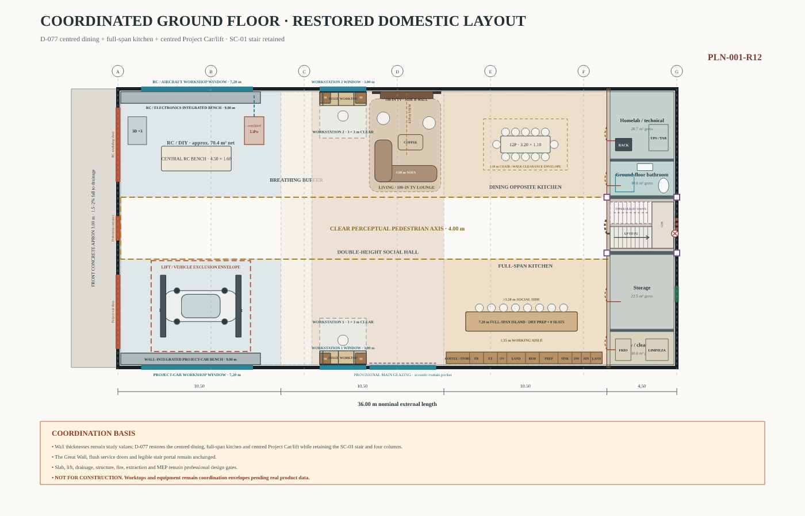</a>
   <strong>Ground-floor plan</strong>
   0.3-borrador-05-PB · <a href="conceptual_v0.3_b05_pb/DH-ARQ-PLN-001-R04_PB-DETALLADA.svg">versioned source</a>
</td>
<td width="50%" valign="top">
  <a href="actual/DH-ARQ-PLN-002_CURRENT-UPPER-FLOOR.svg">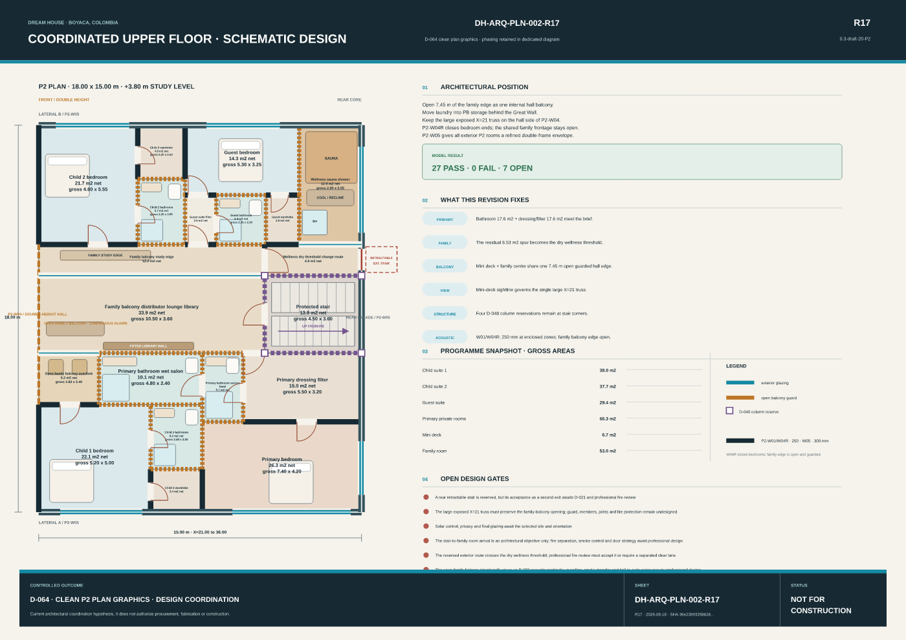</a>
   <strong>Upper-floor plan</strong>
   0.3-draft-20-P2 · <a href="conceptual_v0.3_b20_p2/DH-ARQ-PLN-002-R17_P2-COORDINATED.svg">versioned source</a>
</td>
</tr>
<tr>
<td width="50%" valign="top">
  <a href="actual/DH-ARQ-PLN-CUB-001_CURRENT-ROOF.svg">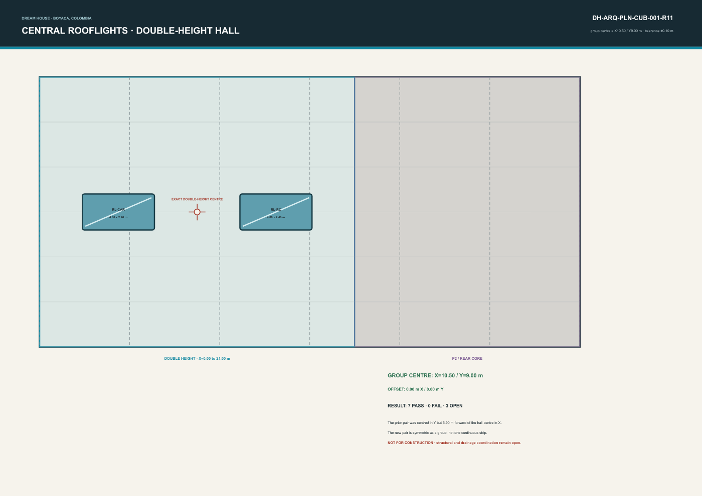</a>
   <strong>Roof and rooflight plan</strong>
   0.4-I01-ROOFLIGHTS · <a href="integracion_v0.4_i01/rooflights/DH-ARQ-PLN-CUB-001-R11_D054-HALF-CENTRES.svg">versioned source</a>
</td>
<td width="50%" valign="top">
  <a href="actual/DH-ARQ-SEC-002_CURRENT-TRANSVERSE.svg">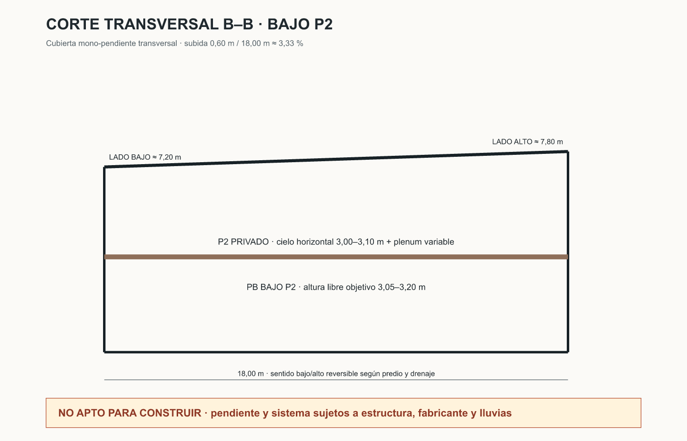</a>
   <strong>Mono-pitch roof section</strong>
   0.3-borrador-07-CUBIERTA · <a href="conceptual_v0.3_b07_cubierta/DH-ARQ-SEC-002-R06_TRANSVERSAL-CUBIERTA.svg">versioned source</a>
</td>
</tr>
<tr>
<td width="50%" valign="top">
  <a href="actual/DH-ARQ-ELE-001_CURRENT-FRONT.svg">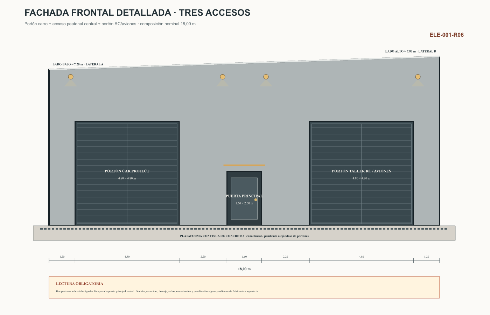</a>
   <strong>Front façade</strong>
   0.3-borrador-07-CUBIERTA · <a href="conceptual_v0.3_b07_cubierta/DH-ARQ-ELE-001-R06_FACHADA-FRONTAL-CUBIERTA.svg">versioned source</a>
</td>
<td width="50%" valign="top">
  <a href="actual/DH-ARQ-ELE-002_CURRENT-REAR.svg">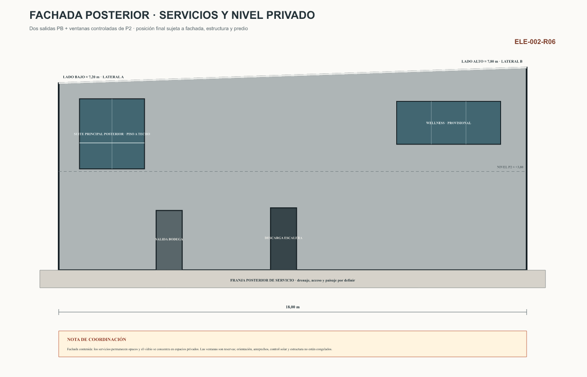</a>
   <strong>Rear façade</strong>
   0.3-borrador-07-CUBIERTA · <a href="conceptual_v0.3_b07_cubierta/DH-ARQ-ELE-002-R06_FACHADA-POSTERIOR-CUBIERTA.svg">versioned source</a>
</td>
</tr>
<tr>
<td width="50%" valign="top">
  <a href="actual/DH-ARQ-DET-003_CURRENT-P2-ACOUSTIC-PARTITION.svg">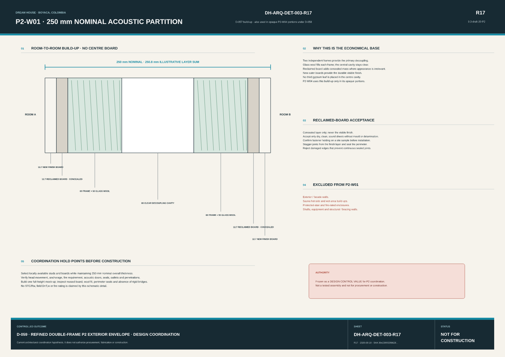</a>
   <strong>P2-W01 · 250 mm acoustic wall</strong>
   0.3-draft-20-P2 · <a href="conceptual_v0.3_b20_p2/DH-ARQ-DET-003-R17_P2-ACOUSTIC-PARTITION.svg">versioned source</a>
</td>
<td width="50%" valign="top">
  <a href="actual/DH-ARQ-DET-004_CURRENT-P2-HALL-EDGE.svg">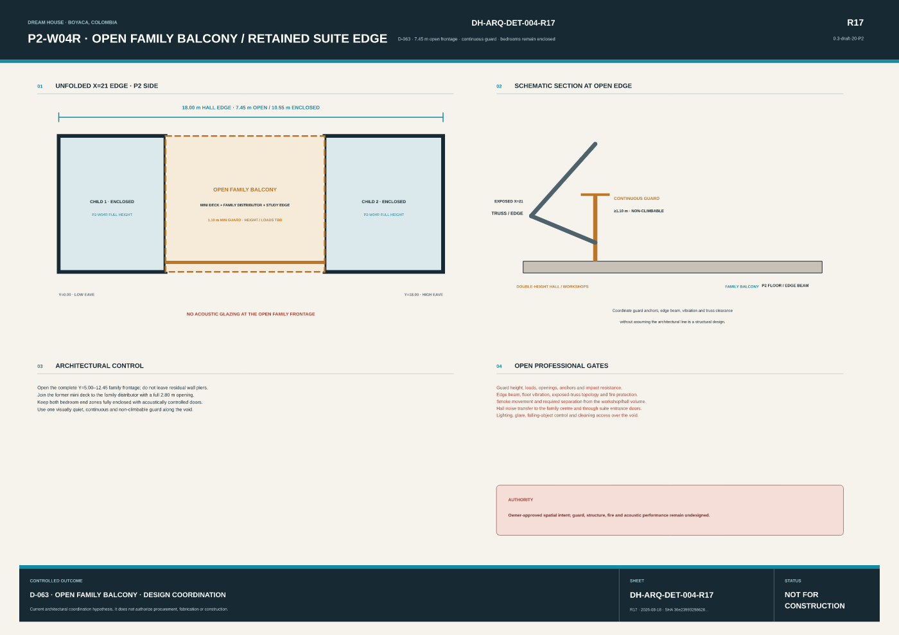</a>
   <strong>P2-W04R · open balcony / retained suite edge</strong>
   0.3-draft-20-P2 · <a href="conceptual_v0.3_b20_p2/DH-ARQ-DET-004-R17_P2-HALL-EDGE.svg">versioned source</a>
</td>
</tr>
<tr>
<td width="50%" valign="top">
  <a href="actual/DH-ARQ-DET-005_CURRENT-P2-EXTERIOR-WALL.svg">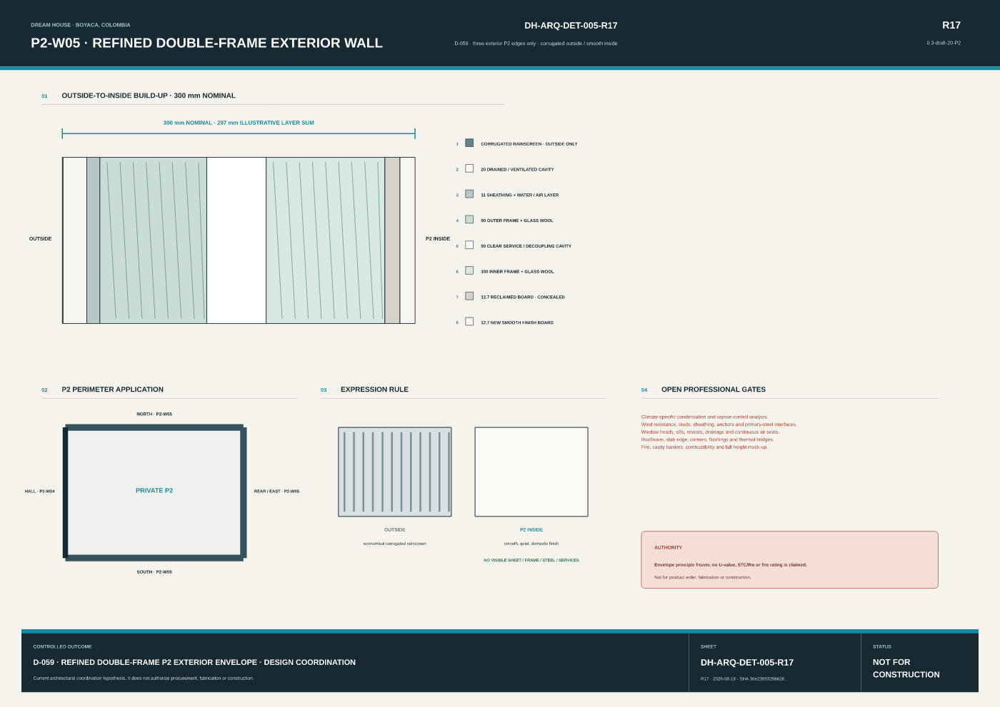</a>
   <strong>P2-W05 · double-frame exterior wall</strong>
   0.3-draft-20-P2 · <a href="conceptual_v0.3_b20_p2/DH-ARQ-DET-005-R17_P2-EXTERIOR-WALL.svg">versioned source</a>
</td>
<td width="50%" valign="top">
  <a href="actual/DH-EST-E1-001_CURRENT-SYNTHESIS.svg">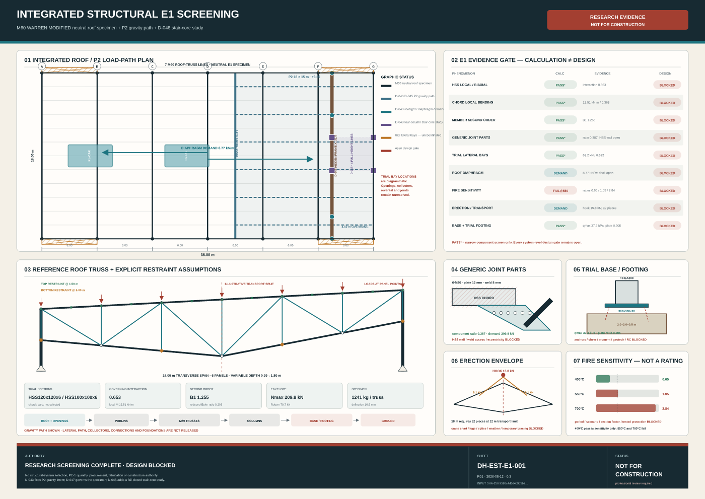</a>
   <strong>Integrated structural evidence</strong>
   0.3 + E1 0.2 · <a href="estructura/DH-EST-E1-001_SINTESIS-ESTRUCTURAL.svg">versioned source</a>
</td>
</tr>
<tr>
<td width="50%" valign="top">
  <a href="actual/DH-EST-E1-002_CURRENT-VERTICAL-CONTINUITY.svg">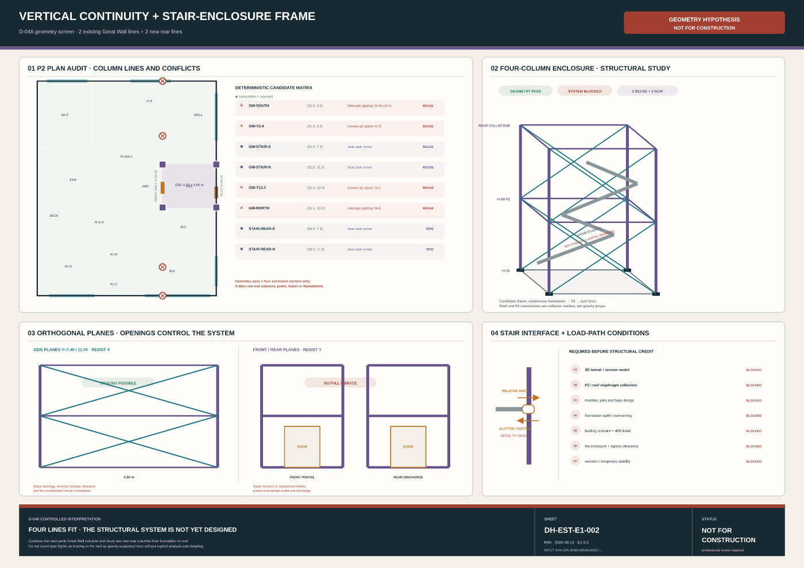</a>
   <strong>Stair-frame continuity</strong>
   0.3 + E1 0.2 · <a href="estructura/DH-EST-E1-002_CONTINUIDAD-VERTICAL-ESCALERA.svg">versioned source</a>
</td>
</tr>
</table>

The current state is a **coordinated set**, not a claim that one sheet contains every
active decision. In particular, read the ground-floor plan with the owner-priorities
detail for D-050's laundry reserve, the rear elevation with D-051's stair reserve, and
all architectural sheets with the structural studies and their open gates.

## Complete current set

| Stable ID | Drawing | Current aliases | Preserved issue | Status / limitation |
| --- | --- | --- | --- | --- |
| `architecture-ground-floor` | Ground-floor plan | [SVG](actual/DH-ARQ-PLN-001_CURRENT-GROUND-FLOOR.svg) · [PNG](actual/DH-ARQ-PLN-001_CURRENT-GROUND-FLOOR.png) | [0.3-borrador-05-PB](conceptual_v0.3_b05_pb/DH-ARQ-PLN-001-R04_PB-DETALLADA.svg) | active ground-floor schematic basis, supplemented by D-050 |
| `architecture-upper-floor` | Upper-floor plan | [SVG](actual/DH-ARQ-PLN-002_CURRENT-UPPER-FLOOR.svg) · [PNG](actual/DH-ARQ-PLN-002_CURRENT-UPPER-FLOOR.png) | [0.3-draft-20-P2](conceptual_v0.3_b20_p2/DH-ARQ-PLN-002-R17_P2-COORDINATED.svg) | issued for coordination under D-064; phase overlay suppressed on main plan only; guard, structure, fire, smoke and acoustic performance remain open; not for construction |
| `architecture-roof-plan` | Roof and rooflight plan | [SVG](actual/DH-ARQ-PLN-CUB-001_CURRENT-ROOF.svg) · [PNG](actual/DH-ARQ-PLN-CUB-001_CURRENT-ROOF.png) | [0.4-I01-ROOFLIGHTS](integracion_v0.4_i01/rooflights/DH-ARQ-PLN-CUB-001-R11_D054-HALF-CENTRES.svg) | active D-054 schematic coordination hypothesis; not for construction |
| `architecture-roof-daylight-section` | Rooflight daylight section | [SVG](actual/DH-ARQ-SEC-CUB-003_CURRENT-DAYLIGHT.svg) · [PNG](actual/DH-ARQ-SEC-CUB-003_CURRENT-DAYLIGHT.png) | [0.4-I01-ROOFLIGHTS](integracion_v0.4_i01/rooflights/DH-ARQ-SEC-CUB-003-R11_D054-DAYLIGHT.svg) | active D-054 schematic coordination hypothesis; not for construction |
| `architecture-roof-longitudinal-section` | Longitudinal roof section | [SVG](actual/DH-ARQ-SEC-001_CURRENT-LONGITUDINAL.svg) · [PNG](actual/DH-ARQ-SEC-001_CURRENT-LONGITUDINAL.png) | [0.3-borrador-07-CUBIERTA](conceptual_v0.3_b07_cubierta/DH-ARQ-SEC-001-R06_LONGITUDINAL-CUBIERTA.svg) | active roof-form schematic basis; not for construction |
| `architecture-roof-transverse-section` | Mono-pitch roof section | [SVG](actual/DH-ARQ-SEC-002_CURRENT-TRANSVERSE.svg) · [PNG](actual/DH-ARQ-SEC-002_CURRENT-TRANSVERSE.png) | [0.3-borrador-07-CUBIERTA](conceptual_v0.3_b07_cubierta/DH-ARQ-SEC-002-R06_TRANSVERSAL-CUBIERTA.svg) | active roof-form schematic basis; not for construction |
| `architecture-front-elevation` | Front façade | [SVG](actual/DH-ARQ-ELE-001_CURRENT-FRONT.svg) · [PNG](actual/DH-ARQ-ELE-001_CURRENT-FRONT.png) | [0.3-borrador-07-CUBIERTA](conceptual_v0.3_b07_cubierta/DH-ARQ-ELE-001-R06_FACHADA-FRONTAL-CUBIERTA.svg) | active façade and roof-form schematic basis; not for construction |
| `architecture-rear-elevation` | Rear façade | [SVG](actual/DH-ARQ-ELE-002_CURRENT-REAR.svg) · [PNG](actual/DH-ARQ-ELE-002_CURRENT-REAR.png) | [0.3-borrador-07-CUBIERTA](conceptual_v0.3_b07_cubierta/DH-ARQ-ELE-002-R06_FACHADA-POSTERIOR-CUBIERTA.svg) | active façade and roof-form schematic basis, supplemented by D-051 |
| `architecture-side-a-elevation` | Side A façade | [SVG](actual/DH-ARQ-ELE-003_CURRENT-SIDE-A.svg) · [PNG](actual/DH-ARQ-ELE-003_CURRENT-SIDE-A.png) | [0.3-borrador-07-CUBIERTA](conceptual_v0.3_b07_cubierta/DH-ARQ-ELE-003-R06_FACHADA-LATERAL-A-CUBIERTA.svg) | active façade and roof-form schematic basis; not for construction |
| `architecture-side-b-elevation` | Side B façade | [SVG](actual/DH-ARQ-ELE-004_CURRENT-SIDE-B.svg) · [PNG](actual/DH-ARQ-ELE-004_CURRENT-SIDE-B.png) | [0.3-borrador-07-CUBIERTA](conceptual_v0.3_b07_cubierta/DH-ARQ-ELE-004-R06_FACHADA-LATERAL-B-CUBIERTA.svg) | active façade and roof-form schematic basis; not for construction |
| `architecture-great-wall-elevation` | Great Wall | [SVG](actual/DH-ARQ-ELE-INT-001_CURRENT-GREAT-WALL.svg) · [PNG](actual/DH-ARQ-ELE-INT-001_CURRENT-GREAT-WALL.png) | [0.3-borrador-05-PB](conceptual_v0.3_b05_pb/DH-ARQ-ELE-INT-001-R04_GRAN-MURO.svg) | active architectural intent, supplemented by structural coordination |
| `architecture-ground-floor-core` | Ground-floor service core | [SVG](actual/DH-ARQ-DET-001_CURRENT-GROUND-FLOOR-CORE.svg) · [PNG](actual/DH-ARQ-DET-001_CURRENT-GROUND-FLOOR-CORE.png) | [0.3-borrador-05-PB](conceptual_v0.3_b05_pb/DH-ARQ-DET-001-R04_NUCLEO-PB.svg) | active service-core schematic basis, supplemented by D-050 |
| `architecture-access-egress` | Upper-floor access and egress | [SVG](actual/DH-ARQ-DIA-001_CURRENT-ACCESS-EGRESS.svg) · [PNG](actual/DH-ARQ-DIA-001_CURRENT-ACCESS-EGRESS.png) | [0.3-draft-20-P2](conceptual_v0.3_b20_p2/DH-ARQ-DIA-001-R17_P2-ACCESS-EGRESS.svg) | active schematic coordination hypothesis; life-safety design remains open |
| `architecture-owner-priorities` | Active coordination interfaces | [SVG](actual/DH-ARQ-DET-002_CURRENT-OWNER-PRIORITIES.svg) · [PNG](actual/DH-ARQ-DET-002_CURRENT-OWNER-PRIORITIES.png) | [0.3-draft-20-P2](conceptual_v0.3_b20_p2/DH-ARQ-DET-002-R17_OWNER-PRIORITIES.svg) | issued for coordination under D-064; not for construction |
| `architecture-p2-acoustic-partition` | P2-W01 · 250 mm acoustic wall | [SVG](actual/DH-ARQ-DET-003_CURRENT-P2-ACOUSTIC-PARTITION.svg) · [PNG](actual/DH-ARQ-DET-003_CURRENT-P2-ACOUSTIC-PARTITION.png) | [0.3-draft-20-P2](conceptual_v0.3_b20_p2/DH-ARQ-DET-003-R17_P2-ACOUSTIC-PARTITION.svg) | frozen design control for coordination; no tested acoustic or fire rating; not for construction |
| `architecture-p2-hall-edge` | P2-W04R · open balcony / retained suite edge | [SVG](actual/DH-ARQ-DET-004_CURRENT-P2-HALL-EDGE.svg) · [PNG](actual/DH-ARQ-DET-004_CURRENT-P2-HALL-EDGE.png) | [0.3-draft-20-P2](conceptual_v0.3_b20_p2/DH-ARQ-DET-004-R17_P2-HALL-EDGE.svg) | owner-approved spatial intent; guard, structure, fire, smoke and acoustic performance remain open; not for construction |
| `architecture-p2-exterior-wall` | P2-W05 · double-frame exterior wall | [SVG](actual/DH-ARQ-DET-005_CURRENT-P2-EXTERIOR-WALL.svg) · [PNG](actual/DH-ARQ-DET-005_CURRENT-P2-EXTERIOR-WALL.png) | [0.3-draft-20-P2](conceptual_v0.3_b20_p2/DH-ARQ-DET-005-R17_P2-EXTERIOR-WALL.svg) | frozen envelope and interior-experience intent; hygrothermal, wind, fire and window design remain open; not for construction |
| `structure-coordination-plan` | Structural inspection plan | [SVG](actual/DH-EST-E0-002_CURRENT-STRUCTURE-PLAN.svg) · [PNG](actual/DH-EST-E0-002_CURRENT-STRUCTURE-PLAN.png) | [0.3 + E1 0.2](estructura/DH-EST-E0-002_ESTRUCTURA-INSPECCION.svg) | active E0/E1 coordination evidence; no system or member selected |
| `structure-lateral-a` | Side A structural elevation | [SVG](actual/DH-EST-E0-003_CURRENT-LATERAL-A.svg) · [PNG](actual/DH-EST-E0-003_CURRENT-LATERAL-A.png) | [0.3 + E1 0.2](estructura/DH-EST-E0-003_ESTRUCTURA-LATERAL-A.svg) | active E0/E1 coordination evidence; no lateral system selected |
| `structure-great-wall` | Great Wall gravity study | [SVG](actual/DH-EST-E0-004_CURRENT-GREAT-WALL.svg) · [PNG](actual/DH-EST-E0-004_CURRENT-GREAT-WALL.png) | [0.3 + E1 0.2](estructura/DH-EST-E0-004_PARED-HIBRIDA.svg) | active E0 gravity-path hypothesis; not for construction |
| `structure-e1-synthesis` | Integrated structural evidence | [SVG](actual/DH-EST-E1-001_CURRENT-SYNTHESIS.svg) · [PNG](actual/DH-EST-E1-001_CURRENT-SYNTHESIS.png) | [0.3 + E1 0.2](estructura/DH-EST-E1-001_SINTESIS-ESTRUCTURAL.svg) | active fail-closed screening evidence; no construction authority |
| `structure-vertical-continuity` | Stair-frame continuity | [SVG](actual/DH-EST-E1-002_CURRENT-VERTICAL-CONTINUITY.svg) · [PNG](actual/DH-EST-E1-002_CURRENT-VERTICAL-CONTINUITY.png) | [0.3 + E1 0.2](estructura/DH-EST-E1-002_CONTINUIDAD-VERTICAL-ESCALERA.svg) | active D-048 coordination study; not for construction |

Full provenance and SHA-256 hashes are recorded in
[`actual/manifest.json`](actual/manifest.json). The human-controlled promotion list is
[`actual/catalog.json`](actual/catalog.json).

## History and update rule

Versioned folders and issued files—including `conceptual_v0.3_b10_p2/`, `estructura/`,
and `integracion_v0.4_i01/`—remain preserved. They are not renamed or overwritten.

When a new drawing becomes the active issue for one of the stable IDs:

1. issue it under its versioned filename and retain its adjacent `manifest.json`;
2. update that ID's `source`, `source_revision`, status, and catalog date;
3. run `python .github/scripts/sync_current_drawings.py --write`;
4. review the SVG and PNG, then run the command again with `--check`; and
5. record any design, scope, or cost decision in the governing project documents.

The presentation workflow performs the same validation in CI. A higher revision number
alone never promotes a hypothesis to the current set.
